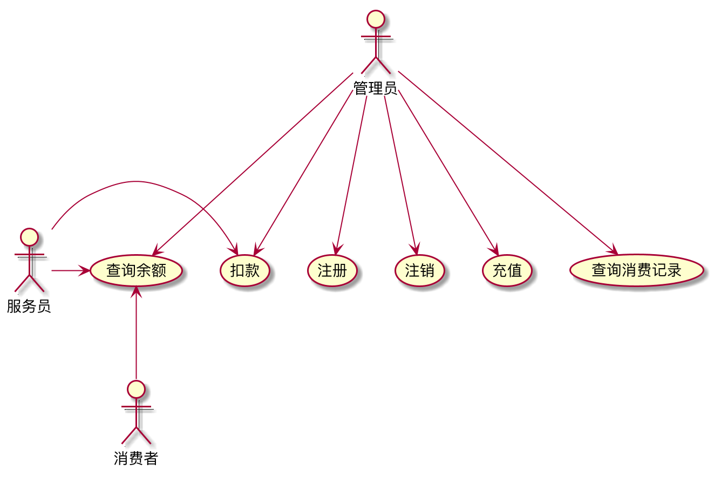
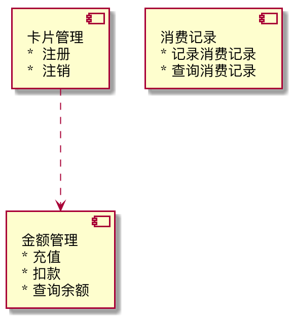
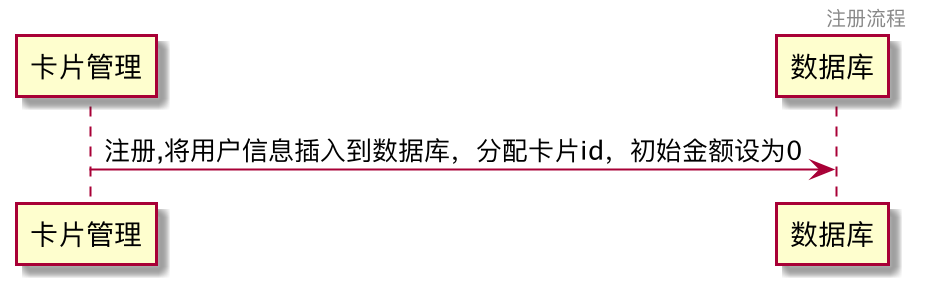
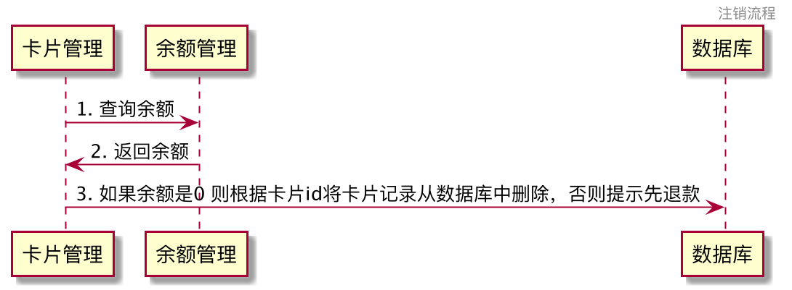
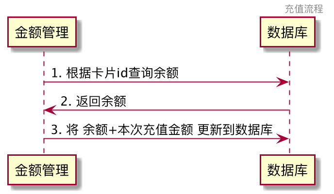
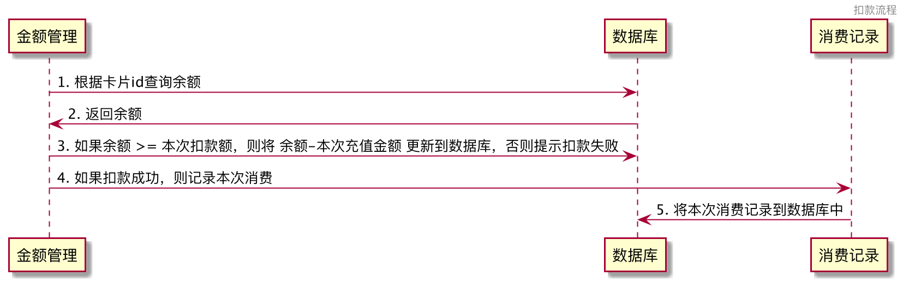
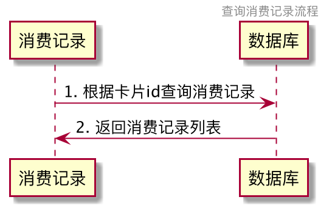
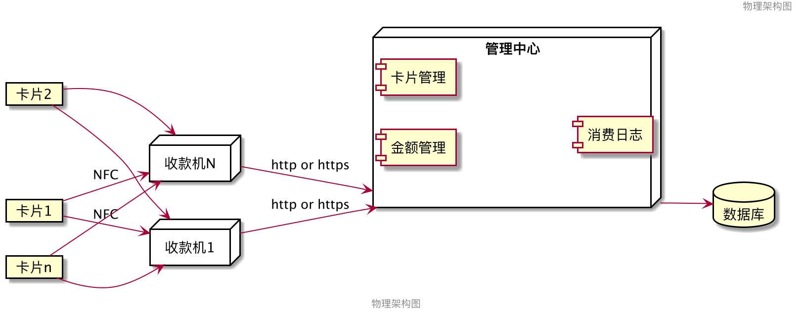

# Week1 课后作业
## 作业一： 食堂就餐卡系统设计
    
* 系统中每个消费者都有一张卡，在管理中心注册缴费，卡内记着消费者的身份、余额
* 使用时将卡插入收款机则显示卡上金额，服务员按收款机上的数字键，收款机自动计算并显示消费额及余额
* 管理中心的管理员监视每一笔消费，可打印出消费情况的相关统计数据
    
请设计系统用例图，组件图，组件时序图，部署图

### 作业分析
#### 用例分析
角色包括：消费者、服务员、管理员

用例：注册、注销、充值、查询余额、扣款、查询消费记录

消费者：查询余额

服务员：查询余额、扣款

管理员：注册、注销、充值、扣款、查询余额、查询消费记录

#### 组件分析
* 卡片管理
    * 注册
    * 注销
* 金额管理
    * 充值
    * 查询余额
    * 扣款
* 消费记录
    * 查询消费记录

#### 组件时序
* 注册流程
* 注销流程
* 充值流程
* 查询余额流程
* 扣款流程
* 消费记录查询流程

#### 部署图
* 卡片
* 收款机
* 管理中心
* 数据库

### UML图
#### 用例图

#### 组件图

#### 组件时序图
* 注册流程

* 注销流程

* 充值流程

* 查询余额流程

* 扣款流程

* 消费记录查询流程

#### 部署图

