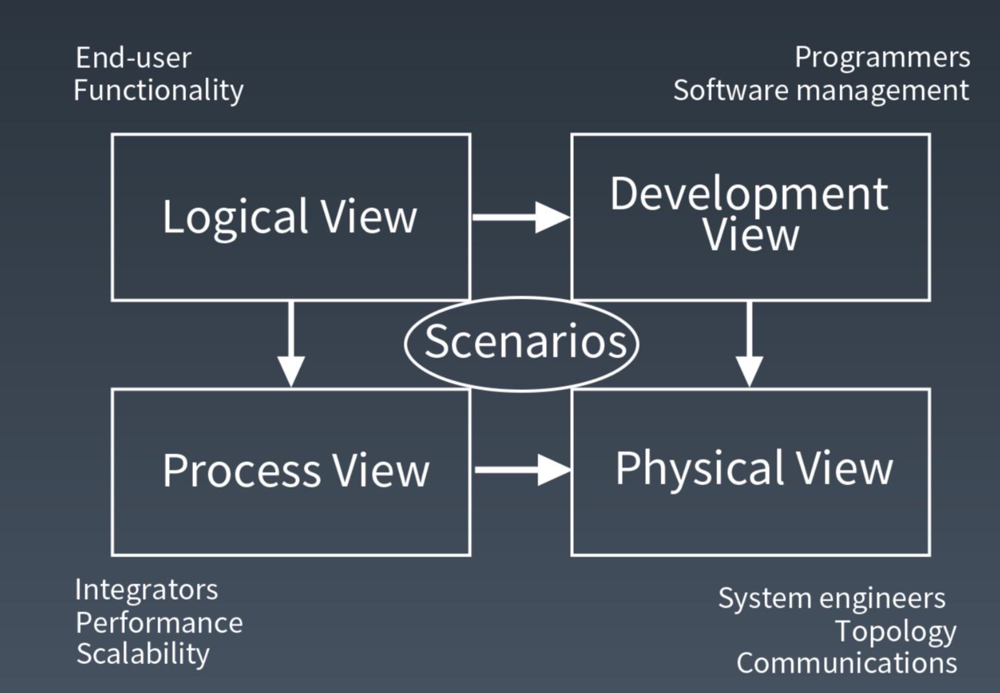

# Week1 课后作业
## 作业二： 根据当周学习情况，完成一篇学习总结
### 1. 软件开发流程
* 需求分析
* 概要设计
* 详细设计
* 开发
* 测试
* 部署/实施
* 运维

架构是主要负责概要设计和核心模块的详细设计

架构师需要参与全流程

### 2. 架构师的主要能力
* 编程能力（基础）
* 基础技术掌握能力
* 常用技术产品的理解与应用的能力
* 性能优化与分析故障能力
* 常用架构模式与框架的理解与应用能力
* 建模以及设计文档的方法和能力
* 业务理解与功能模块及非功能模块拆解能力
* 快速学习能力
* 沟通与领导能力

### 3. 什么是架构师
架构师是做架构设计、对系统架构负责的那个人

架构师是一顶帽子，而不是一把椅子

架构师是一个角色而不是一个职位

### 4. 架构视图
4+1 视图模型

* 逻辑视图：设计对象模型
* 过程视图：捕捉设计的并发和同步特征
* 物理视图：描述了软件到硬件的映射，反映了部署特性
* 开发视图：描述了在开发环境中软件的静态组织结构
* 场景视图：描述了用例场景

### 5. UML 统一建模语言
* 静态图
    * 用例图
    * 对象图（非重点）
    * 类图
    * 组件图
    * 包图（非重点）
    * 部署图
* 动态图
    * 协作图（非重点）
    * 序列图
    * 活动图
    * 状态图
### 6. 软件开发各个阶段需要的图形
* 需求分析：用例图、状态图、时序图、活动图

* 概要设计：部署图、系统级时序图、系统级活动图、组件图、组件时序图、组件活动图

* 详细设计：类图、类时序图、状态图、方法活动图

### 7. 心得体会
架构师是一个角色，而不是一个职位

架构师不是被别人赋予的，架构无处不在，任何一个软件或者一个任务都需要有架构设计

要想成为一名合格的架构师需要深耕技术，打好基础

UML是一种通用的架构语言，是做架构设计和撰写架构文档的基础，是与相关方沟通的工具