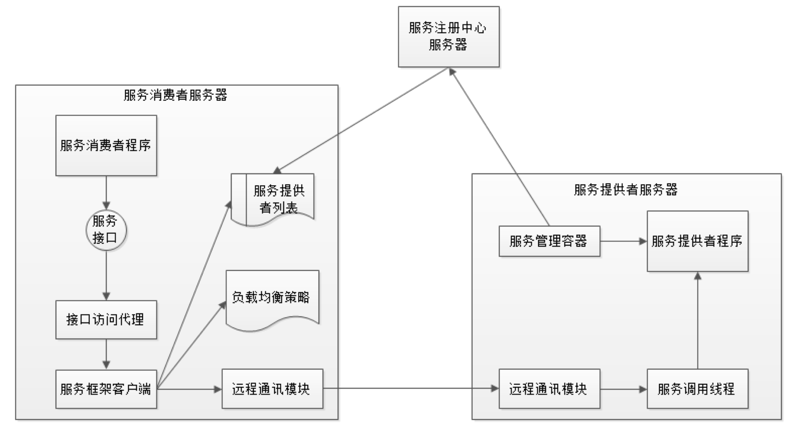
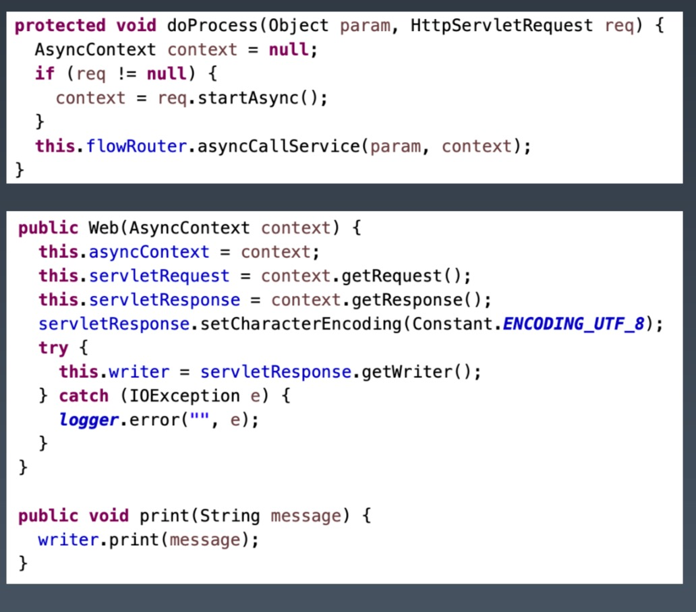
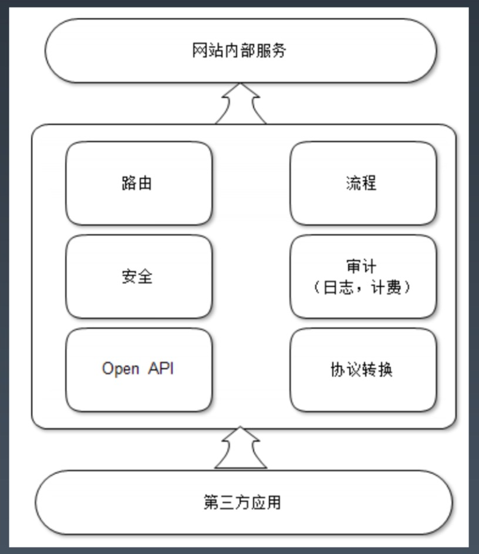
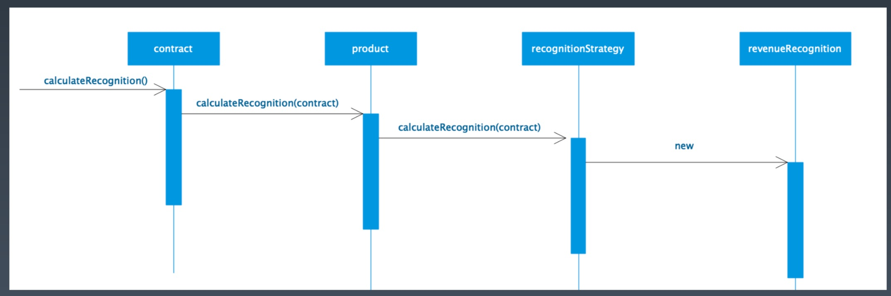

# Week10 总结
## 阿里早期微服务架构重构
### 巨无霸应用系统带来的问题
编译、部署困难：
    
    对于网站开发工程师而言，打包构建一个巨型应用是一件痛苦的事情。
    也许只是修改一行代码，输入 build 命令后，抽完一支烟，回来一看，还在 building；
    又去喝了一杯水，回来一看，还在 building；又去了一次厕所，回来一看，还在 building；
    好不容易 build 结束，一看编译失败，还得重来……
    想砸了电脑有木有
代码分支管理困难

    复用的代码模块由多个团队共同维护修改，代码 merge 的时候总发生冲突。代码merge一般
    在网站发布的时候，和发布等问题互相纠结在一起，顾此失彼，每次发布都要半夜三更。
数据库连接耗尽：

    巨型的应用，大量的访问，必然需要将这个应用部署在一个大规模的服务器集群上，应用与数据库的连接
    通常使用连接池，以每个应用 10 个连接计，一个数百台服务器集群的应用将需要在数据库上创建数千个
    连接，数据库服务器上，每个连接都会占用一些昂贵的系统资源，以至于数据库缺乏足够的系统资源进行
    一般的数据操作
新增业务困难：

    想要在一个已经如乱麻般的系统中增加新业务，维护旧功能，难度可想而知。
    一脚踩进去，发现全都是雷，什么都不敢碰。许多新工程师来公司半年了，还是不能接手业务，
    因为不知道水有多深。
    于是就出现这种怪现象：熟悉网站产品的"老人"忙得要死，加班加点干活；不熟悉网站产品的新人一帮忙就
    出乱，跟着加班加点。
    整个公司热火朝天，加班加点，却还是经常出故障，新产品迟迟不能上线。
解决方案就是拆分，将模块独立部署，降低系统耦合性：
* 纵向拆分：将一个大应用拆分成多个小应用，如果新增业务较为独立，那么就直接将其设计部署为一个独立的 Web 应用系统
* 横向拆分：将复用的业务拆分出来，独立部署为微服务，新增业务只需要调用这些微服务即可快速搭建一个应用系统。

## 微服务框架
### Web Service 与企业级分布式服务

服务提供者通过 WSDL （Web服务描述语言，Web Services Description Language）向注册中心（Service Broker）
描述自身提供的服务接口属性，注册中心使用 UDDI（Universal Description, Discovery, and Integration, 统一描述、
发现和集成）发布服务提供者提供的服务，服务请求者从注册中心检索到服务信息后，通过 SOAP （Simple Object Access 
Protocol,简单对象访问协议）和服务提供者通讯，使用相关服务。

Web Service 虽然有着成熟的技术规范和产品实现，以及在企业应用领域有许多成功的案例，但是也具有一些固有的缺点：
* 臃肿的注册与发现机制
* 低效的 XML 序列化手段
* 开销相对较高的 HTTP 远程通讯
* 复杂的部署和维护手段

这些问题导致 Web Service 难以满足大型网站对系统高性能、高可用、易部署、易维护的要求
### 微服务框架需求
对于大型互联网系统，除了 Web Service 所规范的服务注册与发现，服务调用等标准功能，还需要微服务框架能够支持：
* 失效转移（Fail Over）：
    * 对于大型网站的微服务而言，即使是很少访问的简单服务，也需要集群部署，同时微服务框架还需要支持服务提供者的
    失效转移机制，以实现服务高可用
* 负载均衡：
    * 对于集群部署的服务提供者，服务请求者可以使用加权轮询等手段访问，使用服务提供者集群实现负载均衡
* 高效的远程通讯：
    * 对于大型网站，核心服务每天的调用次数会达到数以亿计，如果没有高效的远程通讯手段，服务调用可能会
    成为整个系统性能的瓶颈
* 对应用最少侵入：
    * 网站技术是为了业务服务的，是否使用微服务需要根据业务发展规划，微服务也需要渐进式的演化，甚至会出现反复，即使用了微服务
    后又退回到集中式部署，微服务框架需要支持这种渐进式演化和反复。当然服务模块本身需要支持可集中式部署，也可分布式部署。
* 版本管理：
    * 为了应对快速变化的需求，服务版本升级不可避免，如果仅仅是服务实现升级，那么这种升级对服务请求者而言是透明的，无需关注。
    但是如果服务的访问接口发生变化，就需要服务请求者和服务提供者同时升级才不会导致服务调用失败。企业应用系统可以申请停机维护，
    同时升级接口，而网站服务不可能中断，需要服务提供者先升级接口，并同时提供历史版本的服务供请求者调用，当请求者访问接口升级
    后才可以关闭历史版本服务。
### 微服务框架（Dubbo）架构

### Service Mesh 服务网格
Service Mesh 是一个基础设施层，用于处理服务间的通信，通常变现为一组轻量级网络代理，他们与应用程序部署在一起，而对应用程序
透明。

### Service Mesh 的 Sidecar 模式

## 微服务架构实践
### 微服务架构落地
* 业务先行，先理顺业务边界和依赖，技术是手段而不是目的
* 先有独立的模块，后有分布式服务
* 业务耦合严重，逻辑复杂多变的系统进行微服务重构要谨慎
* 要搞清楚实施微服务的目的是什么，业务复用？开发边界清晰？分布式集群提升性能？
### 命令与查询职责隔离(CQRS)
在服务接口层面将查询（读操作）与命令（写操作）隔离，实现服务层的读写分离。
* 更清晰的领域模型
* 针对读写分别优化，实现更好的性能
* 查询服务不会修改数据，更好地保护数据
### 事件溯源
将用户请求处理过程中的每次状态变化都记录到事件日志中，并按照时间序列进行持久化存储。
* 利用事件溯源，可以精确复现任何用户状态，进行复核审计
* 利用事件溯源，可以有效监控用户状态变化，并在此基础上实现分布式事务。
### 断路器
当某个服务出现故障，响应延迟或者失败率增加，继续调用这个服务会导致调用者请求阻塞，资源消耗增加，进而出现服务级联失效，这种
情况下使用断路器阻断对故障服务的调用。
* 断路器三种状态：关闭，打开，半开

### 服务重试及调用超时
上游调用者超时时间要大于下游调用者超时时间之和

### 最重要的是需求

## 微服务网关
### 基于网关的微服务架构

### 网关作用

### 微服务网关

### 网关管道技术
网关本身没有什么业务，主要职责是做各种校验和拦截，这些职责可以通过管道技术连接起来

### Flower 异步网关与异步微服务框架

利用 Servlet3 实现异步网关

### 开放平台网关

### 开放授权协议 OAuth2.0

### 授权码校验
OAuth 2.0 一共有 4 种授权方式，分别是授权码、隐式授权、资源所有者密码凭据和客户端凭据。

目前互联网上使用最多的也是最安全的一种方式是授权码方式

## 领域驱动设计 DDD
### 为什么需要 DDD
很多项目的实际情况：
* 用户或产品经理的需求零零散散，不断变化
* 工程师在各处代码中寻找可以实现这些需求变更的代码，修修补补
* 软件只有需求分析，并没有真正的设计，系统没有一个统一的领域模型维持其内在的逻辑一致性
* 功能特性并不是按照领域模型内在的逻辑设计，而是按照各色人等自己的主观想象设计

项目时间一长，各种困难重重，需求不断延期，线上 bug 不断，管理者考虑是不是要推到重来，而
程序员则考虑是不是要跑路

### 事务脚本

### 领域模型

### 贫血模型 VS 充血模型
由于事务脚本模式中，Service、Dao 这些对象只有方法，没有数值成员变量，而方法调用时传递的
数值对象，比如 Contract, 没有方法（或者只有一些 getter、setter 方法），因此事务脚本
又被称为贫血模型。

领域模型的对象则包含了对象的数据和计算逻辑，比如合同对象，既包含合同数据，也包含合同相关的
计算。因此从面向对象的角度看，领域模型才是真正的面向对象。收入确认是和合同强相关的，是合同
对象的一个职责，那么合同对象就应该提供一个 calculateRecognition 方法计算收入。

领域模型是合并了行为和数据的领域的对象模型。通过领域模型对象的交互完成业务逻辑的实现，也就
是说，设计好了领域模型对象，也就是设计好了业务逻辑实现。和事务脚本被称作贫血模型相对应，领
域模型也被称为充血模型。

领域是一个组织所做的事情以及其包含的一切，通俗地说，就是组织的业务范围和做事的方式，也是软
件开发的目标范围。

领域驱动设计就是从领域出发，分析领域内模型及其关系，进而设计软件系统的方法。

### 子域
领域是一个组织所做的事情以及包含的一切。这个范围就太大了，不知道该如何下手。所以通常的做法
是把整个领域拆分成多个子域，比如用户、商品、订单、库存、物流、发票等

如何划分子域？

卖家提现功能属于用户子域？订单子域？财务子域？还是直接设计一个提现子域？
### 限界上下文
在一个子域中，会创建一个概念上的领域边界，在这个边界中，任何领域对象都只表示特定于该边界内部
的确切含义。这样边界便成为限界上下文。限界上下文和子域具有一一对应的关系，用来控制子域的
边界。

通常限界上下文对应一个组件或者一个模块，或者一个微服务。

### 上下文映射图
不同界限上下文，也就是不同的子系统或者模块之间会有各种的交互合作。DDD 使用上下文映射图来
设计这种交互。

### 实体
领域模型对象也称为实体，每个实体都是唯一的，具有一个唯一标识，一个订单对象是一个实体，一个
产品对象也是一个实体，订单ID或者产品ID是它们的唯一标识。实体可能会发生变化，比如订单状态
会变化，但是它们的唯一标识不变。

实体设计是 DDD 的核心所在，首先通过业务分析，识别出实体对象，然后通过相关的业务逻辑设计
实体的属性和方法。这里最重要的，是要把握住实体的特征是什么，实体应该承担什么职责，不应该
承担什么职责，分析的时候要放在业务场景和界限上下文中，而不是想当然地认为这样的实体就应该
承担这样的角色。
### 值对象
并不是领域内的对象都应该被设计为实体，DDD 推荐尽可能将对象设计为值对象。比如像住址这样的
对象就是典型的值对象，也许建在住址上的房子可以被当做实体，但是住址仅仅是对房子的一个描述，
像这样仅仅用来做度量或描述的对象应该被设计为值对象。

值对象的一个特点是不变性，一个值对象创建以后就不能再改变了。如果地址改变了，那就是一个新
地址，而一个订单实体则可能会经历创建、待支付、已支付、待发货、已发货、待签收、待评价等各种
变化。
### 聚合
聚合是一个关联对象的集合，我们将其作为一个单元来处理数据更改。每个集合都有一个根和一个边界。
边界定义了聚合内部的内容。根是聚合中包含的单个特定实体。

聚合根：将多个实体和值对象聚合在一起的实体。

### DDD 分层架构
领域实体的组合调用和事务控制在应用层

### DDD 六边形架构
领域模型通过应用程序封装成一个相对比较独立的模块，而不同的外部系统则通过不同的适配器和领域
模型交互，比如可以通过 HTTP 接口访问领域模型，也可以通过 Web Service 或这消息队列访问
领域模型，只需要为这些不同的访问接口提供不同的适配器就可以了。

