# Week11 总结
## 安全架构
### XSS 攻击
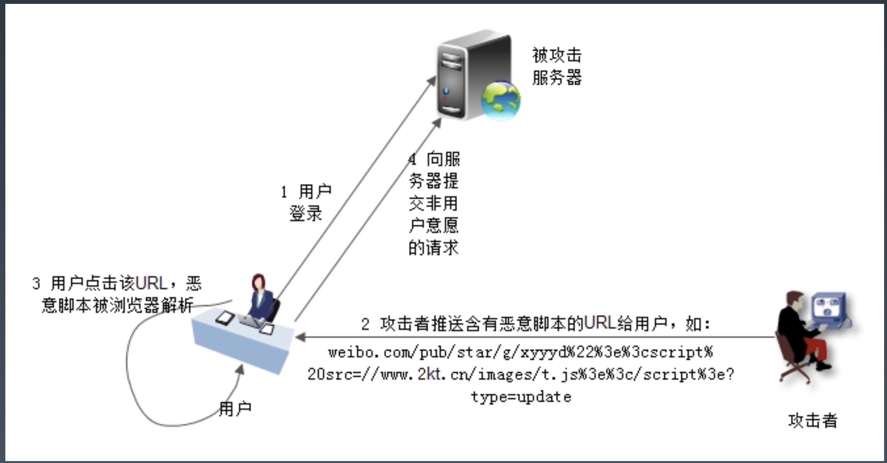

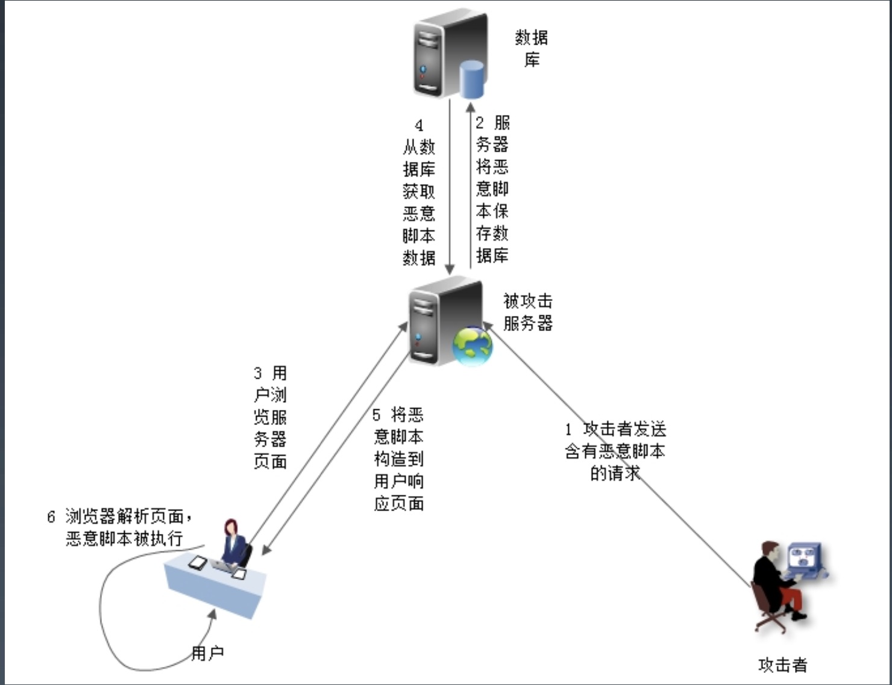
### XSS 攻击防御手段
消毒：XSS 攻击者一般都是通过在请求中嵌入恶意脚本达到攻击目的，这些脚本是一般
用户输入中不使用的，如果进行过滤和消毒处理，即对某些 HTML 危险字符转义，如
">" 转义为"&gt"，"<" 转移为"&lt"等，就可以防止大部分攻击。为了避免对不必要
的内容错误转义，如 "3<5"中的"<"，需要进行文本匹配后再转义，如"<img src=" 
这样的上下文中 "<" 才转义。事实上，消毒几乎是所有网站最必备的 XSS 防攻击手段。
### SQL 注入攻击
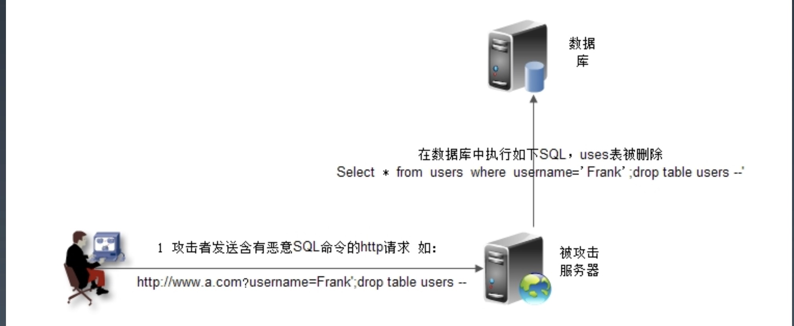
### 获取数据库表结构信息的手段
* 开源：如果网站采用开源软件搭建，如用 Discuz! 搭建论坛网站，那么网站数据库表结构
就是公开的，攻击者可以直接获得。
* 错误回显：如果网站开启错误回显，攻击者故意构造非法参数，服务端异常信息会输出
到浏览器端，为攻击猜测数据库表结构提供便利。
* 盲注：网站关闭错误回显，攻击者根据页面变化情况判断 SQL 语句的执行情况，据此猜测
数据库表结构，此种方式攻击难度较大。
### 注入攻击防御手段
* 消毒：和防 XSS 攻击一样，请求参数消毒是一种比较简单粗暴又有效的手段。通过正则匹配，
过滤请求数据中可能注入的 SQL 文。
如 "drop table", "\b(?:update\b.*?\bsetldelete\b\W*?\bfrom)\b" 等。

* SQL 预编译参数绑定：使用预编译手段，绑定参数是最好的防 SQL 注入方法。目前许多
数据访问层框架，如 myBatis，Hibernate 等，都实现 SQL 预编译和参数绑定，攻击
者的恶意 SQL 会被当做 SQL 的参数，而不是 SQL 命令被执行。
### CSRF 攻击
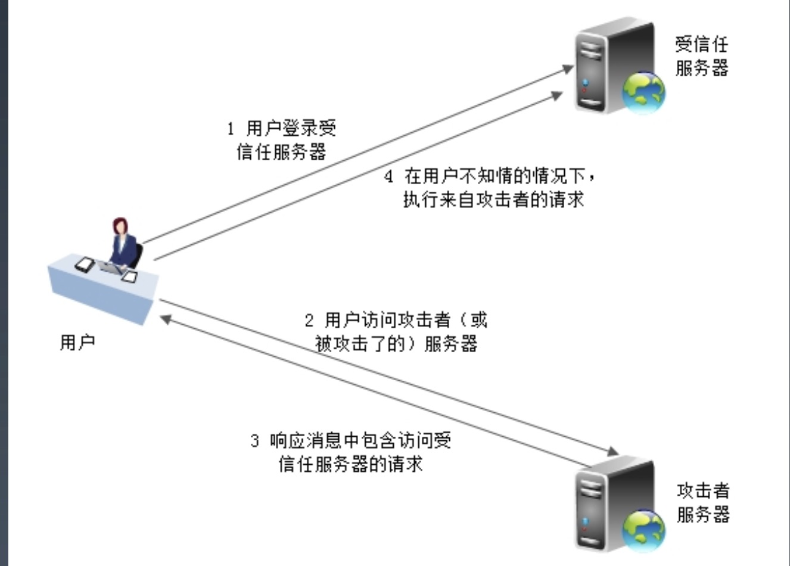
### CSRF 攻击防御手段
* 表单 Token: CSRF 是一个伪造用户请求的操作，所以需要构造用户请求的所有参数才可以。
表单 Token 就是阻止攻击者获得所有请求参数的可能，在页面表单中增加一个随机数 Token，
每次请求的 Token 都不相同，请求提交后检查 Token 的值是否正确以确定请求提交者是否合法。
* 验证码：相对说来，验证码则更加简单有效，即请求提交时，需要用户输入验证码，以
避免在用户不知情的情况下被攻击者伪造请求。但是输入验证码是一个糟糕的用户体验，
所以必要的时候才使用，如支付交易等关键页面。
* Referer check：HTTP 请求头的 referer 域中记录着请求来源，可通过检查请求来源，
验证其是否合法。但是该方法有一定的局限性，referer 也并不一定总能得到。
### 其他需要关注的攻击和漏洞
* Error Code：也称作错误回显，许多 Web 服务器默认是打开异常信息输出的，即服务器
端未处理的异常堆栈信息会直接输出到客户端浏览器，这种方式虽然对程序员调试和错误
报告有好处，但同时也给黑客造成可乘之机。通过故意制造非法输入，使系统运行时出错，
获得异常信息，从而寻找系统漏洞进行攻击。防御手段也很简单，通过配置 Web 服务器
参数，跳转 500 页面（HTTP 响应码 500 表示服务器内部错误）到专门的错误页面即可，
这个功能 Web 应用常用的 MVC 框架也可以做到。
* HTML 注释：为了程序调试方便或其他不恰当原因，有的时候程序开发人员会在 PHP、JSP
等服务器页面程序中使用 HTML 注释语法进行程序注释，这些 HTML 注释就会显示在客户端
浏览器，给黑客造成攻击便利。程序最终发布前需要进行代码 review 或自动扫描，避免 HTML
注释漏洞。
* 文件上传：一般网站都会有文件上传功能，设置头像、分享视频、上传附件等。如果上传的是
可执行的程序，并通过程序获得服务器端命令执行能力，那么攻击者几乎可以在服务器上为所欲为，
并以此为跳板攻击集群环境的其他机器。最有效的防御手段是设置上传文件白名单，只允许上传
可靠的文件类型。此外还可以修改文件名、使用专门的存储手段，保护服务器面受上传文件攻击。
* 路径遍历：攻击者的请求的 URL 中使用相对路径，遍历系统未开放的目录和文件。防御方法
主要是将 JavaScript，CSS 等资源文件独立服务器、独立域名，其他文件不使用静态 URL 
访问，动态参数不包含文件路径信息。
### Web 应用防火墙
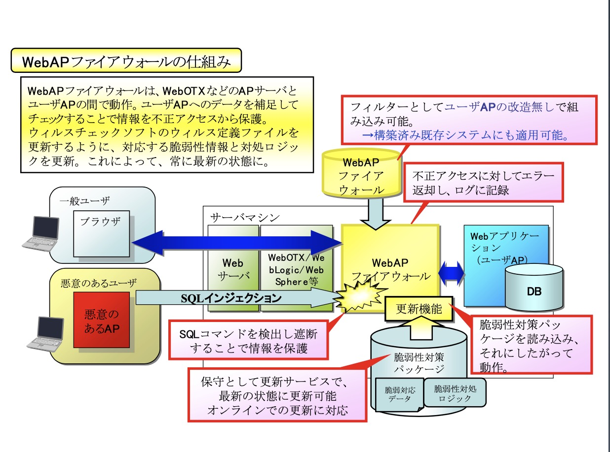
### 开源 Web 应用防火墙 ModSecurity
ModSecurity 是一个开源的 Web 应用防火墙，探测攻击并保护 Web 应用程序，既可以嵌入到
Web 应用服务器中，也可以作为一个独立的应用程序启动。ModSecurity 最早只是 Apache 的
一个模块，现在已经有 Java，.NET 多个版本，并支持 Nginx。

ModSecurity 采用处理逻辑与规则集合分离的架构模式。处理逻辑负责请求和响应的拦截过滤，
规则加载执行等功能。而规则集合则负责对具体的攻击的规则定义，模式识别、防御策略等功能。
处理逻辑比较稳定，规则集合需要不断针对漏洞进行升级，这是一种可扩展的架构设计。
### 网站安全漏洞扫描
和电脑安全漏洞扫描一样，网站也需要安全漏洞扫描。

网站安全漏洞扫描工具是根据内置规则，模拟黑客攻击行为，用以发现网站安全漏洞的工具。许多
大型网站的安全团队都有自己开发的漏洞扫描工具，不定期的对网站的服务器进行扫描，查漏补缺。

目前市场上也有很多商用的网站安全漏洞扫描平台。
### 信息加密技术及密钥安全管理
2011年12月被曝的 CSDN 密码泄露事故中，网站安全措施不力，导致用户数据库被黑客"拖库"
并不稀奇，令人错愕的是数据库中的用户密码居然是明文保存，导致密码泄露，成为地下黑市交易
的商品。

通常，为了保护网站的敏感数据，应用需要对这些信息进行加密处理，信息加密技术可分为三类：
单项散列加密，对称加密，非对称加密。

#### 单项散列加密
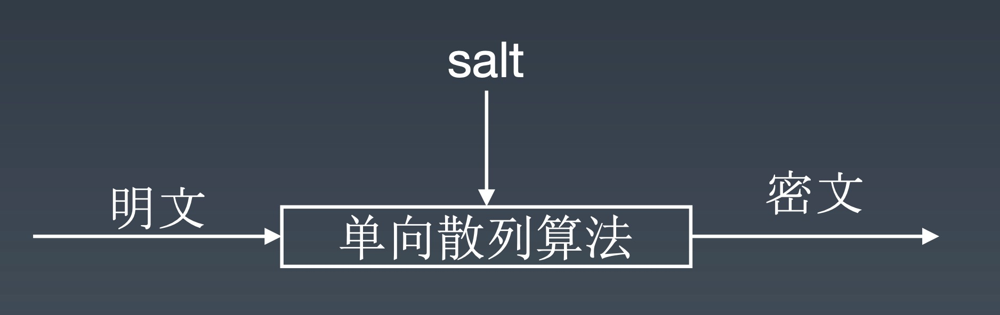

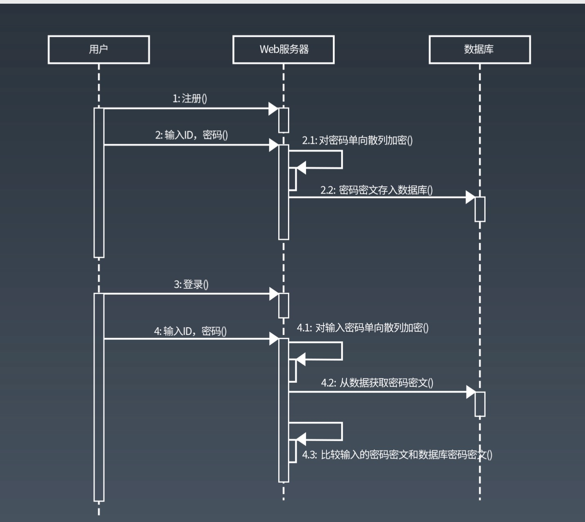

#### 对称加密
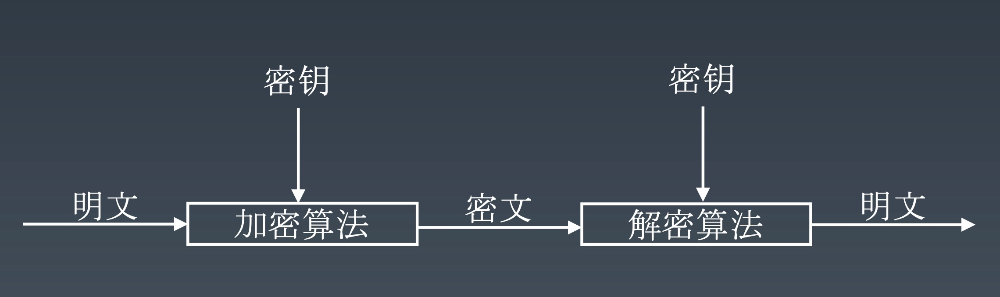
#### 非对称加密
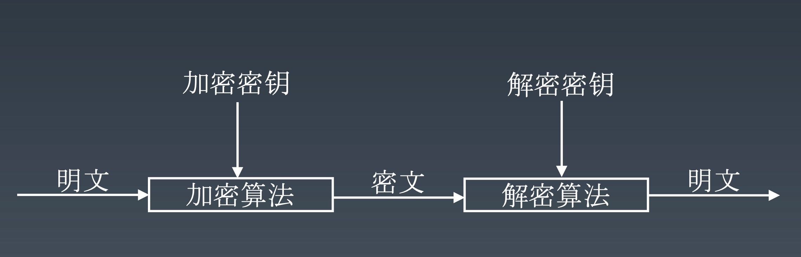
### 密钥安全管理与加解密服务系统架构
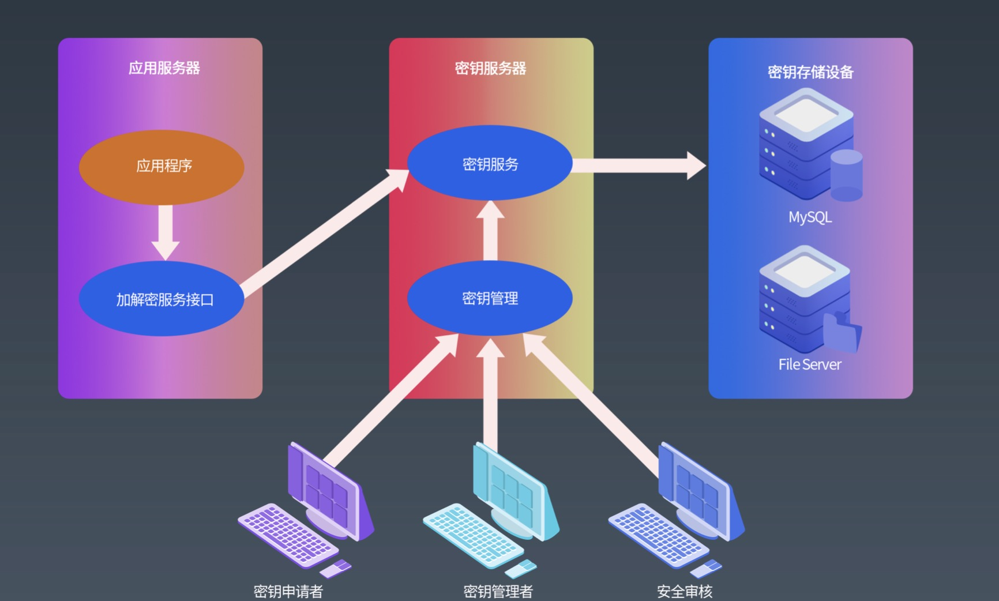
### 反垃圾邮件
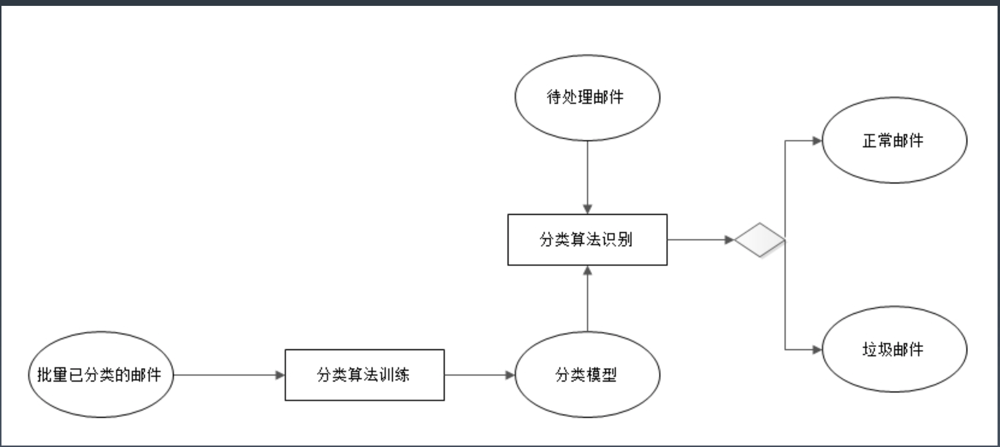
### 贝叶斯分类算法
贝叶斯算法解决概率论中的一个典型问题：一号箱子放有红色球和白色球各20个，二号箱子放有白色球10个，
红色球30个，现在随机挑选一个箱子，取出来一个球的颜色是红色的，请问这个球来自一号箱子的概率是多少。

利用贝叶斯算法进行垃圾邮件的识别基于同样的原理，根据已分类的样本信息获得一组特征值的概率（如"茶叶"
这个词出现在垃圾邮件中的概率和非垃圾邮件中的概率），就得到分类模型，然后对待处理信息提取特征值，结合
分类模型，判断其分类。

贝叶斯公式
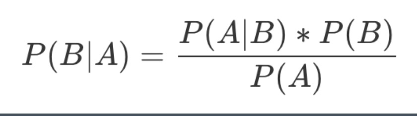

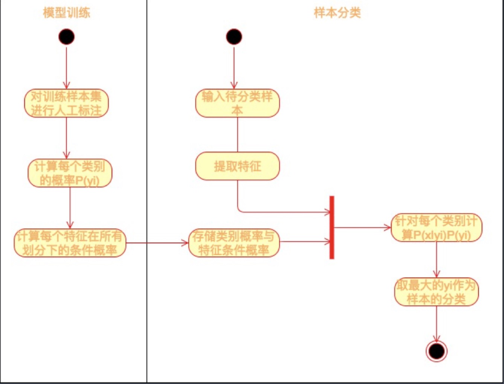

### 布隆过滤器黑名单
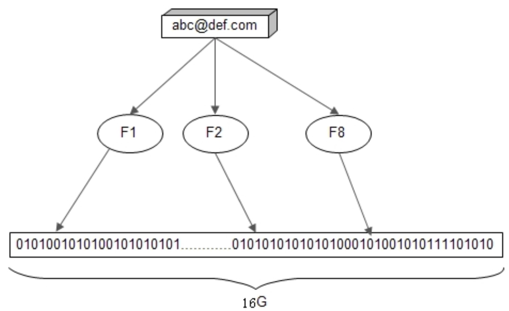
### 电子商务风险控制
电子商务网站在给人们代理购物交易的极大便利的同时，也将风险带给了对网络安全一无所知的人们。
由于买卖双方的信息不对等，交易本来就存在风险，而当交易在网上发生的时候，买卖双方彼此一无
所知，交易风险也就更加难以控制。如果一个电商网站骗子横行，诚信的交易者屡屡被骗，那么网站就
到了最危险的时候，可以说，交易安全是电子商务网站的底线。

电子商务网站有多种形式，B2B，B2C，C2C 每种交易的场景都不相同，风险点也各有特点，大致
可分为以下几种：
* 账户风险：包括账户被黑客盗用，恶意注册账号等几种形式
* 买家风险：买家恶意下单占用库存进行不正当竞争；黄牛利用促销抢购低价商品；此外还有良品
拒收，欺诈退款以及常见于 B2B 交易的虚假询盘等。
* 卖家风险：不良卖家进行恶意欺诈的行为，例如货不对板，虚假发货，炒作信用等，此外还有
发布违禁商品、侵权产品等。
* 交易风险：信用卡盗刷，支付欺诈，洗钱套现等。

大型电商网站都配备有专门的风控团队进行风险控制，风控的手段也包括自动和人工两种方式。
机器自动识别为高风险的交易和信息会发送给风控审核人员进行人工审核，机器自动风控的技术
和方法也不断通过人工发现的新风险类型进行逐步完善。

机器自动风控的技术手段主要有规则引擎和机器学习。

### 规则引擎
当交易的某些指标满足一定条件的时候，就会被认为具有高风险的欺诈可能性。比如：
* 用户来自欺诈高发地区
* 交易金额超过某个数值
* 和上次登录的地址距离差距很大
* 用户登录地与收货地不符
* 用户第一次交易
* ……

大型网站在运营过程中，结合业界的最新发现，会总结出数以千计的此类高风险交易规则。一种
方案是在业务逻辑中通过编程方式使用 if...else... 代码实现这些规则，可以想见，这些
代码会非常庞大，而且由于运营过程中不断发现新的交易风险类型，需要不断调整规则，代码也
需要不断修改。。。

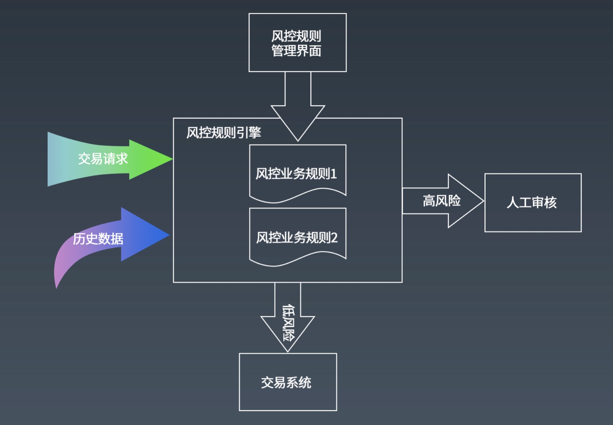
### 机器学习
规则引擎虽然技术简单，但是随着规则的主键增加，出现规则冲突，难以维护等情况，而且规则越多，
性能也越差。大型互联网应用更倾向于使用机器学习模型进行风控。
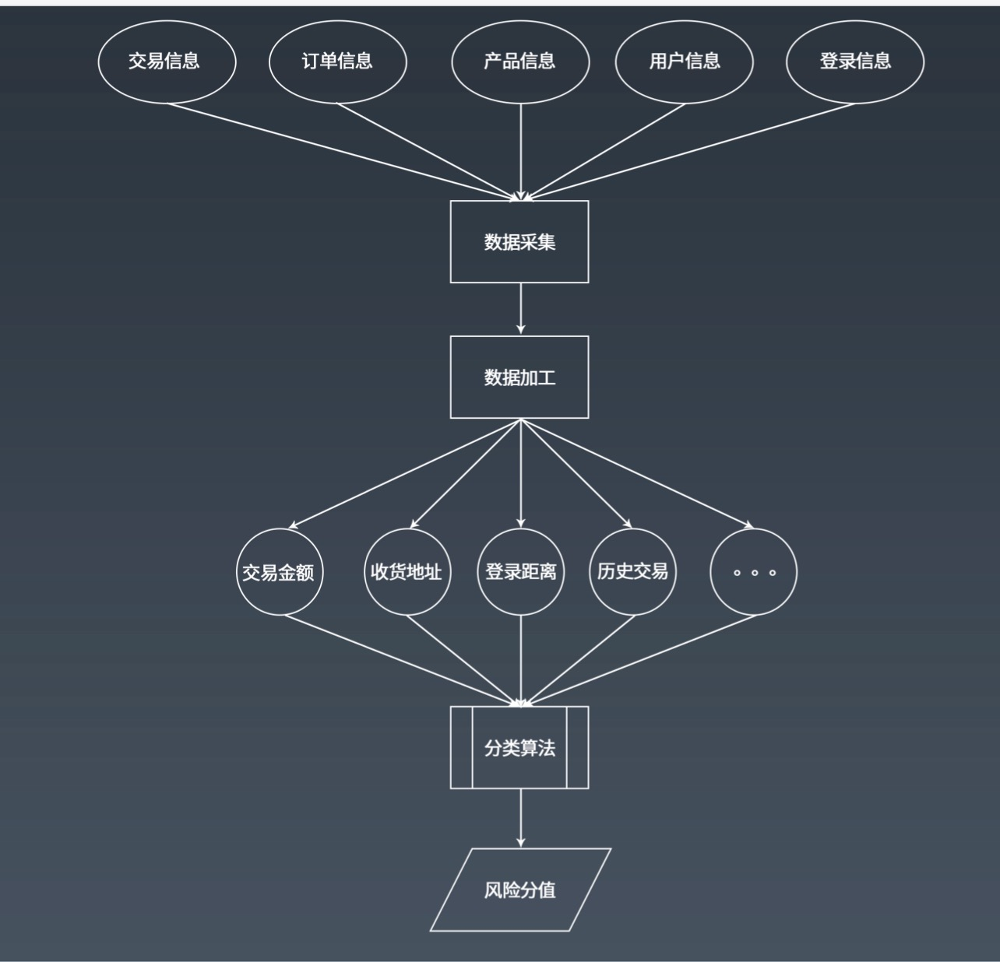
## 高可用系统的度量
### 可用性指标
业界通常用多少个 9 来衡量网站的可用性，如 QQ 的可用性是 4 个 9，即 QQ 服务 99.99% 可用，
这意味着 QQ 服务要保证其在所有运行时间中，只有 0.01% 的时间不可用，也就是一年中大约 53 分钟
不可用。

网站年度可用性指标 = ( 1 - 网站不可用时间/年度总时间) * 100%

网站不可用时间（故障时间）= 故障修复时间点 - 故障发现（报告）时间点

对可用性的定性描述，两个 9 是基本可用，年度停机时间小于 88 小时；3 个 9 较高可用，
年度停机时间小于 9 小时；4 个 9 是具有自动恢复能力的高可用，年度停机时间小于 53 分
钟；5 个 9 是极高可用性，年度停机时间小于 5 分钟。由于可用性影响因素很多，对于网站
整体而言，达到 4 个 9，乃至 5 个 9 的可用性，除了过硬的技术、大量的设备资金投入和
工程师的责任心，还要有个好运气。
### 故障分类管理
| 分类 | 描述 | 权重 |
| --- | --- | --- |
| 事故及故障 | 严重故障，网站整体不可用 | 100 |
| A 类故障 | 网站访问不顺畅，或核心功能不可用 | 20 |
| B 类故障 | 非核心功能不可用，或核心功能少数用户不可用 | 5 |
| C 类故障 | 以上故障以外的其他故障 | 1 |

### 故障处理流程及其考核
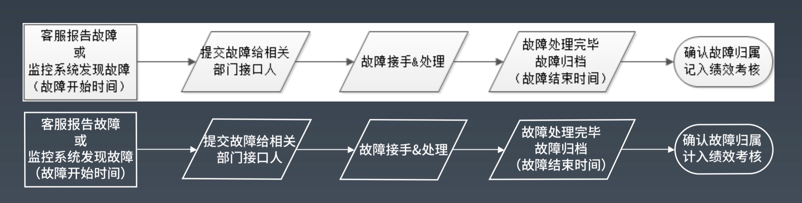
### 引起故障的原因
* 硬件故障
* 软件 bug
* 系统发布
* 并发压力
* 网络攻击
* 外部灾害
## 高可用系统的架构
### 解耦
* 高内聚、低耦合的组件设计原则
* 面向对象基本设计原则
* 面向对象设计模式
* 领域驱动设计建模
### 隔离
* 业务与子系统隔离
* 微服务与中台架构
* 生产者消费者隔离
* 虚拟机和容器隔离
### 异步
* 多线程编程
* 反应式编程
* 异步通信网络编程
* 事件驱动异步架构
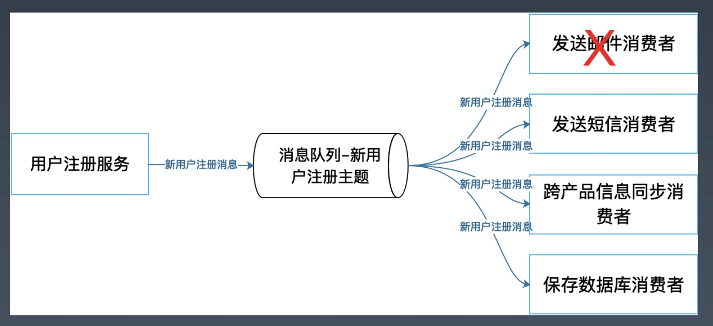
### 备份
* 集群设计
* 数据库复制
    * CAP 原理
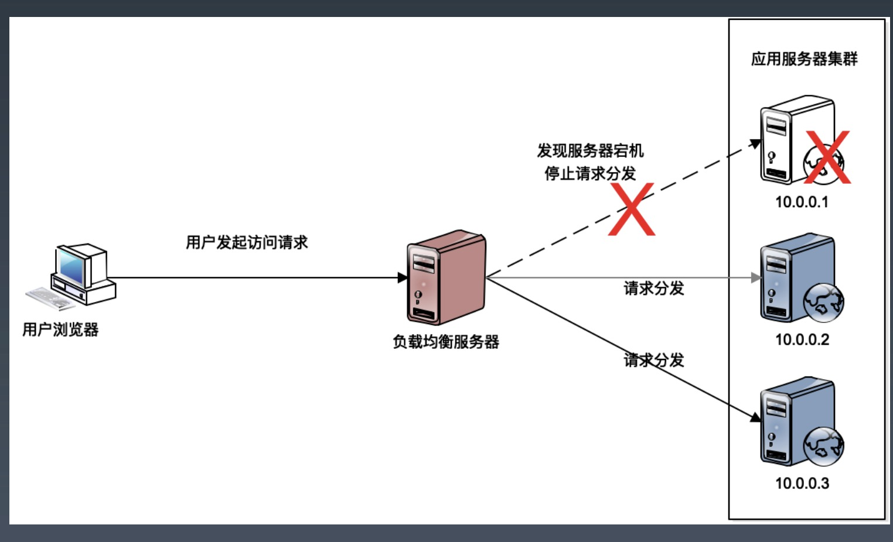
### Failover (失效转移)
数据库主主失效转移

负载均衡失效转移

如何确认失效，需要转移？

设计无状态的服务
### 幂等
应用调用服务失败后，会将调用请求重新发送到其他服务器，但是这个失败可能是虚假
的失败。比如服务已经处理成功，但是因为网络故障应用没有收到响应，这时应用重新
提交请求就导致服务重复调用，如果这个服务是一个转账操作，就会产生严重后果。

服务重复调用有时候是无法避免的，必须保证服务重复调用和调用一次产生的结果相同，
即服务具有幂等性。有些服务天然具有幂等性，比如将用户性别设置为男性，不管设置
多少次，结果都一样。但是对于交易等操作，问题就会比较复杂，需要通过交易编号等
信息进行服务调用有效性校验，只有有效的操作才继续执行。
### 事务补偿
传统事物的 ACID
* 原子性（Atomicity），一致性（Consistency），隔离性（Isolation，又称独立性）、
持久性（Durability）

分布式事务的 BASE
* 基本可用（Basic Availability）、软状态（Soft-state）、最终一致性（Eventual consistency）

事务补偿：通过执行业务逻辑逆操作，使事务回滚到事务前状态
### 重试
远程服务可能会由于线程阻塞、垃圾回收或者网络抖动，而无法及时返还响应，调用者
可以通过重试的方式修复单词调用的故障。
* 上游调用者超时时间要大于下游调用者超时时间之和

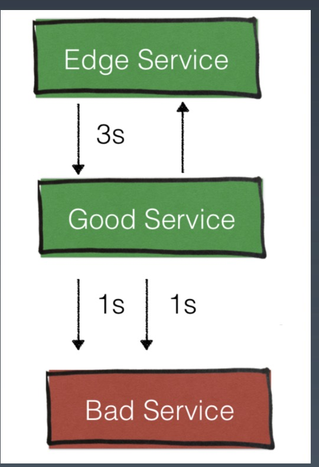

### 熔断
当某个服务出现故障，响应延迟或者失败率增加，继续调用这个服务会导致调用者请求
阻塞，资源消耗增加，进而出现服务级联失效，这种情况下使用断路器阻断对故障服务
的调用。
* 断路器三种状态：关闭、打开，半开
* Spring Cloud 断路器实现：Hystrix

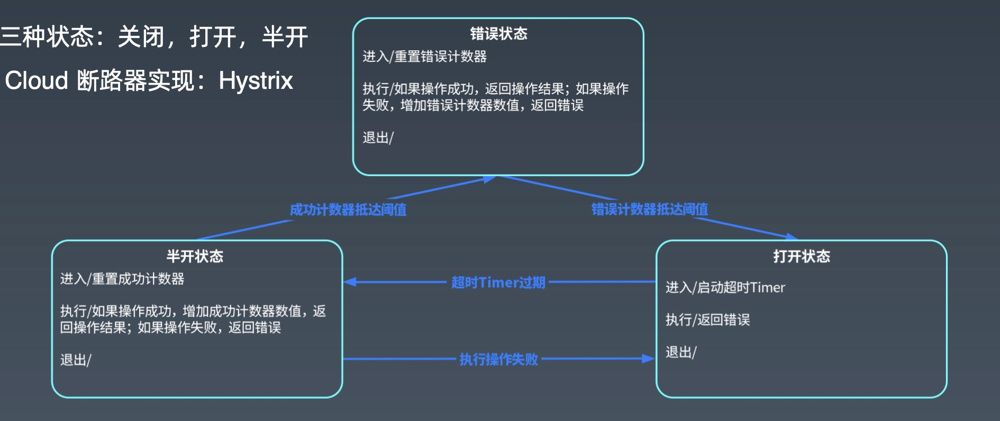

### 限流
在高并发场景下，如果系统的访问量超过了系统的承受能力，可以通过限流对系统进行
保护。限流是指对进入系统的用户请求进行流量限制，如果访问量超过了系统的最大处
理能力，就会丢弃一部分的用户请求，保证整个系统可用，保证大部分用户是可以访问
系统的。这样虽然有一部分用户的请求被丢弃，产生了部分不可用，但还是好过整个系
统崩溃，所有的用户都不可用要好。

限流的几种算法：
* 计数器算法（固定窗口，滑动窗口）
* 令牌桶算法
* 漏桶算法

#### 计数器（固定窗口）算法
使用计数器在周期内累加访问次数，当达到设定的限流值时，出发限流策略。下一个周期开始
时，进行清零，重新计数。
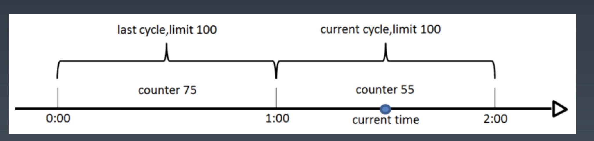

固定窗口算法的临界点问题：假设 1min 内服务器的负载能力为 100，因此一个周期的访问量
限制在 100，然而在第一个周期的最后 5 秒和下一个周期的开始 5 秒时间段内，分别涌入 100 的访问量，
虽然没有超过每个周期的限制量，但是整体上 10 秒内已经达到 200 的访问量，已远远超过服务器
的负载能力

#### 计数器（滑动窗口）算法
将时间周期分为 N 个小周期，分别记录每个小周期内访问次数，并且根据时间滑动删除过期
的小周期
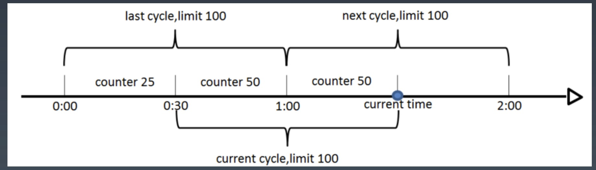

假设时间周期为 1min，将 1min 再分为 2 个小周期，统计每个小周期的访问数量，则可以
看到，第一个时间周期内，访问数量为 75，第二个访问周期内，访问数量为 100，超过
100 的访问则被限流掉了