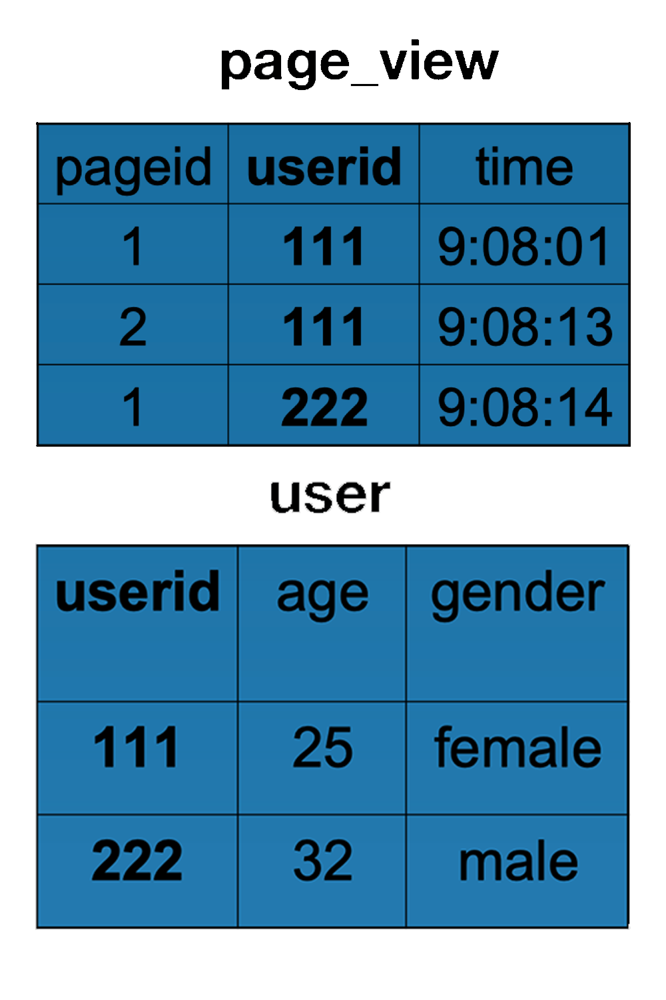

# Week12 课后作业

## 1. 在你所在的公司（行业、领域），正在用大数据处理哪些业务？可以用大数据实现哪些价值？

我所在的公司属于在线教育行业，目前正在使用大数据技术进行应用日志分析、用户画像分析、视频分析、音频分析等方面。

并且结合人工智能，在语音识别、英语口语打分、视频识别等方面有所应用。

另外还在进行数据中台建设。

大数据给公司的业务发展提供支撑，为运营提供数据统计分析、可视化等工具，为销售、老板提供数据报表，为老师提供学生数据分析等。

## 2. 分析如下 HiveQL，生成的 MapReduce 执行程序，map 函数输入是什么？输出是什么，reduce 函数输入是什么？输出是什么？

```sql
INSERT OVERWRITE TABLE pv_users
SELECT pv.pageid, u.age
FROM page_view pv
JOIN user u
ON (pv.userid = u.userid);
```

Page_view 表和 user 表结构与数据示例如下：



* map 函数的输入

  page_view

  | pageid | userid | time    |
  | ------ | ------ | ------- |
  | 1      | 111    | 9:08:01 |
  | 2      | 111    | 9:08:13 |
  | 3      | 222    | 9:08:14 |

  user

  | userid | age  | gender |
  | ------ | ---- | ------ |
  | 111    | 25   | female |
  | 222    | 32   | male   |

  

* map 函数的输出

  | key(userid) | value(<表的序号,pageid>) |
  | ----------- | ------------------------ |
  | 111         | <1,1>                    |
  | 111         | <1,2>                    |
  | 222         | <1,1>                    |

  | key(userid) | value(<表的序号,age>) |
  | ----------- | --------------------- |
  | 111         | <2,25>                |
  | 222         | <2,32>                |

  

*  reduce 函数的输入是map函数输出后进行 shuffle 的结果

  | key(userid) | value(<表的序号,pageid/age>) |
  | ----------- | ---------------------------- |
  | 111         | <1,1>                        |
  | 111         | <1,2>                        |
  | 111         | <2,25>                       |

  | key(userid) | value(<表的序号,pageid/age>) |
  | ----------- | ---------------------------- |
  | 222         | <1,1>                        |
  | 222         | <2,32>                       |

  

* reduce 函数的输出

  | pageid | age  |
  | ------ | ---- |
  | 1      | 25   |
  | 2      | 25   |
  | 1      | 32   |

  


