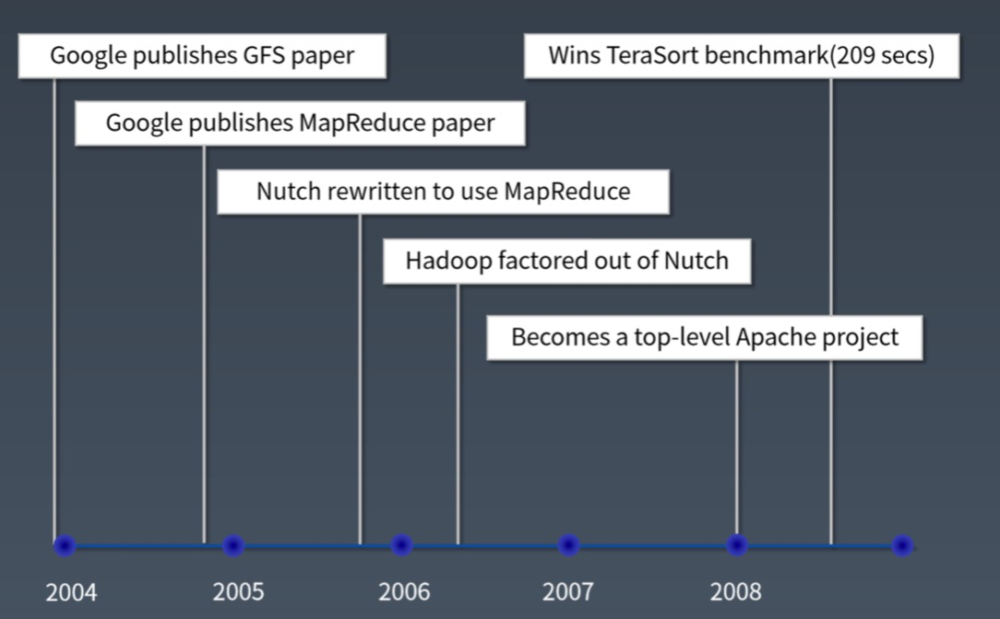

# Week12 总结
## 大数据概述
### 大数据技术发展史
今天我们常说的大数据技术，其实起源于 Google 在 2004 年前后发表的三篇论文，也就是
我们经常听到的大数据"三驾马车"，分别是分布式文件系统 GFS，大数据分布式计算框架 MapReduce
 和 NoSQL 数据库系统 BigTable
 
搜索引擎主要做两件事，一个是网页抓取，一个是索引构建和排序，而在这个过程中，有大量的
数据需要存储和计算。这"三驾马车"其实就是用来解决这个问题的，也就是，一个文件系统、
一个计算框架、一个数据库系统。

浏览下 Hadoop 代码，这个纯用 Java 编写的软件其实并没有什么高深的技术难点，使用的
也都是一些最基础的编程技巧，也没有什么出奇之处，但是它却给社会带来了巨大的影响，甚至
带动一场深刻的科技革命，推动了人工智能的发展与进步。

Lucene 开源项目的创始人 Doug Cutting 当时正在开发开源搜索引擎 Nutch，阅读了
Google 的论文后，根据论文原理初步实现了类似 GFS 和 MapReduce 的功能。

2006 年，Doug Cutting 将这些大数据相关的功能从 Nutch 中分离了出来，然后启动了
一个独立的项目专门开发维护大数据技术，这就是后来赫赫有名的 Hadoop，主要包括
Hadoop 分布式文件系统 HDFS 和大数据计算引擎 MapReduce

Hadoop 发布之后，Yahoo 首先用了起来。

大概又过了一年到 2007 年，百度和阿里巴巴也开始使用 Hadoop 进行大数据存储与计算。

2008 年， Hadoop 正式成为 Apache 的顶级项目，后来 Doug Cutting 本人也成为了
Apache 基金会的主席。自此，Hadoop 作为软件开发领域的一颗明星冉冉升起。

同年，专门运营 Hadoop 的商业公司 Cloudera 成立，Hadoop 得到了进一步的商业支持。

这个时候，Yahoo 的一些人觉得用 MapReduce 进行大数据编程太麻烦了，于是便开发了
Pig。Pig 是一种脚本语言，使用类 SQL 的语法，开发者可以用 Pig 脚本描述要对大数据
集上进行的操作，Pig 经过编译后会生成 MapReduce 程序，然后在 Hadoop 上运行。

编写 Pig 脚本虽然比直接 MapReduce 编程容易，但是依然需要学习新的脚本语法。于是
 Facebook 又发布了 Hive。Hive 支持使用 SQL 语法来进行大数据计算，比如说你可以
写个 Select 语句进行数据查询，然后 Hive 会把 SQL 语句转化成 MapReduce 的计算
程序。这样，熟悉数据库的数据分析师和工程师便可以无门槛地使用大数据进行数据分析
和处理了。

Hive 出现后极大程度地降低了 Hadoop 的使用难度，迅速得到开发者和企业的追捧。据说，
2011 年的时候，Facebook 大数据平台上运行的作业 90% 都来源于 Hive。

随后，众多 Hadoop 周边产品开始出现，大数据生态体系逐渐形成，其中包括：
* 专门将关系型数据库中的数据导入导出到 Hadoop 平台的 Sqoop；
* 针对大规模日志进行分布式收集、聚合和传输的 Flume
* MapReduce 工作流调度引擎 Oozie

