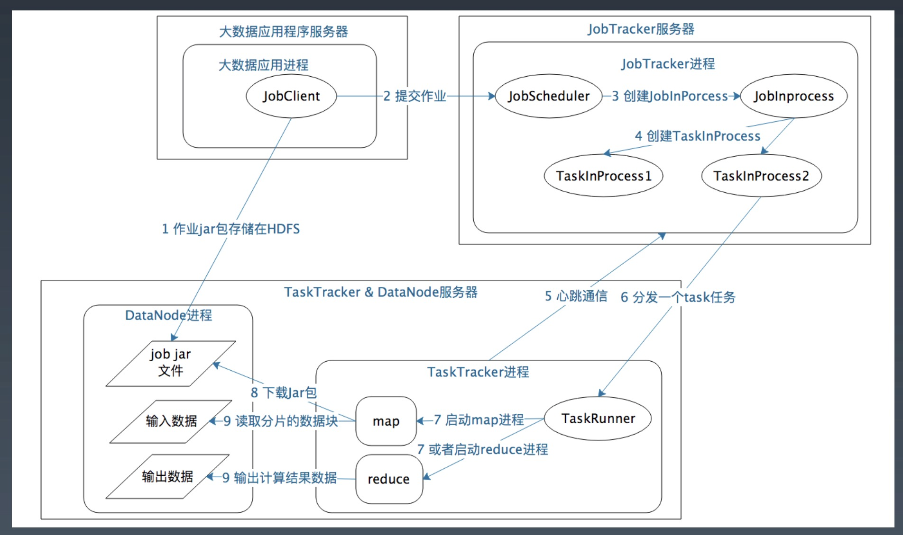

# Week12 总结
## 大数据概述
### 大数据技术发展史
今天我们常说的大数据技术，其实起源于 Google 在 2004 年前后发表的三篇论文，也就是
我们经常听到的大数据"三驾马车"，分别是分布式文件系统 GFS，大数据分布式计算框架 MapReduce
 和 NoSQL 数据库系统 BigTable

搜索引擎主要做两件事，一个是网页抓取，一个是索引构建和排序，而在这个过程中，有大量的
数据需要存储和计算。这"三驾马车"其实就是用来解决这个问题的，也就是，一个文件系统、
一个计算框架、一个数据库系统。

浏览下 Hadoop 代码，这个纯用 Java 编写的软件其实并没有什么高深的技术难点，使用的
也都是一些最基础的编程技巧，也没有什么出奇之处，但是它却给社会带来了巨大的影响，甚至
带动一场深刻的科技革命，推动了人工智能的发展与进步。

Lucene 开源项目的创始人 Doug Cutting 当时正在开发开源搜索引擎 Nutch，阅读了
Google 的论文后，根据论文原理初步实现了类似 GFS 和 MapReduce 的功能。

2006 年，Doug Cutting 将这些大数据相关的功能从 Nutch 中分离了出来，然后启动了
一个独立的项目专门开发维护大数据技术，这就是后来赫赫有名的 Hadoop，主要包括
Hadoop 分布式文件系统 HDFS 和大数据计算引擎 MapReduce

Hadoop 发布之后，Yahoo 首先用了起来。

大概又过了一年到 2007 年，百度和阿里巴巴也开始使用 Hadoop 进行大数据存储与计算。

2008 年， Hadoop 正式成为 Apache 的顶级项目，后来 Doug Cutting 本人也成为了
Apache 基金会的主席。自此，Hadoop 作为软件开发领域的一颗明星冉冉升起。

同年，专门运营 Hadoop 的商业公司 Cloudera 成立，Hadoop 得到了进一步的商业支持。

这个时候，Yahoo 的一些人觉得用 MapReduce 进行大数据编程太麻烦了，于是便开发了
Pig。Pig 是一种脚本语言，使用类 SQL 的语法，开发者可以用 Pig 脚本描述要对大数据
集上进行的操作，Pig 经过编译后会生成 MapReduce 程序，然后在 Hadoop 上运行。

编写 Pig 脚本虽然比直接 MapReduce 编程容易，但是依然需要学习新的脚本语法。于是
 Facebook 又发布了 Hive。Hive 支持使用 SQL 语法来进行大数据计算，比如说你可以
写个 Select 语句进行数据查询，然后 Hive 会把 SQL 语句转化成 MapReduce 的计算
程序。这样，熟悉数据库的数据分析师和工程师便可以无门槛地使用大数据进行数据分析
和处理了。

Hive 出现后极大程度地降低了 Hadoop 的使用难度，迅速得到开发者和企业的追捧。据说，
2011 年的时候，Facebook 大数据平台上运行的作业 90% 都来源于 Hive。

随后，众多 Hadoop 周边产品开始出现，大数据生态体系逐渐形成，其中包括：
* 专门将关系型数据库中的数据导入导出到 Hadoop 平台的 Sqoop；
* 针对大规模日志进行分布式收集、聚合和传输的 Flume
* MapReduce 工作流调度引擎 Oozie


在 Hadoop 早期，MapReduce 既是一个执行引擎，又是一个资源调度框架，服务器集群的资源调度管理由 MapReduce 自己完成。但是这样不利于资源复用，也使得 MapReduce 非常臃肿。于是一个新项目启动了，将 MapReduce 执行引擎和资源调度分离开来，这就是 Yarn。2012 年，Yarn 成为一个独立的项目开始运营，随后被各类大数据产品支持，成为大数据平台上最主流的资源调度系统。

同样是在 2012 年，UC 伯克利 AMP 实验室（Algorithms、Machine 和 People 的缩写）开发的 Spark 开始崭露头角。当时 AMP 实验室的马铁博士发现使用 MapReduce 进行机器学习计算的时候性能非常差，因为机器学习算法通常需要进行很多次的迭代计算，而 MapReduce 每执行一次 Map 和 Reduce 计算都需要重新启动一次作业，带来大量的无谓消耗。还有一点就是 MapReduce 主要使用磁盘作为存储介质，而 2012 年的时候，内存已经突破了容量和成本限制，成为数据运行过程中主要的存储介质。Spark 一经推出，立即受到业界的追捧，并逐步替代 MapReduce 在企业应用中的地位。

一般说来，像 MapReduce、Spark 这类计算框架处理的业务场景都被称为作业批处理计算，因为它们通常针对以”天“为单位产生的数据进行一次计算，然后得到需要的结果，这中间计算需要花费的时间大概是几十分钟甚至更长的时间。因为计算的数据是非在线得到的实时数据，而是历史数据，所以这类计算也被称为大数据离线计算。

而在大数据领域，还有另外一类应用场景，他们需要对实时产生的大量数据进行即时计算，比如对于遍布城市的监控摄像头进行人脸识别和嫌犯追踪。这类计算称为大数据流计算，相应地，有 Storm、Flink、Spark Streaming 等流计算框架来满足此类大数据应用的场景。流式计算要处理的数据是实时在线产生的数据，所以这类计算也被称为大数据实时计算。

NoSQL 系统处理的主要也是大规模海量数据的存储与访问，所以也被归为大数据技术。NoSQL 曾经在 2011 年左右非常火爆，涌现出 HBase、Cassandra 等许多优秀的产品，其中 HBase 是从 Hadoop 中分离出来的、基于 HDFS 的 NoSQL 系统。

上面这些基本上都可以归类为大数据引擎或者大数据框架。而大数据处理的主要应用场景包括数据分析、数据挖掘与机器学习。数据分析主要使用 Hive、Spark SQL 等 SQL 引擎完成；数据挖掘与机器学习则有专门的机器学习框架 TensorFlow、Mahout 以及 MLib 等，内置了主要的机器学习和数据挖掘算法。


### 大数据应用发展史

* 大数据应用的搜索引擎时代

  作为全球最大的搜索引擎公司，Google 也是我们公认的大数据鼻祖，它存储着全世界几乎所有访问的网页，数目可能超过万亿规模，全部存储起来大约需要数万块磁盘。为了将这些文件存储起来，Google 开发了 GFS （Google 文件系统），将数千台服务器上的数万块磁盘统一管理起来，然后当作一个文件系统，统一存储所有这些网页文件。

  Google 得到这些网页文件是要构建搜索引擎，需要对所有文件中的单词进行词频统计，然后根据 PageRank 算法计算网页排名。这中间，Google 需要对这数万块磁盘上的文件进行计算处理，也正是基于这些需求，Google 又开发了 MapReduce 大数据计算框架。

* 大数据应用的数据仓库时代

  曾经人们在进行数据分析与统计时，仅仅局限于数据库，在数据库的计算环境中对数据库中的数据表进行统计分析。并且受数据量和计算能力的限制，只能对最重要的数据进行统计和分析。这里所谓最重要的数据，通常指的都是给老板看的数据和财务相关的数据。

  而 Hive 可以在 Hadoop 上进行 SQL 操作，实现数据统计与分析。也就是说，可以用更低廉的价格获得比以往多得多的数据存储于计算能力。可以把运行日志、应用采集数据、数据库数据放到一起进行计算分析，获得以前无法得到的数据结果，企业的数据仓库也随之呈指数级膨胀。

  不仅是老板，公司中每个普通员工比如产品经理、运营人员、工程师，只要有数据访问权限，都可以提出分析需求，从大数据仓库中获得自己想要了解的数据分析结果。

* 大数据应用的数据挖掘时代

  很早以前商家就通过数据发现，买尿不湿的人通常也会买啤酒，于是精明的商家就把这两样商品放在一起，以促进销售。除了商品和商品有关系，还可以利用人和人之间的关系推荐商品。如果两个人购买的商品有很多都类似甚至相同的，不管这两个人天南海北相隔多远，他们一定有某种关系，比如可能有差不多的教育背景、经济收入、兴趣爱好。根据这种关系，可以进行关联推荐，让他们看到自己感兴趣的商品。

  大数据还可以将每个人身上不同特性挖掘出来，打上各种各样的标签：90 后、生活在一线城市、月收入 1~2 万、宅……这些标签组成了用户画像，并且只要这样的标签足够多，就可以完整描绘出一个人。除了商品销售，数据挖掘还可以用于人际关系挖掘。

* 大数据应用的机器学习时代

  人们很早就发现，数据中蕴藏着规律，这个规律是所有数据都遵循的，过去发生的事情遵循这个规律，将来要发生的事情也遵循这个规律。一旦找到这个规律，对于正在发生的事情，就可以按照这个规律进行预测。

  在过去，受数据采集、存储、计算能力的限制，只能通过抽样方式获取小部分数据，无法得到完整的、全局的、细节的规律。而现在有了大数据，可以把全部的历史数据都收集起来，统计其规律，进而预测正在发生的事情。

  这就是机器学习。

### 大数据应用领域

* 医学影像只能识别

  图像识别是机器学习获得的重大突破之一，使用大量的图片数据进行深度机器学习训练，机器可以识别出特定的图像元素，比如猫或者人脸，当然也可以识别出病理特征。

  比如 X 光片里的异常病灶位置，是可以通过机器学习智能识别出来的。甚至可以说医学影像只能识别在某些方面已经比一般医生拥有更高的读图和识别能力。

* 病历大数据智能诊疗

  病历，特别是专家写的病历，本身就是一笔巨大的知识财富，利用大数据技术将这些知识进行处理、分析、统计、挖掘，可以构成一个病历知识库，可以分享给更多人，即构成一个只能辅助诊疗系统。

  

* AI 外语老师

  得益于语音识别和语音合成技术的成熟（语音识别与合成技术同样是利用大数据技术进行机器学习与训练），一些在线教育网站尝试用人工智能外语老师进行外语教学。这里面的原理其实并不复杂，聊天机器人技术已经普遍应用，只要将学习的知识点设计进聊天过程中，就可以实现一个简单的 AI 外语老师了。

* 智能解题

  比较简单的只能解题系统其实是利用搜索引擎技术，在收集大量的试题以及答案的基础上，进行试题匹配，将匹配成功的答案返回。这个过程看起来就像智能做题一样，表面看给个题目就能解出答案，而实际上只是找到答案。

  进阶一点的只能解题系统，通过图像识别与自然语言处理（这两项技术依然使用大数据技术实现），进行相似性匹配。更改试题的部分数字、文字表述，但是不影响实质性解答思路，依然可以解答。

  高阶的智能解题系统，利用神经网络机器学习技术，将试题的自然语言描述转化成形式语言，然后分析知识点和解题策略，进行自动推到，从而完成实质性的解题。

* 舆情监控与分析

  编写数据爬虫，实时爬取各个社交新媒体上的各种用户内容和媒体信息，然后通过自然语言处理，就可以进行情感分析、热点事件追踪等。舆情实时监控可用于商业领域，引导智能广告投放；可用于金融领域，辅助执行自动化股票、期权、数据货币交易；可用于社会管理，及时发现可能引发社会问题的舆论倾向。

  在美国总统大选期间，候选人就曾雇佣大数据公司利用社交媒体的数据进行分析，发现选票可能摇摆的地区，有针对性前去进行竞选演讲。并利用大数据分析选民关注的话题，包装自己的竞选主张。Facebook 也因为授权大数据公司滥用自己用户的数据而遭到调查和谴责，市值蒸发了数百亿美元。

* 大数据风控

  在金融借贷中，如何识别出高风险用户，要求其提供更多抵押、支付更高利息、调整更低的额度，甚至拒绝贷款，从而降低金融机构风险？事实上，金融行业已经沉淀了大量的历史数据，利用这些数据进行计算，可以得到用户特征和风险指数的曲线（即风控模型）。当新用户申请贷款的时候，将该用户特征带入曲线进行计算，就可以得到该用户的风险指数，进而自动给出改用户的贷款策略。

* 新零售

  亚马逊 Go 无人店使用大量的摄像头，实时捕捉用户行为，判断用户取出还是放回商品、取了何种商品等。这实际上是大数据流计算与机器学习的结合，最终实现的购物效果是，无需排队买单，进去就拿东西，拿好了就走。

* 无人驾驶

  无人驾驶就是在人的驾驶过程中实时采集车辆周边数据和驾驶控制信息，然后通过机器学习，获得周边信息与驾驶方式的对应关系（自动驾驶模型）。然后将这个模型应用到无人驾驶汽车上，传感器获得车辆周边数据后，就可以通过自动驾驶模型计算出车辆控制信息（转向、刹车等）。计算自动驾驶模型需要大量的数据，所以我们看到，这些无人驾驶创业公司都在不断攀比自己的训练数据有几十万公里、几百万公里，因为训练数据的量意味着模型的完善程度。

## HDFS

### 常用 RAID 技术


### HDFS 系统架构


### 数据存储细节


### HDFS 设计目标

HDFS 以流式数据访问模式存储超大文件，运行于商用硬件集群上。

超大文件

流式数据访问

* 一次写入多次读取

商用硬件

### 不适合 HDFS 的场景

低延迟的数据访问

大量小文件

* 超过 NameNode 的处理能力

多用户随机写入修改文件

HDFS 为了做到可靠性（reliability）创建了多份数据块（data blocks）的复制（replicas），并将它们放置在服务器集群的计算节点中（compute nodes），MapReduce 就可以在它们所在的节点上处理这些数据了。


### 设计目标

假设：节点失效是常态

理想：

1. 任何一个节点失效，不影响 HDFS 服务
2. HDFS 可以自动完成副本的复制

### 文件

文件切分成块（默认大小 64M），以块为单位，每个块有多个副本存储在不同的机器上，副本数可在文件生成时指定（默认 3）

NameNode 是主节点，存储文件的元数据如文件名，文件目录结构，文件属性（生成时间，副本数，文件权限），以及每个文件的块列表以及块所在的 DataNode 等等

DataNode 在本地文件系统存储文件块数据，以及块数据的校验和

可以创建、删除、移动或重命名文件，当文件创建、写入和关闭之后不能修改文件内容。

### 分而治之（Divide and Conquer）


### NameNode

NameNode 是一个中心服务器，负责管理文件系统的名字空间（namespace）以及客户端对文件的访问。

文件操作，NameNode 负责文件元数据的操作，DataNode 负责处理文件内容的读写请求，跟文件内容相关的数据流不经过 NameNode，只会询问它跟哪个  DataNode 联系，否则 NameNode 会成为系统的瓶颈。

副本存放在哪些 DataNode 上由 NameNode 来控制，根据全局情况作出块放置决定，读取文件时 NameNode 尽量让用户先读取最近的副本，降低带宽消耗和读取时延。

NameNode 全权管理数据块的复制，它周期性地从集群中的每个 DataNode 接收心跳信号和块状态报告（Blockreport）。接收到心跳信号意味着该 DataNode 节点工作正常。块状态报告包含了一个该 DataNode 上所有数据块列表。

### DataNode

一个数据块在 DataNode 以文件存储在磁盘上，包括两个文件，一个是数据本身，一个是元数据，包括数据块的长度，块数据的校验和，以及时间戳。

DataNode 启动后向 NameNode 注册，通过后，周期性（1小时）的向 NameNode 上报所有的块信息。

心跳是每 3 秒一次，心跳返回结果带有 NameNode 给该 DataNode 的命令如复制块数据到另一台机器，或删除某个数据块。如果超过 10 分钟没有收到某个 DataNode 的心跳，则认为该节点不可用。

集群运行中可以安全加入和退出一些机器。

### HDFS 关键运行机制——高可用

一个名字节点和多个数据节点

数据复制（冗余机制）

* 存放的位置（机架感知策略）

故常检测

数据节点

* 心跳包（检查是否宕机）
* 块报告（安全模式下检测）
* 数据完整性检测（校验和比较）

名字节点（日志文件，镜像文件）

空间回收机制


### HDFS 如何写文件？


写一个数据块


* 使用 HDFS 提供的客户端开发库 Client，向远程的 NameNode 发起 RPC 请求；
* NameNode 会检查要创建的文件是否已经存在，创建者是否有权限进行操作，成功则会为文件创建一个记录，否则会让客户端抛出异常；
* 当客户端开始写入文件的时候，开发库会将文件切分成多个 packets，并在内部以数据队列 "data queue" 的形式管理这些 packets，并向 NameNode 申请新的 blocks，获取用来存储 replicas 的合适的 datanodes 列表，列表的大小根据在 NameNode 中对 replication 的设置而定。
* 开始以 pipeline （管道）的形式将 packet 写入所有的 replicas 中。开发库把 packet 以流的方式写入第一个 datanode，该 datanode 把该 packet 存储之后，再将其传递给在此 pipeline 中的下一个 datanode，直到最后一个 datanode ，这种写数据的方式呈流水线的形式。
* 最后一个 datanode 成功存储之后会返回一个 ack packet，在 pipeline 里传递至客户端，在客户端的开发库内部维护着”ack queue“，成功收到 datanode 返回的 ack packet 后会从”ack queue“移除响应的 packet
* 如果传输过程中，有某个 datanode 出现了故障，那么当前的 pipeline 会被关闭，出现故障的 datanode 会从当前的 pipeline 中移除，剩余的 block 会继续剩下的 datanode 中继续以 pipeline 的形式传输，同时 NameNode 会分配一个新的 datanode，保持 replicas 设定的数量。

### HDFS 如何读文件？


* 使用 HDFS 提供的客户端开发库 Client，向远程的 NameNode 发起 RPC 请求
* NameNode 会视情况返回文件的部分或者全部 block 列表，对于每个 block，NameNode 都会返回有该 block 拷贝的 DataNode 地址；
* 客户端开发库 Client 会选取离客户端最近的 DataNode 来读取 block；如果客户端本身就是 DataNode，那么将从本地直接获取数据
* 读取完当前 block 的数据后，关闭与当前的 DataNode 连接，并为读取下一个 block 寻找最佳的 DataNode
* 当读完列表的 block 后，且文件读取还没有结束，客户端开发库会继续向 NameNode 获取下一批的 block 列表
* 读取完一个 block 都会进行 checksum 验证，如果读取 DataNode 时出现错误，客户端会通知 NameNode，然后再从下一个拥有该 block 拷贝的 DataNode 继续读。

### 节点失效是常态

* DataNode 中的磁盘挂了怎么办？

  * DataNode 正常服务
  * 坏掉的磁盘上的数据尽快通知 NameNode

* DataNode 所在的机器挂了怎么办？

  * 问：NameNode 怎么知道 DataNode 挂掉了？
  * 答：DataNode 每 3 秒向 NameNode 发送心跳，如果 10 分钟 DataNode 没有向 NameNode 发送心跳，则 NameNode 认为该 DataNode 已经 dead，NameNode 将取出该 DataNode 上对应的 block，对其进行复制。

* NameNode 挂了怎么办？

  * 持久化元数据
    * 操作日志（edit log）
      * 记录文件创建，删除，修改文件属性等操作
    * Fsimage
      * 包含完整的命名空间
      * File -> Block 的映射关系
      * 文件的属性（ACL，quota，修改时间等）

  

* Client 挂了怎么办？

  * 问：Client 所在机器挂了有什么影响？
  * 答：一致性问题


### HDFS 一致性模型

* 文件创建以后，不保证在 NameNode 立即可见，即使文件刷新并存储，文件长度依然可能为 0；
* 当写入数据超过一个块后，新的 reader 可以看见第一个块，reader 不能看见当前正在写入的块
* HDFS 提供 sync() 方法强制缓存与数据节点同步，sync() 调用成功后，当前写入数据对所有 reader 可见且一致
* 调用 sync() 会导致额外的开销

### 副本摆放策略


### 压缩

减少存储所需的磁盘空间

加速数据在网络和磁盘上的传输

| 压缩格式 | Java 实现 | 原生实现 |
| -------- | --------- | -------- |
| DEFLATE  | 是        | 是       |
| gzip     | 是        | 是       |
| bzip2    | 是        | 否       |
| LZO      | 否        | 是       |

### SequenceFile


数据块 block

* 默认 64M，通常设置为 128M

* 可以在 hdfs-site.xml 中设置

  <property>

  ​	<name>dfs.block.size</name>

  ​	<value>134217728</value>

  </property>

NameNode 参数，在 hdfs-site.xml 中设置

* dfs.name.dir

<property>

​	<name>dfs.name.dir</name>

​	<value>/data0/name,/nfs/name</value>

​	<description>文件存储路径</description>

</property>

* dfs.replication

<property>

​	<name>dfs.replication</name> 

​	<value>3</value> 

​	<description>副本数</description>

</property>

DataNode 参数，在 hdfs-site.xml 中的设置

* dfs.data.dir

  <property>

  ​	<name>dfs.data.dir</name> 

  ​	<value>/data0/hdfs,/data1/hdfs</value> 

  ​	<description>数据存储目录</description>

  </property>

### Hadoop 文件系统

文件系统抽象（org.apache.hadoop）

* fs.FileSystem
* fs.LocalFileSystem
* hdfs.DistributedFileSystem 
* hdfs.HftpFileSystem
* hdfs.HsftpFileSystem
* fs.HarFileSystem

### Java 接口

通过 FileSystem API 读取数据

* Path 对象
  * hdfs://localhost:9000/user/tom/t.txt
* 获取 FileSystem 实例
  * publish static FileSystem get(Configuration conf) throws IOException
  * publish static FileSystem get(URI uri,Configuration conf) throws IOException
* 获取文件输入流
  * publish FSDataInputStream open(Path p) throws IOException 
  * publish abstract FSDataInputStream open(Path p,int bufferSize) throws IOException

## MapReduce

### MapReduce： 大规模数据处理

* 处理海量数据(> 1TB)
* 上百上千 CPU 实现并行处理

简单地实现以上目的

* 移动计算比移动数据更划算

分而治之

### MapReduce 特性

* 自动实现分布式并行计算
* 容错
* 提供状态监控工具
* 模型抽象简洁，程序员易用

### MapReduce

它由称为 map 和 reduce 的两部分用户程序组成，然后利用框架在计算机集群上面根据需求运行多个程序实例来处理各个子任务，然后再对结果进行归并。

### WordCount 举例

文本前期处理

strl_ist = str.replace('\n', '').lower().split(' ') 

count_dict = {}

如果字典里有该单词则加 1，否则添加入字典

for str in strl_ist:
 if str in count_dict.keys():

​	count_dict[str] = count_dict[str] + 1

 else:

​	count_dict[str] = 1


### MapReduce 的 WordCount

```java
public class WordCount {
  public static class TokenizerMapper
    extends Mapper<Object, Text, Text, IntWritable>{
    private final static IntWritable one = new IntWritable(1); 
    private Text word = new Text();
 		public void map(Object key, Text value, Context context
                   ) throws IOException,InterruptedException { 
      StringTokenizer itr = new StringTokenizer(value.toString()); 
      while (itr.hasMoreTokens()) {
        word.set(itr.nextToken());
        context.write(word, one); 
      }
    }
  }
  
  public static class IntSumReducer extends Reducer<Text,IntWritable,Text,IntWritable> {
   private IntWritable result = new IntWritable();
   public void reduce(Text key, Iterable<IntWritable> values, Context context
                     ) throws IOException, InterruptedException {
     int sum = 0;
     for (IntWritable val : values) {
       sum += val.get(); 
     }
     result.set(sum);
     context.write(key, result); 
   }
}
   public static void main(String[] args) throws Exception {
     Configuration conf = new Configuration(); //得到集群配置参数
     Job job = Job.getInstance(conf, "WordCount"); //设置到本次的 job 实例中
     job.setJarByClass(WordCount.class); //指定本次执行的主类是 WordCount
     job.setMapperClass(TokenizerMapper.class); //指定 map 类
     job.setCombinerClass(IntSumReducer.class); //指定 combiner 类
     job.setReducerClass(IntSumReducer.class); //指定 reducer 类
     job.setOutputKeyClass(Text.class);
     job.setOutputValueClass(IntWritable.class);
     FileInputFormat.addInputPath(job, new Path(args[0])); //指定输入数据的路径
     FileOutputFormat.setOutputPath(job, new Path(args[1])); //指定输出路径
     System.exit(job.waitForCompletion(true) ? 0 : 1); //指定 job 执行模式，等待任务执行完成后，提交任务的客户端才会退出！
   } 
}
```

 




适合 MapReduce 的计算类型

* TopK
* K-means
* Bayes
* SQL

不适合 MapReduce 的计算类型

* Fibonacci

### InputFormat

验证作业的输入的正确性

将输入文件切分成逻辑的 InputSplits，一个 InputSplit 将被分配给一个单独的 Mapper task 提供 RecordReader 的实现，这个 RecordReader 会从 InputSplit 中正确读出一条一条的 K - V 对供 Mapper 使用。


### FileInputFormat

得到分片的最小值 minSize 和最大值 maxSize，可以通过设置 mapred.min.split.size 和 mapred.max.split.size 来设置；

对于每个输入文件，计算 max(minSize, min(maxSize, blockSize));

如果 minSize <= blockSize <= maxSize, 则设为 blockSize

分片信息 <file, start,length,hosts>, 通过 hosts 实现 map 本地性

### OutputFormat

OutputFormat 接口决定了在哪里以及怎样持久化作业结果。

默认的 OutputFormat 就是 TextOutputFormat，它是一种以行分隔，包含制表符界定的键值对的文本文件格式。

### Partitioner

什么是 Partitioner

* Mapreduce 通过 Partitioner 对 Key 进行分区，进而把数据按照我们自己的需求来分发。

什么情况下使用 Partitioner

* 如果你需要 key 按照自己的意愿分发，那么你需要这样的组件。

* 框架默认的 HashPartitioner

* 例如：数据内包含省份，而输出要求每个省份输出一个文件

  ```java
  public int getPartition(K key, V value, int numReduceTasks) {
    return (key.hashCode() & Integer.MAX_VALUE) % numReduceTasks; 
  }
  ```

### 主要调度方法

单队列调度

* 特点：FIFO
* 优点：简单
* 缺点：资源利用率低

容量调度（ Capacity Scheduler，Hadoop-0.19.0 ）

* 特点：
  * 多队列，每个队列分配一定系统容量（Guaranteed Capacity）
  * 空闲资源可以被动态分配给负载重的队列
  * 支持作业优先级
* 作业选择：
  * 选择队列：资源回收请求队列优先；最多自由空间队列优先
  * 选择作业：按提交时间、优先级排队；检查用户配额；检查内存
* 优点：
  * 支持多作业并行执行，提高资源利用率
  * 动态调整资源分配，提高作业执行效率
* 缺点：
  * 队列设置和队列选择无法自动进行，用户需要了解大量系统信息

公平调度（Fair Scheduler，Hadoop-0.19.0）

* 目标：
  * 改善小作业的影响时间
  * 确保生产性作业的服务水平
* 特点：
  * 将作业分组——形成作业池（based on a configurable attribute，such as user name，unix group，...）
  * 给每个作业池分配最小共享资源（Minimum map slots, Minimum reduce slots）
  * 将多余的资源平均分配给每个作业
* 作业选择：
  * 优先调度资源小于最小共享资源的作业
  * 选择分配资源与所需资源差距最大的作业
* 优点：
  * 支持作业分类调度，使不同类型的作业获得不同的资源分配，提高服务质量
  * 动态调整并行作业数量，充分利用资源
* 缺点：
  * 不考虑节点的实际负载状态，导致节点负载实际不均衡

### JobTracker 内部实现

作业控制

* 作业抽象成三层：作业监控层（JIP)，任务控制层（TIP)，任务执行层。
* 任务可能会被尝试多次执行，每个任务实例被称作 Task Attempt（TA)
* TA 成功，TIP 会标注该任务成功，所有 TIP 成功，JIP 成功

资源管理

* 根据 TaskTracker 状态信息进行任务分配

### JobTracker 容错

JobTracker 失败，那么未完成 Job 失败；

通过 Job 日志，Job 可部分恢复。

### TaskTracker 容错

超时

* TaskTracker 10 分钟（mapred.tasktracker.expiry.interval）未汇报心跳，则将其从集群移除

灰名单，黑名单

* TaskTracker 上部署性能监控脚本
* 如果性能表现太差，被 JobTacker 暂停调度

### Task 容错

允许部分 Task 失败

* 允许失败的任务占比，默认 0， Mapred.max.map.failers.percent, mapred.max.reduce.failures.percent

Task 由 TIP 监控，失败任务多次尝试，慢任务启动备份任务

* 每次都是一个 TA （Task Attempt），最大允许尝试次数：mapred.map.max.attempts, mapred.reduce.max.attempts

### Record 容错

跳过导致Task 失败的坏记录

* K,V 超大，导致 OOM，配置最大长度，超出截断 mapred.linercordreader.maxlength
* 异常数据引发程序 bug，task 重试几次后，自动进入 skip mode，跳过导致失败的记录，mapred.skip.attempts.to.start.skipping

## Yarn

### YARN: Yet Another Resource Negotiator

下一代 MapReduce 框架的名称

不再是一个传统的 MapReduce 框架，甚至与 MapReduce 无关

一个通用的运行框架，用户可以编写自己的计算框架，在该运行环境中运行。

MapReduce 的架构，在 MapReduce 应用程序的启动过程中，最重要的就是要把 MapReduce 程序分发到大数据集群的服务器上，在 hadoop 1 中，这个过程主要是通过 TaskTracker 和 JobTracker 通信来完成。

这种架构方案的主要缺点是，服务器集群资源调度管理和 MapReduce 执行过程耦合在一起，如果想在当前集群中运行其他计算任务，比如 Spark 或者 Storm， 就无法统一使用集群中的资源了。

在 Hadoop 早期的时候，大数据技术就只有 Hadoop 一家，这个缺点并不明显。但随着大数据技术的发展，各种新的计算框架不断出现，我们不可能为每一种计算框架部署一个服务器集群，而且就算能部署新集群，数据还是在原来集群的 HDFS 上。所以我们需要把 MapReduce 的资源管理和计算框架分开，这也是 Hadoop 2 最主要的变化，就是将 Yarn 从 MapReduce 中分离出来，成为一个独立的资源调度框架。

MRv2 最基本的设计思想是将 JobTracker 的两个主要功能，即资源管理和作业管理分成两个独立的进程。

* 在该解决方案中包含两个组件：全局的 ResourceManager（RM) 和与每个应用相关的 ApplicationMaster （AM）
* 这里的”应用“指一个单独的 MapReduce 作业或者 DAG 作业

### Yarn 架构


Yarn 包括两个部分：

一个是资源管理器（Resource Manager），一个是节点管理器（Node Manager）

这也是 Yarn 的两种主要进程：ResourceManager 进程负责整个集群的资源调度管理，通常部署在独立的服务器上；NodeManager 进程负责具体服务器上的资源和任务管理，在集群的每一台计算服务器上都会启动，基本上跟   HDFS 的 DataNode 进程一起出现。

资源管理器又包含两个主要组件：调度器和应用程序管理器。

调度器其实就是一个资源分配算法，根据应用程序（Client）提交的资源申请核当前服务器集群的资源状况进行资源分配。Yarn 内置了几种资源调度算法，包括 Fair Scheduler、Capacity Scheduler 等，你也可以开发自己的资源调度算法供 Yarn 调用。

Yarn 进行资源分配的单位是容器（Container），每个容器包含了一定量的内存、CPU等计算资源，默认配置下，每个容器包含一个 CPU 核心。容器由 NodeManager 进程启动和管理，NodeManager 进程会监控本节点上容器的运行状况并向 ResourceManager 进程汇报。

应用程序管理器负责应用程序的提交、监控应用程序运行状态等。应用程序启动后需要在集群中运行一个 ApplicationMaster，ApplicationMaster 也需要运行在容器里面。每个应用程序启动后都会先启动自己的 ApplicationMaster，由 ApplicationMaster 根据应用程序的资源需求进一步向 ResourceManager 进程申请容器资源，得到容器以后就会分发自己的应用程序代码到容器上启动，进而开始分布式计算。

### Yarn 的工作流程（MapReduce 为例）

1. 我们向 Yarn 提交应用程序，包括 MapReduce ApplicationMaster、我们的 MapReduce 程序，以及 MapReduce Application 启动命令。
2. ResourceManager 进程和 NodeManager 进程通信，根据集群资源，为用户程序分配第一个容器，并将 MapReduce ApplicationMaster 分发到这个容器上面，并在容器里面启动 MapReduce ApplicationMaster。
3. MapReduce ApplicationMaster 启动后立即向 ResourceManager 进程注册，并未自己的应用程序申请容器资源。
4. MapReduce ApplicationMaster 申请到需要的容器后，立即和相应的 NodeManager 进程通信，将用户 MapReduce 程序分发到 NodeManager 进行所在的服务器，并在容器中运行，运行的就是 Map 或者 Reduce 任务。
5. Map 或者 Reduce 任务在运行期和 MapReduce ApplicationMaster 通信，汇报自己的运行状态，如果运行结束，MapReduce ApplicationMaster 向 ResourceManager 进程注销并释放所有的容器资源。

## Hive


```sql
 hive> CREATE TABLE pokes (foo INT, bar STRING); hive> SHOW TABLES;
hive> ALTER TABLE pokes ADD COLUMNS (new_col INT); hive> DROP TABLE pokes;
hive> LOAD DATA LOCAL INPATH './examples/files/kv1.txt' OVERWRITE INTO TABLE pokes;
hive> SELECT a.foo FROM invites a WHERE a.ds='2008-08-15';
```

### Hive 架构


### Hive 执行流程

* 操作符（Operator）是 Hive 的最小处理单元
* 每个操作符处理代表 HDFS 操作或 MR 作业
* 编译器把 Hive SQL 转换成一组操作符


### Hive 编译器


### Example Query (Filter)

Filter status updates containing ‘michael jackson’

* SELECT * FROM status_updates WHERE status LIKE ‘michael jackson’


### Example Query (Aggregation)

Figure out total number of status_updates in a given day

* SELECT COUNT(1) FROM status_updates WHERE ds = ’2009-08-01’

### Facebook


### Example Query (multi-group-by)

```sql
FROM (SELECT a.status, b.school, b.gender FROM status_updates a JOIN profiles b
ON (a.userid = b.userid and a.ds='2009-03-20' )
      ) subq1
INSERT OVERWRITE TABLE gender_summary
PARTITION(ds='2009-03-20') SELECT subq1.gender, COUNT(1)
GROUP BY subq1.gender
INSERT OVERWRITE TABLE school_summary PARTITION(ds='2009-03-20')
SELECT subq1.school, COUNT(1) GROUP BY subq1.school
```


## Hive Metastore

### Single User Mode (Default)


### Multi User Mode


### Remote Server


### Hive QL – Join

```sql
INSERT OVERWRITE TABLE pv_users SELECT pv.pageid, u.age
FROM page_view pv
JOIN user u
ON (pv.userid = u.userid);
```

### Hive QL – Join in Map Reduce


### Join Optimizations

Map Joins

* User specified small tables stored in hash tables on the mapper backed by jdbm
* No reducer needed

```sql
INSERT INTO TABLE pv_users
SELECT /*+ MAPJOIN(pv) */ pv.pageid, u.age FROM page_view pv JOIN user u
ON (pv.userid = u.userid);
```

### Hive QL – Map Join


