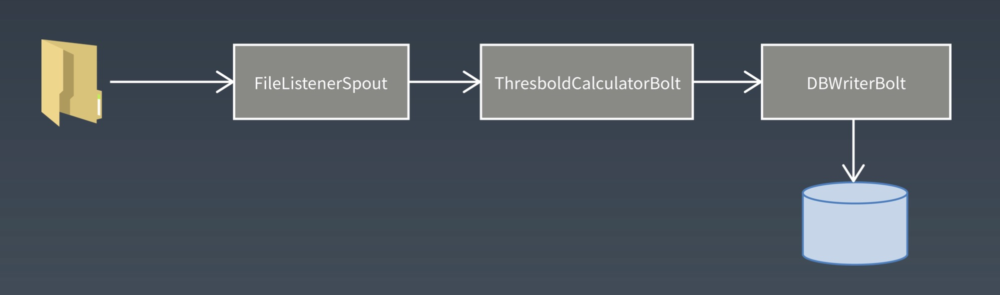

# Week13 总结

## Spark

### Spark 生态体系


### Spark vs Hadoop


### Spark 特点（ Spark 为什么更快）

DAG 切分的多阶段计算过程更快速

使用内存存储中间计算结果更高效

RDD 的编程模型更简单

### Spark WordCount 编程示例

```scala
val textFile = sc.textFile("hdfs://...")
val counts = textFile.flatMap(line => line.split(" "))
						.map(word => (word,1))
						.reduceByKey(_+_)
counts.saveAsTextFile("hdfs://...")
```

第 1 行代码：根据 HDFS 路径生成一个输入数据 RDD

第 2 行代码：在输入数据 RDD 上执行 3 个操作，得到一个新的 RDD

* 将输入数据的每一行文本用空格拆分成单词
* 将每个单词进行转换，word => (word,1) 生成的结构
* 相同的 key 进行统计，统计方式是对 value 求和，( _ + _ )

第 3 行代码：将这个 RDD 保存到 HDFS

### 作为编程模型的 RDD

RDD 是 Spark 的核心概念，是弹性数据集（Resilient Distributed Datasets）的缩写。RDD 既是 Spark 面向开发者的编程模型，又是 Spark 自身架构的核心元素。

作为 Spark 编程模型的 RDD。我们知道，大数据计算就是在大规模的数据集上进行一系列的数据计算处理。MapReduce 针对输入数据，将计算过程分为两个阶段，一个 Map 阶段，一个 Reduce 阶段，可以理解成是面向过程的大数据计算。我们在用 MapReduce 编程的时候，思考的是，如何将计算逻辑用 Map 和 Reduce 两个阶段实现，map 和 reduce 函数的输入和输出是什么，MapReduce 是面向过程的。

而 Spark 则直接针对数据进行编程，将大规模数据集合抽象成一个 RDD 对象，然后在这个 RDD 上进行各种计算处理，得到一个新的 RDD，继续计算处理，直到得到最后的结果数据。所以 Spark 可以理解成是面向对象的大数据计算。我们在进行 Spark 编程的时候，思考的是一个 RDD 对象需要经过什么样的操作，转换成另一个 RDD 对象，思考的重心和落脚点都在 RDD 上。

WordCount 的代码示例里，第 2 行代码实际上进行了 3 次 RDD 转换，每次转换都得到一个新的 RDD，因为新的 RDD 可以继续调用 RDD的转换函数，所以连续写成一行代码。事实上，可以分成 3 行。

```scala
val rdd1 = textFile.flatMap(line => line.split(" "))
val rdd2 = rdd1.map(word => (word,1))
val rdd3 = rdd2.reduceByKey(_+_)
```

RDD 上定义的函数分为两种，一种是转换（transformation）函数，这种函数的返回值还是 RDD；另一种是执行（action）函数，这种函数不再返回 RDD。

RDD 定义了很多转换操作函数，比如有计算 map(func)、过滤 filter(func)、合并数据集 union(otherDataset)、根据 key 聚合 reduceByKey(func,[numPartitions])、连接数据集 join(otherDataser,[numPartitions])、分组 groupByKey([numPartitions]) 等十几个函数。

### 作为数据分片的 RDD

跟 MapReduce 一样，Spark 也是对大数据进行分片计算，Spark 分布式计算的数据分片、任务调度都是以 RDD 为单位展开的，每个 RDD 分片都会分配到一个执行进程去处理。

RDD 上的转换操作又分成两种，一种转换操作产生的 RDD 不会出现新的分片，比如 map、filter 等，也就是说一个 RDD 数据分片，经过 map 或者 filter 转换操作后，结果还在当前分片。就像你用 map 函数对每个数据加 1，得到的还是这样一组数据，只是值不同。实际上，Spark 并不是按照代码写的操作顺序去生成 RDD，比如 rdd2 = rdd1.map(func)

这样的代码并不会在物理上生成一个新的 RDD。物理上，Spark 只有在产生新的 RDD 分片时候，才会真的生成一个 RDD，Spark 的这种特性也被称作惰性计算。

另一种转换操作产生的 RDD 则会产生新的分片，比如 reduceByKey，来自不同分片的相同 key 必须聚合在一起进行操作，这样就会产生新的 RDD 分片。然而，实际执行过程中，是否会产生新的 RDD 分片，并不是根据转换函数名就能判断出来的。


### Spark 的计算阶段

和 MapReduce 一个应用一次只运行一个 map 和一个 reduce 不同，Spark 可以根据应用的复杂程度，分割成更多的计算阶段（stage），这些计算阶段组成一个有向无环图 DAG，Spark 任务调度器可以根据 DAG 的依赖关系执行计算阶段。


这个 DAG 对应的 Spark 程序伪代码如下

```scala
rddB = rddA.groupBy(key)
rddD = rddC.map(func) 
rddF = rddD.union(rddE) 
rddG = rddB.join(rddF)
```

整个应用被切分成 3 个阶段，阶段 3 需要依赖阶段 1 和阶段 2，阶段 1 和阶段 2 互不依赖。Spark 在执行调度的时候，先执行阶段 1 和阶段 2，完成以后，再执行阶段 3。如果有更多的阶段，Spark 的策略也是一样的。只要根据程序初始化好 DAG，就建立了依赖关系，然后根据依赖关系顺序执行各个计算阶段，Spark 大数据应用的计算就算完成了。

Spark 作业调度执行的核心是 DAG，有了 DAG，整个应用就被切分成哪些阶段，每个阶段的依赖关系也就清楚了。之后再根据每个阶段要处理的数据量生成响应的任务集合（TaskSet），每个任务都分配一个任务进程去处理，Spark 就实现了大数据的分布式计算。

负责 Spark 应用 DAG 生成和管理的组件是 DAGScheduler，DAGScheduler 根据程序代码生成 DAG，然后将程序分发到分布式计算集群，按计算阶段的先后关系调度执行。

那么 Spark 划分计算阶段的依据是什么呢？显然并不是 RDD 上的每个转换函数都会生成一个计算阶段，比如上面的例子有 4 个转换函数，但是只有 3 个阶段。

当 RDD 之间的转换连接线呈现多对多交叉连接的时候，就会产生新的阶段。一个 RDD 代表一个数据集，图中每个 RDD 里面都包含多个小块，每个小块代表 RDD 的一个分片。

Spark 也需要通过 shuffle 将数据进行重新组合，相同 key 的数据放在一起，进行聚合、关联等操作，因而每次 shuffle 都产生新的计算阶段。这也是为什么计算阶段会有依赖关系，它需要的数据来源于前面一个或多个计算阶段产生的数据，必须等待前面的阶段执行完毕才能进行 shuffle，并得到数据。

计算阶段划分的依据是 shuffle，不是转换函数的类型，有的函数有时候有shuffle，有时候没有。例子中 RDD B 和 RDD F 进行 join，得到 RDD G，这里的 RDD F 需要进行 shuffle，RDD B 就不需要。


### Spark 的作业管理

Spark 里面的 RDD 函数有两种，一种是转换函数，调用以后得到的还是一个 RDD，RDD 的计算逻辑主要通过转换函数完成。

另一种是 action 函数，调用以后不再返回 RDD。比如 count() 函数，返回 RDD 中数据的元素个数；saveAsTextFile(path)，将 RDD 数据存储到 path 路径下。Spark 的 DAGScheduler 在遇到 shuffle 的时候，会生成一个计算阶段，在遇到 action 函数的时候，会生成一个作业（job）。

RDD 里面的每个数据分片，Spark 都会创建一个计算任务去处理，所以一个计算阶段会包含很多个计算任务（task）。


### Spark 的执行过程

Spark 支持 Standalone、Yarn、Mesos、Kubernetes 等多种部署方案，几种部署方案原理也都一样，只是不同组件角色命名不同，但是核心功能和运行流程都差不多。


首先，Spark 应用程序启动在自己的 JVM 进程里，即 Driver 进程，启动后调用 SparkContext 初始化执行配置和输入数据。SparkContext 启动 DAGScheduler 构造执行的 DAG 图，切分成最小的执行单位也就是计算任务。

然后 Driver 向 Cluster Manager 请求计算资源，用于 DAG 的分布式计算。Cluster Manager 收到请求以后，将 Driver 的主机地址等信息通知给集群的所有计算节点 Worker。

Worker 收到信息以后，根据 Driver 的主机地址，跟 Driver 通信并注册，然后根据自己的空闲资源向 Driver 通报自己可以领用的任务数。Driver 根据 DAG 图开始向注册的 Worker 分配任务。

Worker 收到的任务后，启动 Executor 进程开始执行任务。Executor 先检查自己是否有 Driver 的执行代码，如果没有，从 Driver 下载执行代码，通过 Java 反射加载后开始执行。

## 流计算

### Storm 实时的 Hadoop

实时计算系统

* 低延迟
* 高性能
* 分布式
* 可伸缩
* 高可用

### Storm 的基本概念


* Nimbus : 负责资源分配和任务调度。
* Supervisor ：负责接受 Nimbus 分配的任务，启动和停止属于自己管理的 Worker 进程。
* Worker ： 运行具体处理组件逻辑的进程。
* Task ： Worker 中每一个 Spout/Bolt 的线程称为一个 Task

Topology : Storm 中运行一个实时应用程序，因为各个组件间的消息流动形成逻辑上的一个拓扑结构。

Spout : 在一个 Topology 中产生源数据流的组件。通常情况下 Spout 会从外部数据源中读取数据，然后转换为 Topology 内部的源数据。Spout 是一个主动的角色，其接口中有个 nextTuple() 函数，Storm 框架会不停地调用此函数，用户只要在其中生成源数据即可。

Bolt ：在一个 Topology 中接受数据然后执行处理的组件。Bolt 可以执行过滤、函数操作、合并、写数据库等任何操作。Bolt 是一个被动角色，其接口中有个 execute(Tuple input) 函数，在接受到消息后会调用此函数，用户可以在其中执行自己想要的操作。

Tuple：一次消息传递的基本单元。本来应该是一个 key-value 的 map，但是由于各个组件间传递的 tuple 的字段名称已经事先定义好，所以 tuple 中只要按需填入各个 value 就行了，所以就是一个 value list

Stream ： 源源不断传递的 tuple 就组成了 stream


### Stream Groupings

Stream Grouping 定义了一个流在 Bolt 任务间改如何被切分。这里有 Storm 提供的 6 个 Stream Grouping 类型：

* 随机分组（shuffle gouping）：随机分发 tuple 到 Bolt 的任务，保证每个任务获得相等数量的 tuple
* 字段分组（Fields gouping）：根据指定字段分割数据流，并分组。例如，根据”user-id“字段，相同的”user-id“的元组总是分发到同一个任务，不同”user-id“的元组可能分发到不同的任务
* 全部分组（All grouping）：tuple 被复制到 Bolt 的所有任务。这种类型需要谨慎使用。
* 全局分组（Global grouping）：全部流都分配到 Bolt 的同一个任务。明确地说，是分配给 ID 最小的那个 Task。
* 无分组（None grouping）：你不需要关心流是如何分组。目前，无分组等效于随机分组。但最终，Storm 将把无分组的 Bolts 放到 Bolts 或 Spouts 订阅它们的统一线程去执行（如果可能）。
* 直接分组（Direct grouping）：这是一个特别的分组类型。元组生产者决定 tuple 由哪个元组处理者任务接收。
* 当然还可以实现 CustomStreamGrouping 接口来定制自己需要的分组。

### example

当车辆超越 80 公里每小时，则记录。

使用的一个类型日志，其中包含车辆数据信息有：车牌号、车辆行驶的速度以及数据获取的位置。


### topology



### Spout


### Bolt


### Storm 应用场景（淘宝）

Storm 被广泛用来进行实时日志处理，出现在实时统计、实时风控、实时推荐等场景中。一般来说，我们从类 Kafka 的 metaq 或者基于 HBase 的 TimeTunnel 中读取实时日志消息，经过一系列处理，最终将处理结果写入到一个分布式存储中，提供给应用程序访问。我们每天的实时消息量从几百万到几十亿不等，数据总量达到 TB 级。对于我们来说，Storm 往往会配合分布式存储服务一起使用。在我们正在进行的个性化搜索实时分析项目中，就使用了 TimeTunnel + HBase + Storm + UPS 的架构，每天处理十几亿的用户日志信息，从用户行为的发生到完成分析延迟在秒级。

### Spark Streaming


### Flink

```java
StreamExecutionEnvironment see = StreamExecutionEnvironment.getExecutionEnvironment(); DataStream<WikipediaEditEvent> edits = see.addSource(new WikipediaEditsSource()); ExecutionEnvironment env = ExecutionEnvironment.getExecutionEnvironment(); DataSet<String> text = env.readTextFile("/path/to/file");
```


## HiBench

HiBench 是 Intel 开放的一个 Hadoop Benchmark Suit，包含 9 个典型的 Hadoop 负载

* Microbenchmarks
  * Sort
  * WordCount
  * TeraSort
* HDFS benchmarks
  * DFSIO
* web search benchmarks
  * Nutch indexing
  * PageRank
* machine learning benchmarks
  * Mahout Bayesian classification
  * Mahout K-means clustering
* data analytics benchmarks
  * Hive Query Benchmarks

主页是 ： [https://github.com/intel-hadoop/hibench](https://github.com/intel-hadoop/hibench)

### Micro Benchmarks

Sort （sort）：使用 Hadoop RandomTextWriter 生成数据，并对数据进行排序

WordCount（workcount）：统计输入数据中每个单词的出现次数，输入数据使用 Hadoop RandomTextWriter 生成。

TeraSort（terasort）：这是由微软的数据库大牛 Jim Gray（2007年失踪）创建的标准 benchmark，输入数据由 Hadoop TeraGen 产生。

### HDFS Benchmarks

增强的  DFSIO（dfsioe）：通过产生大量同时执行读写请求的任务来测试 Hadoop 集群的 HDFS 吞吐量。

### Web Search Benchmarks

Nutch indexing（nutchindexing）：大规模搜索引擎索引是 MapReduce 的一个重要应用，这个负载测试 Nutch（Apache 的一个开源搜索引擎）的索引子系统，使用自动生成的 Web 数据，Web 数据中的链接和单词符合 Zipfian 分布。

PageRank（pagerank）：这个负载包含一种在 Hadoop 上的 PageRank 算法实现，使用自动生成的 Web 数据，Web 数据中的链接符合 Zipfian 分布。

### Data Analytics Benchmarks

Hive Query Benchmarks（hivebench）：这个负载的开发基于 SIGMOD 09 的一篇论文”A Comparison of Approaches to Large-Scale Data Analysis“ 和 HIVE-396，包含执行典型 OLAP 查询的 Hive 查询（Aggregation and Join），使用自动生成的 Web 数据，Web 数据中的链接符合 Zipfian 分布。

### Machine Learning Benchmarks

Mahout Bayesian classification（bayes) ： 大规模机器学习也是 MapReduce 的一个重要应用，这个负载测试 Mahout 0.7 （Apache 的一个开源机器学习库）中的 Naive Bayesian 训练器，输入数据是自动生成的文档，文档中的单词符合 Zipfian 分布。

Mahout K-means clustering（kmeans）：这个负载测试 Mahout 0.7 中的 K-means 聚类算法，输入数据集由基于均匀分布和高斯分布的 GenKMeansDataset 产生。

### 安装与配置

建立环境：

* Hibench-2.2 ： 从 [https://github.com/intel-hadoop/HiBench/zipball/HiBench-2.2](https://github.com/intel-hadoop/HiBench/zipball/HiBench-2.2) 下载
* Hadoop : 在运行任何负载之前，请确保 Hadoop 环境能正常运行，所有负载在 Cloudera Distribution of Hadoop 3 update 4 （cdh3u4）和 Hadoop 1.0.3 上测试通过。
* Hive ：如果要测试 hivebench，请确保已正确建立了 Hive 环境。

配置所有负载：

* 需要在 ${HIBENCH_HOME}/bin/hibench-config.sh 文件中设置一些全局的环境变量。


配置单个负载：

* 在每个负载目录下，可以修改 conf/configure.sh 这个文件，设置负载运行的参数。

同步每个节点的时间

单独运行每个负载：

* 可以单独运行每个负载，通常，在每个负载目录下有三个不同的文件：


## 大数据可视化

### 互联网运营常用数据指标

新增用户数

* 新增用户数是网站增长性的关键指标，指新增加的访问网站的用户数（或者新下载 App 的用户数），对于一个处于爆发期的网站，新增用户数会在短期内出现倍增的走势，是网站的战略机遇期，很多大型网站都经历过一个甚至多个短期内用户暴增的阶段。新增用户数有日新增用户数、周新增用户数、月新增用户数等几种统计口径。

用户存留率

* 新增的用户并不一定总是对网站（App）满意，在使用网站（App）后感到不满意，可能会注销账户（卸载 App），这些辛苦获取来的用户就流失掉了。网站把经过一段时间依然没有流失的用户称作留存用户，留存用户数比当期新增用户数就是用户留存率。

用户留存率=留存用户数/当期新增用户数

计算留存有时间窗口，即和当期数据比，3 天前新增用户留存的，称作 3 日留存；相应的，还有 5 日留存、7 日留存等。新增用户可以通过广告、促销、病毒营销等手段获取，但是要让用户留存下来，就必须要使产品有实打实的价值。用户留存率是反映用户体验和产品价值的一个重要指标，一般来说，3 日留存率能做到 40% 以上就算不错了。和用户留存率对应的是用户流失率。

用户流失率=1-用户留存率

活跃用户数

* 用户下载注册，但是很少打开产品，表示产品缺乏黏性和吸引力。活跃用户数表示打开使用产品的用户数，根据统计口径不同，有日活跃用户数、月活跃用户数等。提升活跃是网站运营的重要目标，各类 App 常用推送优惠促销消息给用户的手段促使用户打开产品。

PV

* 打开产品就算活跃，打开以后是否频繁操作，就用 PV 这个指标衡量，用户每次点击，每个页面跳转，被称为一个 PV （Page View）。PV 是网页访问统计的重要指标，在移动 App 上，需要进行一些变通来进行统计。

GMV

* GMV 即成交总金额（Gross Merchandise Volume），是电商网站统计营业额（流水）、反映网站营收能力的重要指标。和 GMV 配合使用的还有订单量（用户下单总量）、客单价（单个订单的平均价格）等。

转化率

* 转化率是指在电商网站产生购买行为的用户与访问用户之比。

转化率=有购买行为的用户数/总访问用户数

用户从进入网站（App）到最后购买成功，可能需要经过复杂的访问路径，每个环节都有可能会离开：进入首页想了想没什么要买的，然后离开；搜索结果看了看不想买，然后离开；进入商品详情页面，看看评价、看看图片、看看价格，然后离开；放入购物车后又想了想自己的钱包，然后离开；支付的时候发现不支持自己喜欢的支付方式，然后离开……一个用户从进入网站到支付，完成一笔真正的消费，中间会有很大概率流失，网站必须要想尽办法：个性化推荐、打折促销、免运费、送红包、分期支付，以留住用户，提高转化率。

### 数据可视化图标与数据监控

折线图

* 折线图是用的最多的可视化图表之一，通常横轴为时间，用于展示在时间维度上的数据变化规律，正向指标（比如日活跃用户数）斜率向上，负向指标（比如用户流失率）斜率向下，都表示网站运营日趋良好，公司发展欣欣向荣。


散点图

* 数据分析的时候，散点图可以有效帮助分析师快速发现数据分布上的规律与趋势，可谓肉眼聚类算法。


热力图

* 热力图用以分析网站页面被用户访问的热点区域，以更好进行页面布局和视觉展示。在地图上展示的热力图则表示了该地区的拥堵和聚集状态，方便用户进行出行规划。


漏斗图

* 漏斗图可谓是网站数据分析中最重要的图表，表示在用户的整个访问路径中每一步的转化率。


## 大数据算法与机器学习

### 网页 排名算法 PageRank

PageRank，网页排名，又称网页级别，Google 左侧排名或佩奇排名，是一种由搜索引擎根据网页之间相互的超链接计算的技术，而作为网页排名的要素之一，以 Google 公司创办人拉里佩奇（Larry Page）之姓来命名。

### PageRank 让链接来投票

PageRank 通过网络浩瀚的超链接关系来确定一个页面的等级。Google 把从 A 页面到 B 页面的链接解释为 A 页面给 B 页面投票，Google 根据投票来源（甚至来源的来源，即链接到 A 页面的页面）和投票目标的等级来决定新的等级。简单的说，一个高等级的页面可以使其他低等级页面的等级提升。

一个页面的得票数由所有链向它的页面的重要性来决定，到一个页面的超链接相当于对该页面投一票。一个页面的 PageRank 是由所有链向它的页面（链入页面）的重要性经过递归算法得到的。一个油较多链入的页面会有较高的等级，相反如果一个页面没有任何链入的页面，那么它没有等级。


### PageRank 算法

假设一个由 4 个页面组成的小团体：A，B，C 和 D。如果所有页面都链向 A，那么 A 的 PR（PageRank）值将是 B，C 及 D 的 PageRank 总和。


继续假设 B 也有链接到 C，并且 D 也有链接到包括 A 的 3 个页面。一个页面不能投票 2 次。所以 B 给每个页面半票。以同样的逻辑，D 投出的票只有三分之一算到了 A 的 PageRank 上。


换句话说，根据链出总数平分一个页面的 PR 值。


$$
PR(A) = \frac {PR(B)}{L(B)} + \frac {PR(C)}{L(C)} + \frac PR(D)/L(D)
$$


