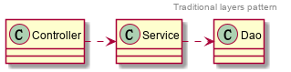
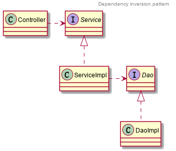
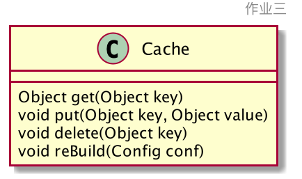
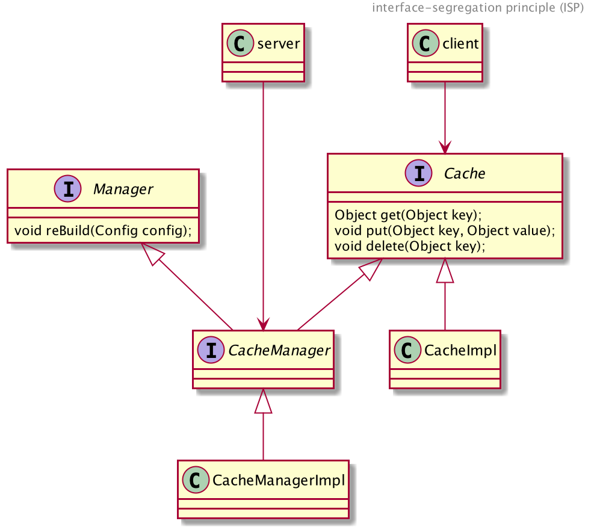

# Week2 课后作业
## 作业一： 请描述什么是依赖倒置原则，为什么有时候依赖倒置原则又被称为好莱坞原则？

* 答：依赖倒置原则（Dependency inversion principle），维基百科英文原文解释：

A. High-level modules should not depend on low-level modules. Both should depend on abstractions (e.g. interfaces).

B. Abstractions should not depend on details. Details (concrete implementations) should depend on abstractions.

翻译过来：

1. 高层模块不应该依赖低层模块。高层模块和低层模块应该依赖于抽象。
2. 抽象不应该依赖于细节。细节（或具体实现）应该依赖于抽象。

传统分层模式：高层模块（Controller）直接依赖低层模块（Service），高层模块 Service 依赖低层模块 Dao。



依赖倒置模式：增加抽象层（interface），高低层模块都依赖于抽象层



## 作业二： 请描述一个你熟悉的框架，是如何实现依赖倒置原则的
1. Tomcat 的依赖倒置原则
```
Tomcat 是 Web 容器， Tomcat 对 Web 应用来说是高层模块， Web 应用是低层模块。
Tomcat 和 Web 应用的代码没有直接的依赖关系，它们都依赖于 Servlet 规范这个抽象。
```
2. 用 Spring 开发 Web 应用的依赖倒置原则
```
用 Spring 开发的 Web 应用一般分为三层： Controller 层，Service 层， Dao 层。
Service 层包括 Service 接口和 ServiceImpl 具体实现类。
Dao 层包括 Dao 接口和 DaoImpl 具体实现类。
Controller 是 Service 的高层模块。
Service 是 Dao 的高层模块。
Controller 和 ServiceImpl 的代码没有互相依赖，它们都依赖于 Service 这个抽象。
Service 这个抽象没有依赖 ServiceImpl 这个具体实现，ServiceImpl 这个具体实现依赖 Service 这个抽象。
ServiceImpl 和 DaoImpl 的代码没有互相依赖，它们都依赖于 Dao 这个抽象。
Dao 这个抽象没有依赖 ServiceImpl 和 DaoImpl 这两个具体实现，这两个具体实现依赖了 Dao 这个抽象。
```


## 作业三： 请用接口隔离原则优化 Cache 类的设计，画出优化后的类图

```
作业三提示：cache 实现类中有四个方法，其中 put get delete 方法是需要暴露给应用程序的，
rebuild 方法是需要暴露给系统进行远程调用的。如果将 rebuild 暴露给应用程序，应用程序很
可能会错误调用 rebuild 方法，导致 cache 服务失效。按照接口隔离原则：不应该强迫客户程序
依赖它们不需要的方法。也就是说，应该使 cache 类实现两个接口，一个接口包含 get put 
delete 暴露给应用程序，一个接口包含 rebuild 暴露给系统远程调用。从而实现接口隔离，使
应用程序看不到 rebuild 方法。
```

接口隔离原则：

英文解释： 

interface-segregation principle (ISP) states that no client should be forced to depend on methods it does not use.

翻译：

客户端不应该依赖它不使用的方法。

这里应用程序不应该依赖 reBuild 方法，所以需要设计两个接口将 reBuild 单独拿出来，Cache 接口包括
get、put、delete 方法，CacheManager 接口包括 reBuild 方法。

CacheImpl 实现 Cache 接口，CacheManagerImpl 实现 Cache 和 CacheManager 接口。

client 依赖于 Cache 接口，server 依赖于 CacheManagerImpl

根据依赖倒置原则，server 不应该依赖于 CacheManagerImpl 这个具体实现，应该依赖于抽象

所以重新设计：
* Cache 接口包含 get、put、delete 方法
* Manager 接口包含 reBuild 方法
* CacheManager 接口继承 Cache 和 Manager 接口
* CacheImpl 实现 Cache 接口
* CacheManagerImpl 实现 CacheManager 接口

类图：

