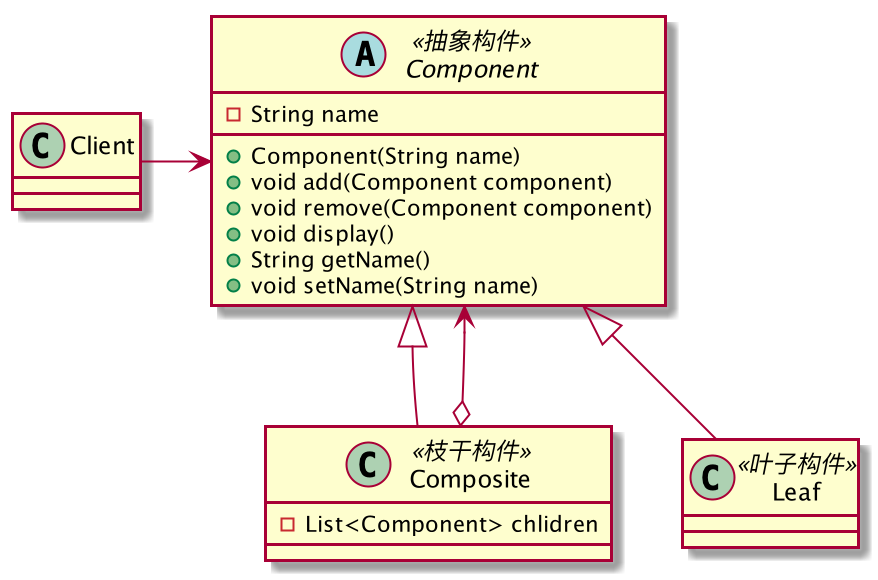

# Week3 课后作业
## 作业1
1. 请在草稿纸上手写一个单例模式的实现代码，拍照提交作业


2. 请用组合设计模式编写程序，打印输出图 1 的窗口，窗口组件的树结构如图 2 所示，打印输出
示例参考图 3


组合模式类图



抽象类 Component, 定义了基本方法, 包括添加子构件 add，删除子构件 remove，打印 display

```java
public abstract class Component {
    private String name;

    public Component(String name) {
        this.name = name;
    }

    public abstract void add(Component component);
    public abstract void remove(Component component);
    public abstract void display();

    public void setName(String name) {
        this.name = name;
    }
    public String getName() {
        return this.name;
    }
}
```

客户端 Client，使用组合模式遍历树形结构
```java
public class Client {
    public static void main(String[] args) {
        Composite root = new Composite("WinForm(WINDOW窗口)");
        Leaf picture = new Leaf("Picture(LOGO图片)");
        Leaf buttonLogin = new Leaf("Button(登录)");
        Leaf buttonReg = new Leaf("Buttor(注册)");
        Composite frame = new Composite("Frame(FRAME1)");
        Leaf lableName = new Leaf("Lable(用户名)");
        Leaf textBox = new Leaf("TextBox(文本框)");
        Leaf lablePass = new Leaf("Lable(密码)");
        Leaf passwordBox = new Leaf("PasswordBox(密码框)");
        Leaf checkBox = new Leaf("CheckBox(复选框)");
        Leaf textBoxName = new Leaf("TextBox(记住用户名)");
        Leaf linkLable = new Leaf("LinkLable(忘记密码)");
        root.add(picture);
        root.add(buttonLogin);
        root.add(buttonReg);
        root.add(frame);
        frame.add(lableName);
        frame.add(textBox);
        frame.add(lablePass);
        frame.add(passwordBox);
        frame.add(checkBox);
        frame.add(textBoxName);
        frame.add(linkLable);
        root.display();
    }
}
```

枝干构件 Composite，枝干构件包含一个 List 容器用于存放子构件，add 方法向容器中添加子构件，
remove 方法从容器中删除子构件，display 方法打印当前构件同时遍历子构件的打印方法

```java
public class Composite extends Component {
    private List<Component> children = new LinkedList<>();
    public Composite(String name) {
        super(name);
    }

    @Override
    public void add(Component component) {
        this.children.add(component);
    }

    @Override
    public void remove(Component component) {
        this.children.remove(component);
    }

    @Override
    public void display() {
        System.out.println("print " + this.getName());
        for (Component comp : this.children) {
            comp.display();
        }
    }
}
```

叶子构件，不支持添加、删除子构件的方法，只有一个打印方法，打印自己的名字

```java
public class Leaf extends Component {
    public Leaf(String name) {
        super(name);
    }

    @Override
    public void add(Component component) {
        throw new UnsupportedOperationException();
    }

    @Override
    public void remove(Component component) {
        throw new UnsupportedOperationException();
    }

    @Override
    public void display() {
        System.out.println("print " + this.getName());
    }
}
```
