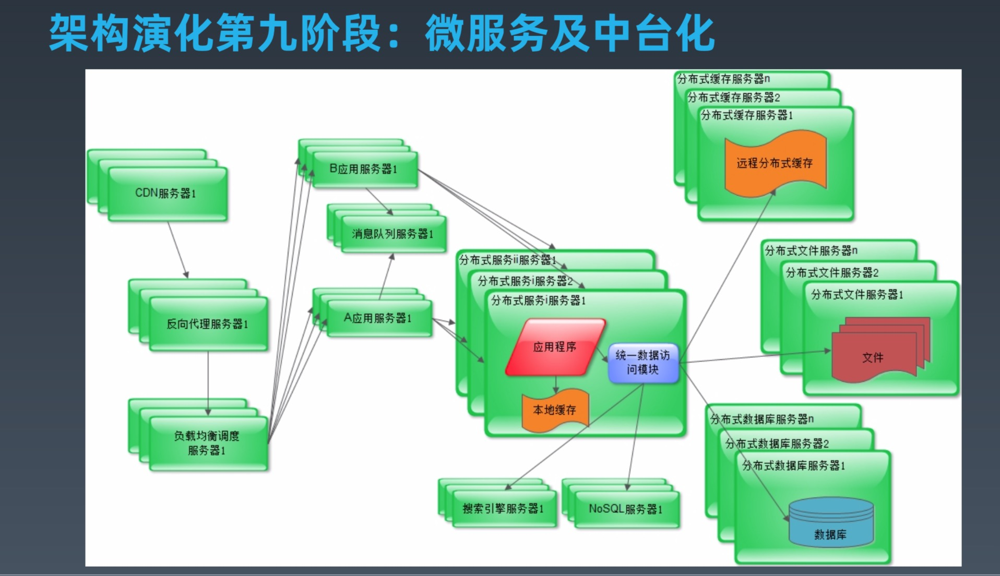

# Week4 课后作业
## 作业一：
一个典型的大型互联网应用系统使用了哪些技术方案和手段，主要解决什么问题？请列举描述。

### 前端技术
* App 及 Web 开发技术：主要用户开发展示层和用户交互
* 浏览器及 HTTP 优化技术：优化前后端通讯性能，安全性等
* CDN ： 主要提升客户端的静态资源（图片、视频等）访问速度，将静态资源存储在里客户端较近的服务器上
* 动静分离 ：将静态资源与动态资源分离，减小服务端压力，用 CDN 或 Nginx 缓存来加速静态资源的访问速度
* 图片服务 ：专门用于存储图片，提供生成短链接、防盗链、水印等功能
* 反向代理 ：保护后端服务器的真实 IP，可以全面记录连接，提供预防和捕获信息的能力
* DNS ： 域名解析服务器，让客户只需要记住人类容易理解的域名，而无需记住一串数字的 IP
### 网关及应用层技术
* 网关 ： 网间连接器、协议转换器，主要用于广域网互联或局域网互联
* 负载均衡 : 负载均衡是高可用架构的一个关键组件，主要用来提高性能和可用性，通过负载均衡将流量分发到多个服务器，同时多服务器能够消除这部分的单点故障
* 动态页面静态化 ： 动态页面静态化是通过动态网站静态化将动态网页以静态的形式进行展现。
* 业务拆分：微服务化
### 服务层技术
* 微服务：将一个大服务拆分成若干小服务，采用分治思想，将服务解耦，便于大规模团队协作开发模式
* 分布式消息队列：主要用于异步通讯，和削峰平谷
* 分布式缓存：主要用于缓存数据，减小数据库压力，提高性能
* 分布式一致性（锁）服务：生成分布式一致性 id， 生成分布式锁，主要用户分布应用的 id 生成和分布式事务
### 存储层技术
* 分布式文件：用于分布式文件存储，例如附件、视频、大文件、日志等
* 分布式关系型数据库：用于存储数据，当数据量达到单台数据库无法支撑是需要考虑分库分表，用分布式关系型数据库
* NoSQL 数据库：可以很容易的访问和抓取数据。用户的个人信息，社交网络，地理位置，用户生成的数据和用户操作日志已经成倍的增加。我们如果要对这些用户数据进行挖掘，那SQL数据库已经不适合这些应用了, NoSQL 数据库的发展却能很好的处理这些大的数据。
### 后台技术
* 大数据平台：例如 hadoop、spark、strom 等，随着互联网的不断发展数据量越来越大，对大数据量的存储、计算、分析等需求随之产生，大数据平台主要用于大数据计算、存储和分析
* 搜索引擎：互联网应用的数据量达到一定规模后，客户需要通过搜索引擎找到感兴趣的内容或商品，搜索引擎主要解决数据搜索问题
* 推荐引擎：通过数据分析、关联分析，数据挖掘等，从大数据量中挖掘出关联关系数据，推荐给对应的用户，提高客户留存率和转化率
* 数据仓库：数据仓库，是为企业所有级别的决策制定过程，提供所有类型数据支持的战略集合。它是单个数据存储，出于分析性报告和决策支持目的而创建。 为需要业务智能的企业，提供指导业务流程改进、监视时间、成本、质量以及控制。
### 运维和安全
* 数据采集与展示：对于线上应用系统一些运营指标、性能指标需要通过数据采集和展示来反馈给后端研发、产品、运营等部分，甚至需要分析后产生报表反馈给决策层，从而对应用进行改进
* 数据监控和报警：对于线上应用的关键指标，如异常日志、响应速度等进行监控，超过阈值后进行告警，进而尽快进行自动干预或人工干预，降低宕机风险，减小损失
* 攻击和防护：互联网应用是对外开放的，所有人可访问的，需要做好安全防护，一旦出现安全事件对于一个企业而言很可能是致命的。可以采用网闸、防火墙、防 DDOS 攻击，防 SQL 注入攻击等手段预防。
* 数据加解密：客户端到服务器数据传输过程中需要对敏感数据进行加密，客户端加密，服务端解密，方式他人监听数据，敏感数据包含用户密码，用户身份证号、银行卡号、银行卡密码、余额、交易额度等等。