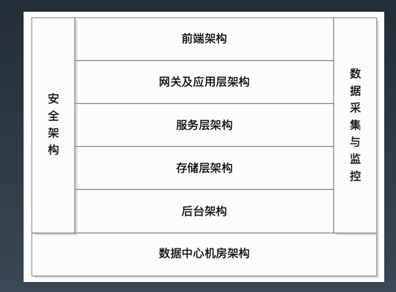

# Week4 总结
## 互联网系统面临的挑战
* 高并发，大流量
* 高可用
* 海量数据：海量数据的存储和管理
* 用户分布广泛，网络情况复杂
* 安全环境恶劣
* 需求快速变更，发布频繁
* 渐进式发展
## 应对方案
### 应对高并发的方案
* 垂直伸缩
* 水平伸缩

垂直伸缩相比于水平伸缩优点在于速度快，软件改动小，缺点在于存在物理极限，过了某个点之后成本陡增

## 互联网的架构演化
0. 单体应用: 应用和数据库都部署在一台服务器上
1. 应用于数据分离：应用和数据库部署在不同的服务器上
2. 应用层增加缓存
3. 增加负载均衡，使用应用集群
4. 数据库读写分离
5. 使用反向代理和CDN加速网站响应
6. 使用分布式文件系统和分布式数据库系统
7. 使用 NoSQL 和搜索引擎
8. 业务拆分
9. 微服务及中台化

## 互联网架构模式
* 分层：横向
* 分割：纵向
* 分布式
* 集群
* 缓存：CDN、反向代理、本地缓存、远程缓存
* 异步：
    * 提高系统可用性
    * 加快网站响应速度
    * 消除并发访问高峰
* 冗余
* 自动化
* 安全

## 衡量架构的指标
* 高性能
* 高可用
* 可伸缩
* 可扩展
* 安全

## 互联网架构一览

### 前端架构
* App 及 Web 开发技术
* 浏览器及 HTTP 优化技术
* CDN
* 动静分离
* 图片服务
* 反向代理
* DNS
### 网关及应用架构
* 网关架构
* 负载均衡
* 动态页面静态化
* 业务拆分
### 服务层架构
* 微服务架构
* 分布式消息队列
* 分布式缓存
* 分布式一致性（锁）服务
### 存储层架构
* 分布式文件
* 分布式关系数据库
* NoSQL 数据库
### 后台架构
* 大数据平台
* 搜索引擎
* 推荐引擎
* 数据仓库
### 运维安全
* 数据采集与展示
* 数据监控与报警
* 攻击与防护
* 数据加密和解密