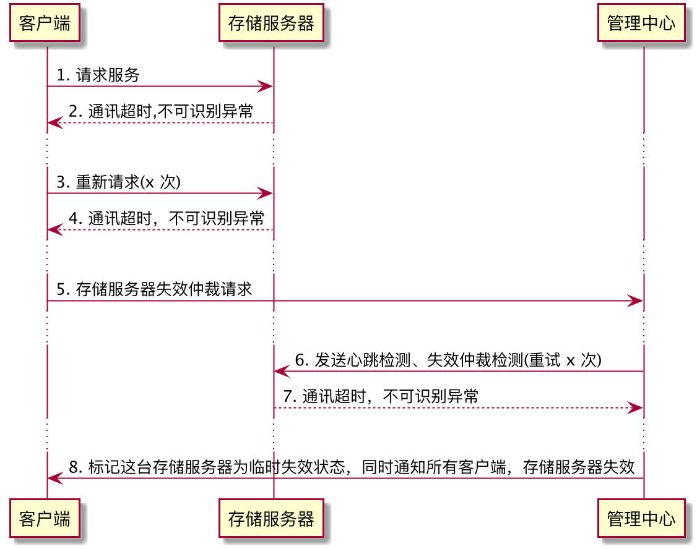
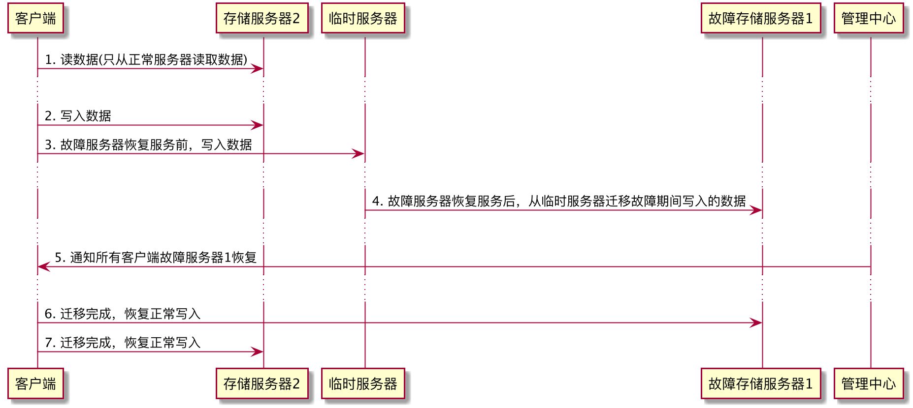
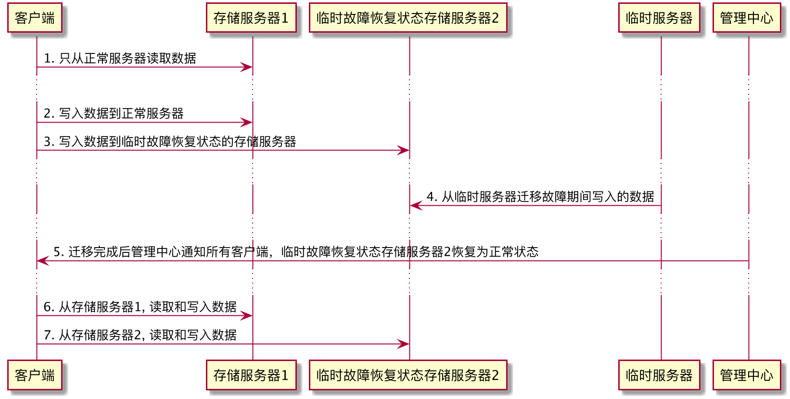

# Week6 课后作业
## 作业一：
下面两题，至少选做一题
### 请简述 CAP 原理
* C 是 Consistency 一致性

一致性指的是，每次读取的数据都应该是最近写入的数据或者返回一个错误，而不是过期的数据，
也就是说，数据是一致的

* A 是 Availability 可用性

可用性是说，每次请求都应该得到一个响应，而不是返回一个错误或者失去响应，不过这个响应
不需要保证数据是最近写入的，也就是说系统需要一直都是可以正常使用的，不会引起调用者异常，
但是并不保证响应数据是最新的

* P 是 Partition tolerance 分区耐受性

分区耐受性是说，即使因为网络原因，部分服务器节点之间消息丢失或延迟了，系统依然应该是可操作的

* CAP 原理
当网络分区失效发生的时候，我们要么取消操作，这样数据就是一致的，但是系统却不可用；要么我们
继续写入数据，但是数据的一致性就得不到保证。

对于一个分布式系统而言，网络失效一定会发生，也就是说，分区耐受性是必须要保证的，那么在
可用性和一致性上就必须二选一。

当网络分区失效，也就是网络不可用的时候，如果选择了一致性，系统就可能返回一个错误码或者干脆
超时，即系统不可用。如果选择了可用性，那么系统总是可以返回一个数据，但是并不能保证这个数据
是最新的。

所以，关于 CAP 原理，更准确的说法是，在分布式系统必须要满足分区耐受性的前提下，可用性和
一致性无法同时满足。

* 数据的一致性可以分为以下几点
    * 数据强一致
    
    分布式系统中各个副本（节点）的数据总是强一致的，这会牺牲可用性和性能。金融相关的系统
    往往需要数据的强一致性。
    
    * 数据用户一致性
    
    应用层有一定的纠错机制，把多个副本（节点）不一致的数据经过计算处理，返回给用户一个
    确定且一致的数据。例如，多个客户端购物车中的商品不一致，下单时应用程序将其合并。
    大型互联网架构一般采用这种设计，性能较好，并且数据不会出现错误。
    
    * 数据最终一致性
    
    物理存储的数据不一致，用户访问得到的数据也可能不一致，但是系统经过一定时间的自我修复
    （通常时间比较短），数据会达到最终一致性。这种设计性能最高，但是可能有数据错误。
    
通过 CAP 可以看出，系统架构设计就是一个取舍的问题。

### 针对 Doris 案例，请用 UML 时序图描述 Doris 临时失效的处理过程（包括判断系统进入临时失效状态，临时失效中的读写过程，失效恢复过程）

* 判断系统进入临时失效状态

* 临时失效中的读写过程

* 失效恢复过程

