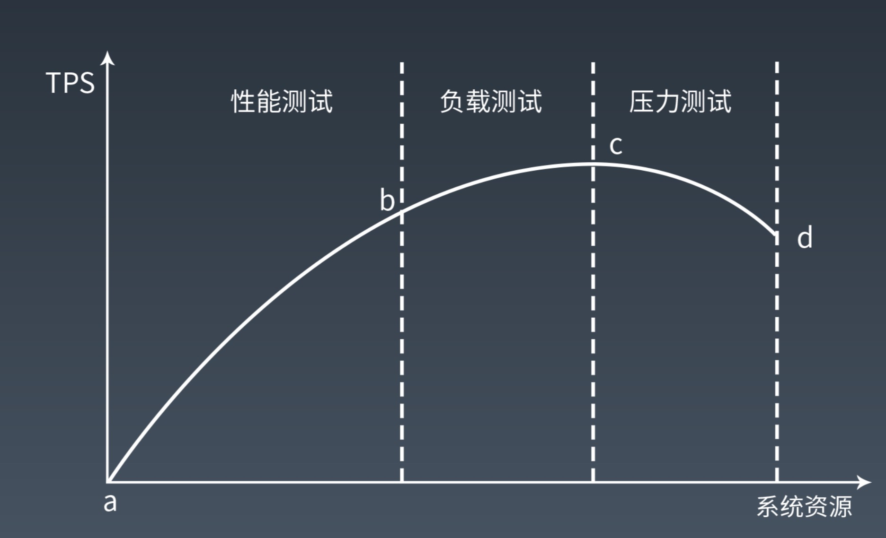
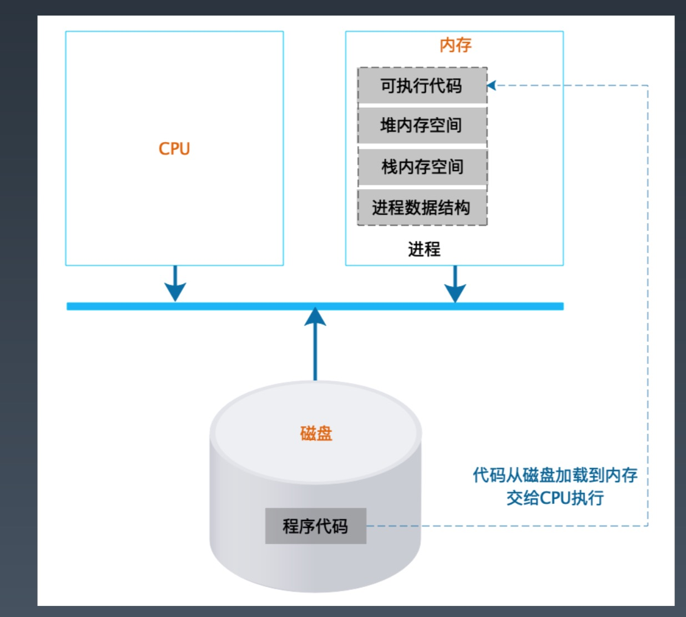

# Week7 总结
## 性能测试
性能测试是性能优化的前提
### 指标
* 响应时间：请求的处理时间，从客户端发出请求到客户端收到响应数据之间的时间
* 并发数：系统能够同时处理的请求数
* 吞吐量：单位时间内系统处理的请求数

### 公式
吞吐量 = ( 1000 / 响应时间ms ) * 并发数

### 性能计数器
描述服务器或操作系统性能的一些数据指标。包括 System Load、对象与线程数、内存使用、CPU使用、
磁盘与网络 IO 等

### 性能测试方法
细分为： 性能测试、负载测试、压力测试、稳定性测试

### 全链路压测

全链路压测指的是在特定的业务场景下，将相关的链路完整的串联起来同时压测，尽可能地模拟出真实的用户行为。

#### 全链路压测的挑战
* 相关业务众多，如何做到无死角压测
* 压测数据如何构造
* 在线上真实环境压测，如何保证对线上环境无影响
* 如何模拟大促的巨大流量
#### 数据隔离
* 逻辑隔离：直接把测试数据和正常数据写到一起，通过特殊标识区分
* 虚拟隔离：在所有写数据的地方做 mock ，并不真正写入
* 物理隔离：所有写数据的地方对压测流量做识别，判断是压测流量直接写到隔离的位置

全链路压测平台，进行流量构造

## 性能优化
### 性能优化的两个基本原则
* 你不能优化一个没有测试的软件
* 你不能优化一个你不了解的软件
### 性能优化的一般方法
* 性能测试获取性能指标
* 指标分析，发现性能与资源的瓶颈点
* 架构与代码分析
* 架构与代码优化
* 性能测试，形成闭环
### 系统性能优化分层思想
* 机房与骨干网性能优化
    * 异地多活多机房架构、网络专线、CDN
* 服务器与硬件性能优化
    * 购买更好的硬件
* 操作系统性能优化
    * 操作系统参数调优
* 虚拟机性能优化
* 基础组件性能优化
    * 测试各种组件的各种版本组合的性能
* 软件架构性能优化
* 软件代码性能优化
### 软件架构性能优化三板斧
* 缓存
* 异步
* 集群
### 软件代码性能优化
* 遵循面向对象的设计原则和设计模式
* 并发编程，多线程，锁
* 资源复用：线程池，对象池
* 异步编程：生产者，消费者
* 数据结构优化：数组、链表、hash、树
### Akka
[Akka](https://akka.io/docs/)
响应式编程框架，纯异步编程

## 操作系统
### 程序运行时架构
程序是活的

### 进程运行期状态
* 运行
* 就绪：等待 CPU
* 阻塞：等待 IO 、锁等非 CPU 资源
### 进程 VS 线程

