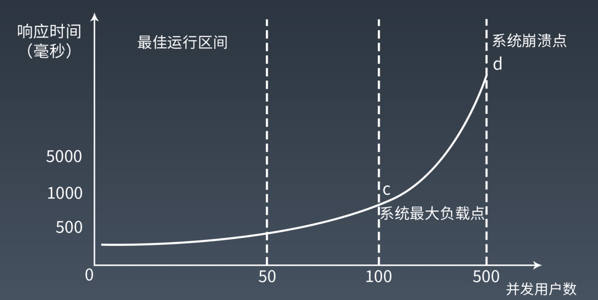
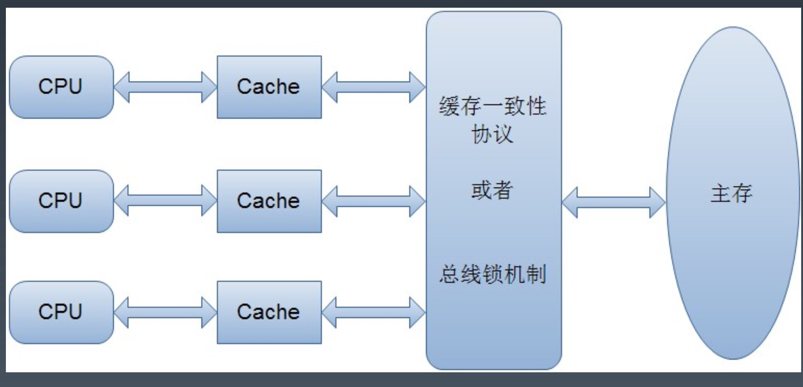
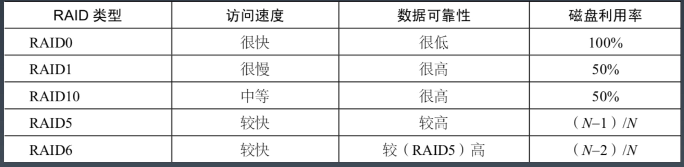

# Week7 总结
## 性能测试
性能测试是性能优化的前提
### 指标
* 响应时间：请求的处理时间，从客户端发出请求到客户端收到响应数据之间的时间
* 并发数：系统能够同时处理的请求数
* 吞吐量：单位时间内系统处理的请求数

### 公式
吞吐量 = ( 1000 / 响应时间ms ) * 并发数

### 性能计数器
描述服务器或操作系统性能的一些数据指标。包括 System Load、对象与线程数、内存使用、CPU使用、
磁盘与网络 IO 等

### 性能测试方法
细分为： 性能测试、负载测试、压力测试、稳定性测试

### 全链路压测

全链路压测指的是在特定的业务场景下，将相关的链路完整的串联起来同时压测，尽可能地模拟出真实的用户行为。

#### 全链路压测的挑战
* 相关业务众多，如何做到无死角压测
* 压测数据如何构造
* 在线上真实环境压测，如何保证对线上环境无影响
* 如何模拟大促的巨大流量
#### 数据隔离
* 逻辑隔离：直接把测试数据和正常数据写到一起，通过特殊标识区分
* 虚拟隔离：在所有写数据的地方做 mock ，并不真正写入
* 物理隔离：所有写数据的地方对压测流量做识别，判断是压测流量直接写到隔离的位置

全链路压测平台，进行流量构造

## 性能优化
### 性能优化的两个基本原则
* 你不能优化一个没有测试的软件
* 你不能优化一个你不了解的软件
### 性能优化的一般方法
* 性能测试获取性能指标
* 指标分析，发现性能与资源的瓶颈点
* 架构与代码分析
* 架构与代码优化
* 性能测试，形成闭环
### 系统性能优化分层思想
* 机房与骨干网性能优化
    * 异地多活多机房架构、网络专线、CDN
* 服务器与硬件性能优化
    * 购买更好的硬件
* 操作系统性能优化
    * 操作系统参数调优
* 虚拟机性能优化
* 基础组件性能优化
    * 测试各种组件的各种版本组合的性能
* 软件架构性能优化
* 软件代码性能优化
### 软件架构性能优化三板斧
* 缓存
* 异步
* 集群
### 软件代码性能优化
* 遵循面向对象的设计原则和设计模式
* 并发编程，多线程，锁
* 资源复用：线程池，对象池
* 异步编程：生产者，消费者
* 数据结构优化：数组、链表、hash、树
### Akka
[Akka](https://akka.io/docs/)
响应式编程框架，纯异步编程

## 操作系统
### 程序运行时架构
程序是活的

### 进程运行期状态
* 运行
* 就绪：等待 CPU
* 阻塞：等待 IO 、锁等非 CPU 资源
### 进程 VS 线程
进程从操作系统获得基本内存空间，所有线程共享着进程的内存地址空间。而每个线程也会拥有自己私有的内存地址范围，其他线程不能访问。
### Java Web 应用多线程运行视图

### 线程安全
多个线程共同修改同一块内存会有线程安全问题
### 临界区
多个线程访问共享资源的这段代码被称为临界区，解决线程安全问题主要是给临界区加锁
### 阻塞导致高并发系统崩溃
锁（IO）会引起线程阻塞。阻塞导致线程既不能继续执行，也不能释放资源.进而导致资源耗尽。最终导致系统崩溃。
### 避免阻塞引起的崩溃
* 限流：控制进入系统的请求数，进而减少创建的线程数
* 降级：关闭部分功能程序的执行，尽早释放线程
* 避免阻塞：异步 I/O；无临界区（Actor 模型）
## 锁
### 锁原语 CAS
CAS(V,E,N)
* V 表示要更新的变量
* E 表示预期值
* N 表示新值

如果 V 值等于 E，则将 V 设为 N，否则什么都不做

CAS 是一种系统原语，原语的执行必须是连续的，在执行过程中不允许被中断

### Java 通过 CAS 原语在对象头中修改 Mark Word 实现加锁

### 偏向锁
指一段同步代码一直被一个线程所访问，那么该线程会自动获取锁，降低获取锁的代价
### 轻量级锁
指当锁是偏向锁时，被另一个线程所访问，偏向锁就会升级为轻量级锁，其他线程会通过自旋的形式尝试获取锁，不会阻塞，提高性能
### 重量级锁
指当锁是轻量级锁时，另一个线程虽然自旋，但是自旋不会一直持续下去，当自旋到一定次数时，还没获取锁，就会进入阻塞，改锁膨胀
为重量级锁，重量级锁会让其他申请的线程进入阻塞，性能降低
### 多 CPU 情况下的锁

### 总线锁
使用处理器的 LOCK# 信号，当一个处理器在内存总线上输出此信号的时候，其他处理器的请求将被阻塞，该处理器独占内存
### 缓存锁
是指内存区域如果被缓存在处理器的缓存行中，并且在 Lock 操作期间被锁定，那么当它执行锁操作回写到内存时，处理器不在总线上
声言 LOCK# 信号，而是修改内部的内存地址，并允许它的缓存一致性机制来保证操作的原子性，因为缓存一致性机制会阻止同时修改
由两个以上处理器缓存的内存区域数据，当其他处理器回写已被锁定的缓存行数据时，会使缓存行无效
### 公平锁 非公平锁
* 公平锁：多个线程按照申请锁的顺序来获取锁
* 非公平锁：多个线程获取锁的顺序并不是按照申请锁的顺序，有可能后申请的线程比先申请的线程优先获取锁,可能会造成饥饿现象
### 可重入锁
某个线程已经获得了某个锁，可以再次获取锁而不会出现死锁
### 独享锁/互斥锁 共享锁 读写锁
* 独享锁/互斥锁：该锁一次只能被一个线程所持有
* 共享锁：该锁可以被多个线程所持有
* 读写锁：多个读线程之间并不互斥，而写线程与任何线程互斥
### 乐观锁 悲观锁
* 悲观锁认为对于同一个数据的并发操作，一定会发生修改，哪怕没有修改，也会认为修改。因此对于同一个数据的并发操作，悲观锁
采取加锁的形式。悲观的认为，不加锁的操作一定会出问题。
* 乐观锁认为对于同一个数据的并发操作，是不会发生修改的。在更新数据的时候，检查是否已经被修改过了，如果修改过，就放弃。
### 分段锁
细化锁粒度，当操作不需要更新整个数组时，就仅仅对一段数据加锁

ConcurrentHashMap

### 自旋锁
是指尝试获取锁的线程不会立即阻塞，而是采取循环的方式去尝试获取锁，这样的好处是减少线程上下文切换的消耗，缺点是循环会消耗 CPU

## 文件与硬盘 I/O
### 机械硬盘
机械磁头、磁臂，通过这些机械装置的转动定位数据块
### 固态硬盘
通过芯片算法定位数据块
### B+ 树
MySQL 数据库的 InnoDB 存储引擎
### LSM 树
LSM被设计来提供比传统的B+树或者ISAM更好的写操作吞吐量，通过消去随机的本地更新操作来达到这个目标。

### 文件控制块
文件系统将硬盘空间以块为单位进行划分，每个文件占据若干块，然后再通过一个文件控制块 FCB 记录每个文件占据的硬盘数据块。
### Linux Inode 文件控制块
* inode 中记录着文件权限、所有者、修改时间和文件大小等文件属性信息，以及文件数据块硬盘地址索引
* inode 是固定结构的，能够记录的硬盘地址索引数也是固定的，只有15个索引
* 每个 inode 最多可以存储 12+256+256*256+256*256*256 个数据块,如果每个数据块的大小为 4k，也就是单个文件最大不超过 70G
### RAID 独立硬盘冗余阵列

### 分布式文件系统
HDFS：在大数据场景下应用