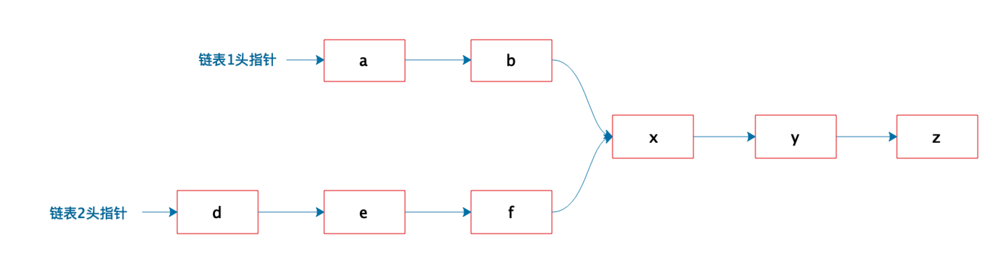
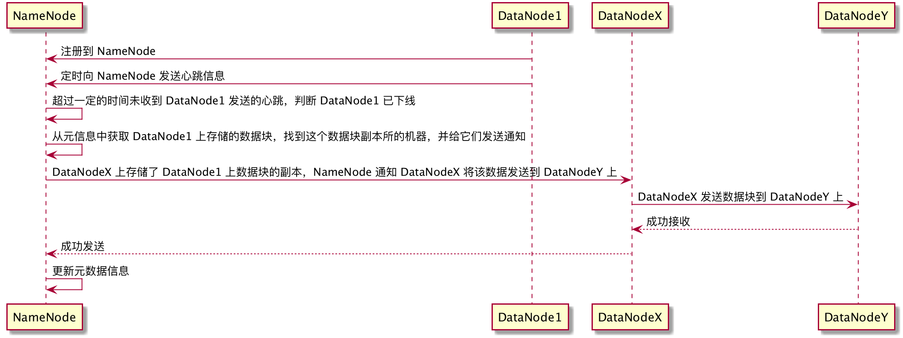

# Week8 作业
## 1. 有两个单向链表（链表长度分别为 m，n），这两个单向链表有可能在某个元素合并，如下图所示的这样，也可能不合并。现在给定两个链表的头指针，在不修改链表的情况下，如何快速地判断这两个链表是否合并？如果合并，找到合并的元素，也就是图中的 x 元素。请用（伪）代码描述算法，并给出时间复杂度和空间复杂度。


算法：
* (1) 遍历两个链表 l1,l2, 找到两个链表的长度 m,n
* (2) 假设 m 大于 n，l1 先向前走 (m-n) 步
* (3) 比较 l1 的当前节点和 l2 的头节点做对比，如果相同，则证明两个链表合并了，返回当前节点
* (4) 如果 l1 的当前节点和 l2 的头节点不同，那么 l1 和 l2 都向前走一步
* (5) 比较 l1 和 l2 的当前节点，如果相同则证明是合并的，返回当前节点
* (6) 如果不同，重复 4 、5 步，直到其中一个链表到尾部，则证明没找到

伪代码：
```java
fun node mergeLinkNode(l1,l2) {
    m,n = len(l1),len(l2)
    if m>n
        m,n=n,m
        l1,l2=l2,l1
    for i=0;i<m-n;i++
        l1 = l1.next
    while(l1 != null && l2 != null && l1 != l2) {
        l1 = l1.next
        l2 = l2.next
    }
    if (l1 == l2) {
        return l1
    }
    return null
}
```

## 2. 请画出 DataNode 服务器节点宕机的时候，HDFS 的处理过程时序图。
