# Week7 总结
## 数据结构与算法
### 时间复杂度和空间复杂度
时间复杂度：
* 并不是计算程序具体运行的时间，而是算法执行语句的次数
* O(2^n) 表示对 n 个数据的处理需要进行 2^n 次计算
* O(1), O(log(n)), O(n^a) 多项式时间复杂度
* O(a^n) 和 O(n!) 非多项式时间复杂度

空间复杂度：
* 一个算法在运行过程中临时占用存储空间大小的度量
* O(n) 表示需要临时存储 n 个数据

### NP 问题
* P : 能在多项式时间复杂度内解决的问题
* NP : 能在多项式时间复杂度内验证答案正确与否的问题
* NP ?= P
* NP-hard : 比 NP 问题更难的问题 (NP 问题的解法可以规约到 NP-hard 问题的解法)
* NP 完全问题 : 是一个 NP-hard 问题，也是一个 NP 问题

### 数组
创建数组必须要内存中一块连续的空间。

数组中必须存放相同的数据类型。

随机快速读写是数组的一个重要特性，根据数组下标访问数据，时间复杂度为 O(1)

### 链表
链表可以使用零散的内存空间存储数据。

所以链表中每个数据元素必须包含一个指向下一个数据元素内存地址的指针。

要想在链表中查找一个数据，只能遍历链表，所以链表的查找复杂度是 O(N)

链表中增删数据要比数组性能好的多。

链表数组结合，实现快速查找和快速增删。

### Hash 表
数组+链表，链表解决 hash 冲突。
### 栈
数组和链表都被称为线性表。

栈在线性表的基础上增加了操作限制：后进先出，即后面添加的元素，再删除是需要先被删除。

### 队列
队列也是一种操作受限的线性表：先进先出。

阻塞等待的线程被放入队列。

典型应用场景：生产者消费者
* 用队列搜索好友中关系最近的有钱人
* 用队列搜索最短路径

### 树
有一个根节点。

根节点有若干个子节点，每个子节点也有若干个子节点。

没有子节点的节点称为叶子节点。

### 二叉排序树
左子树上的所有节点的值均小于或等于它的根节点的值。

右子树上所有节点的值均大于或等于它的根节点的值。

左右子树也都是二叉排序树。

不平衡的二叉排序树，最差情况退化为链表。

### 平衡（二叉）排序树
从任何一个节点出发，左右子树深度之差的绝对值不超过1.

左右子树仍然是平衡二叉树。

插入时，最多只需要两次旋转就会重新恢复平衡。

删除时，需要维护从被删除节点到根节点这条路径上所有节点的平衡性，时间复杂度 O(logN)

### 红黑（排序）树
* 每个节点只有两种颜色：红、黑
* 根节点是黑色
* 每个叶子节点（NIL）都是黑色的空节点
* 从根节点到叶子节点，不会出现两个连续的红色节点
* 从任何一个节点出发，到叶子节点，这条路径上都有相同数目的黑色节点
### 红黑树 VS 平衡二叉树
* 红黑树最多只需 3 次旋转就会重新达成红黑平衡，时间复杂度 O(1)
* 在大量增删的情况下，红黑树的效率更高
* 红黑树的平衡性不如平衡二叉树，查找效率要差一些
### 跳表
将链表中若干个节点向上跳跃，形成节点更少的新的一层链表。

跳表中查找元素的时间复杂度为 O(logN)

### 递归算法（快速排序）
* 基准条件：为空或者只包含一个元素的数组是有序的
* 确定一个基准值
* 找到由所有小于基准值的元素组成的子数组
* 找到由所有大于基准值的元素组成的子数组
* 递归，直到子数组为空或只有一个元素
* 合并两个子数组

* 时间复杂度 : n*log(n)
* 空间复杂度 : log(n)

### 贪心算法
背包问题：背包问题是一个 NP 问题

### 改进贪心算法 - 迪杰特斯拉算法（最快路径）
* 1. 找出"最便宜"的节点，即可在最短时间内到达的节点
* 2. 更新该节点的邻居的开销，检查是否有前往它们的更短路径，如果有，就更新其开销。
* 3. 重复这个过程，直到对图中的每个节点都这样做了
* 4. 计算最终路径
### 动态规划算法解决背包问题
通过找到合适的角度，将所求解的目标值在某（几）个维度上展开，将一个大问题拆解为若干小问题，
小问题的最优解，寻找大问题的最优解

每个动态规划算法都从一个网格开始
### 遗传算法解决背包问题
遗传算法（Genetic Algorithm，GA）是模拟达尔文生物进化论的自然选择和遗传学机理的生物
进化过程的计算模型，是一种通过模拟自然进化过程搜索最优解的方法。

遗传算法以一种群体中的所有个体为对象，并利用随机化技术指导对一个被编码的参数空间进行高效
搜索。其中，选择、交叉和变异构成了遗传算法的遗传操作；参数编码、初始群体设定、适应度函数
的设计、遗传操作设计、控制参数设定五个要素组成了遗传算法的核心内容。

* 遗传算法只能找到较优解，无法判断其是否为最优解

#### 选择算法
* 轮盘赌选择：是一种回放式随机采样方法。每个染色体进入下一代的概率等于它的适应度值与整体
适应度值和的比例
* 随机竞争选择：每次按轮盘赌选择一对个体，然后让这两个个体进行竞争，适应度高的被选中，如此
反复，直到选满为止
* 均匀排序：对群体中的所有个体按其适应度大小进行排序，基于这个排序来分配各个个体被选中
的概率

交叉遗传、基因突变

#### 遗传算法得到的不是最优解
遗传算法过程

![ga][ga.png]

## 网络通讯协议
### Web 请求的一次网络通信历程
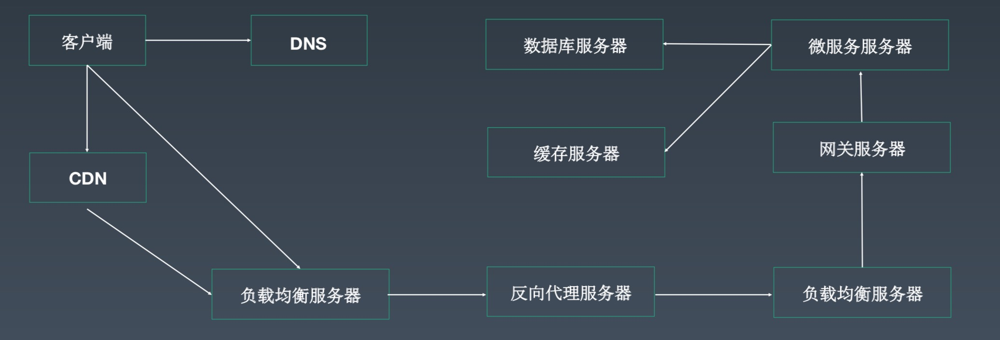
### OSI 七层模型 和 TCP/IP 四层模型
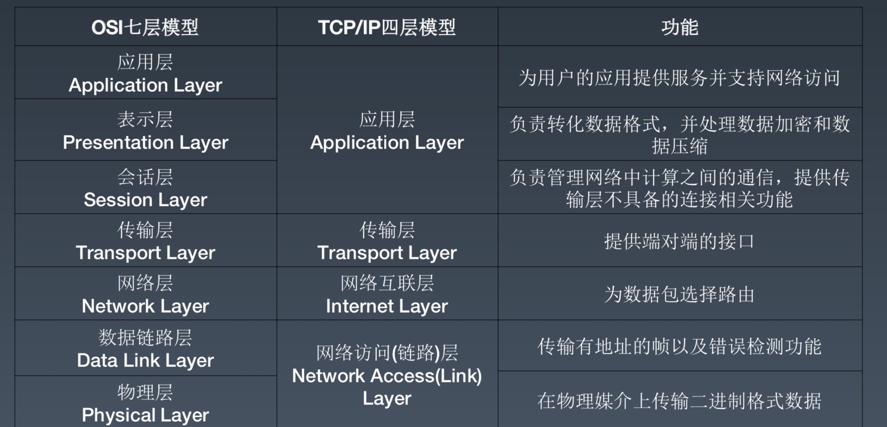

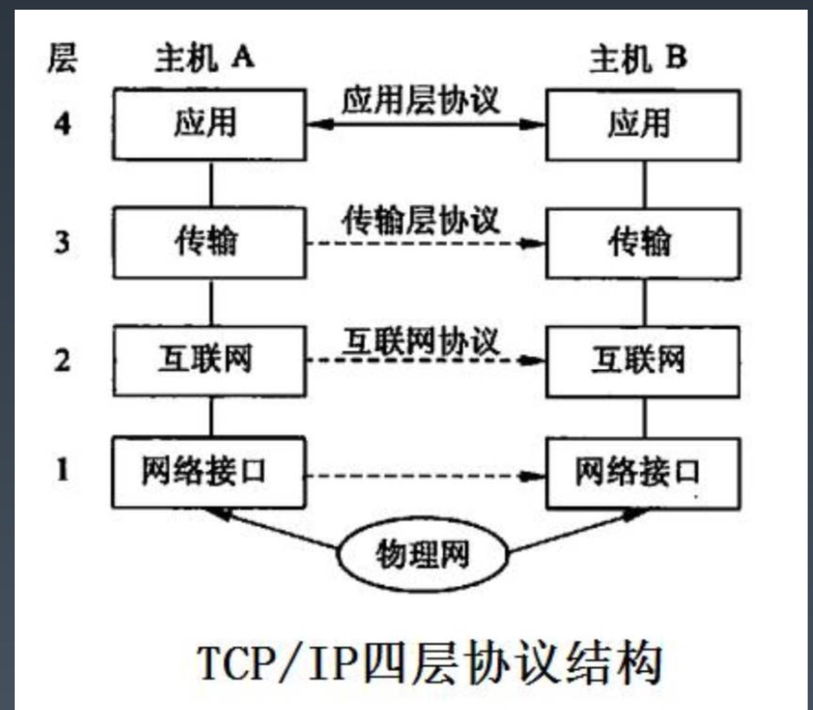
### 网络数据包格式
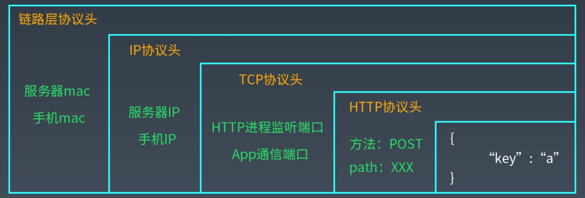

### 物理层
物理层负责数据的物理传输，计算机输入输出只能是 0 1 这样的erjinzhi数据,但是在真正的通信
线路里有光纤、电缆、无线各种设备。光信号和电信号，以及无线电磁信号在物理上是完全不同的，
如何让这些不同的设备能够理解、处理相同的二进制数据，这就是物理层要解决的问题
### 链路层
链路层就是将数据封装后交给物理层传输，主要就是将数据封装成数据帧，以帧为单位通过物理层进行
通信，有了帧，就可以在帧上进行数据校验，进行流量控制。

链路层会定义帧的大小，这个大小也被称为最大传输单元。像 HTTP 要在传输的数据上添加一个 HTTP 
头一样，数据链路层也会将封装好的帧添加一个帧头，帧头里记录的一个重要信息就是发送者和接受者
的 MAC 地址。MAC 地址是网卡的设备标识符，是唯一的，数据帧通过这个信息确保数据送达到正确
的目标机器

### 数据链路层负载均衡
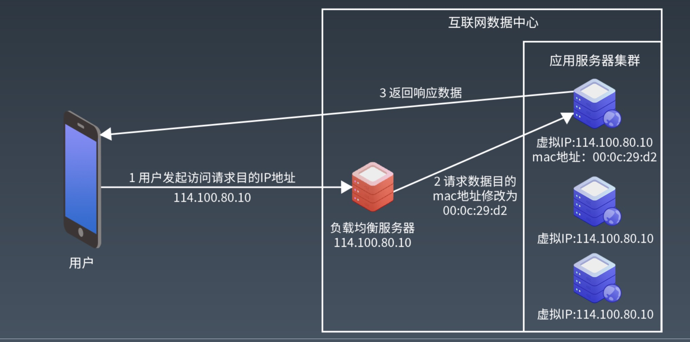
### 网络层
网络层 IP 协议使得互联网应用根据 IP 地址就能访问到目标服务器,请求离开 App 后，到达运营
服务商的交换机，交换机会根据这个 IP 地址进行路由转发，可能中间会经过很多个转发节点，最后
数据到达目标服务器

网络层的数据需要交给链路层进行处理，而链路层帧的大小定义了最大传输单元，网络层 IP 数据包
必须要小于最大传输单元才能进行网络传输，这个数据包也有一个 IP 头，主要包括的就是发送者
和接收者的 IP 地址
### IP 负载均衡
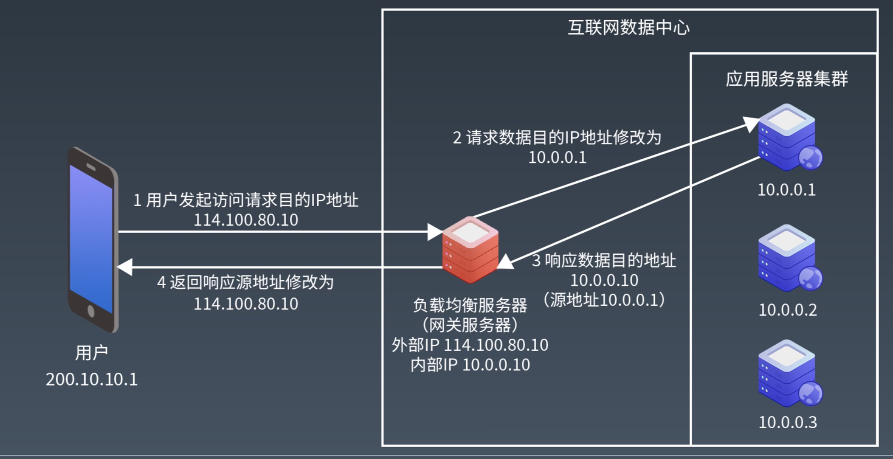
### 传输层 (TCP协议)
IP 协议不是一个可靠的通信协议，不会建立稳定的通信链路，并不会确保数据一定送达。要保证通信
的稳定可靠，需要传输层协议 TCP

TCP 协议是一种面向连接的、可靠的、基于字节流的传输层协议。TCP 作为一个比较基础的通讯协议，
有很多重要的机制保证了 TCP 协议的可靠性和强壮

* 使用序号，对收到的 TCP 报文段进行排序和检测重复的数据
* 无错传输，使用校验和检测报文段的错误
* 使用确认和计时器来检测和纠正丢包或者延时
* 流量控制，避免主机分组发送得过快而使接收方来不及完全收下
* 拥塞控制，发送方根据网络承载情况控制分组的发送量，以获得高性能同时避免拥塞崩溃
* 丢失包重传
### TCP 建立连接 3次握手
* APP 先发送 SYN=1, Seq=X 的报文，表示请求建立连接，X 是一个随机数
* 服务器接收到这个报文后，应答 SYN=1, ACK=X+1, Seq=Y 的报文，表示同意建立连接
* App 收到这个报文后，检查 ACK 的值为自己发送的 Seq 值 +1, 确认建立连接, 并发送 
ACK=Y+1 的报文给服务器；服务器收到这个报文后检查 ACK 值为自己发送的 Seq + 1，确认
建立连接。至此，APP 和服务器建立起了 TCP 连接，就可以进行数据传输了
### TCP 关闭连接 4次挥手
* 客户端向服务器端发送一个 FIN, 请求关闭数据传输
* 当服务器接收到客户端的 FIN 时，向客户端发送一个 ACK，其中 ACK 的值为 FIN + SEQ
* 然后服务器向客户端发送一个 FIN，告诉客户端应用程序关闭
* 当客户端收到服务器端的 FIN 是，回复一个 ACK 给服务器端。其中 ACK 的值等于 FIN + SEQ

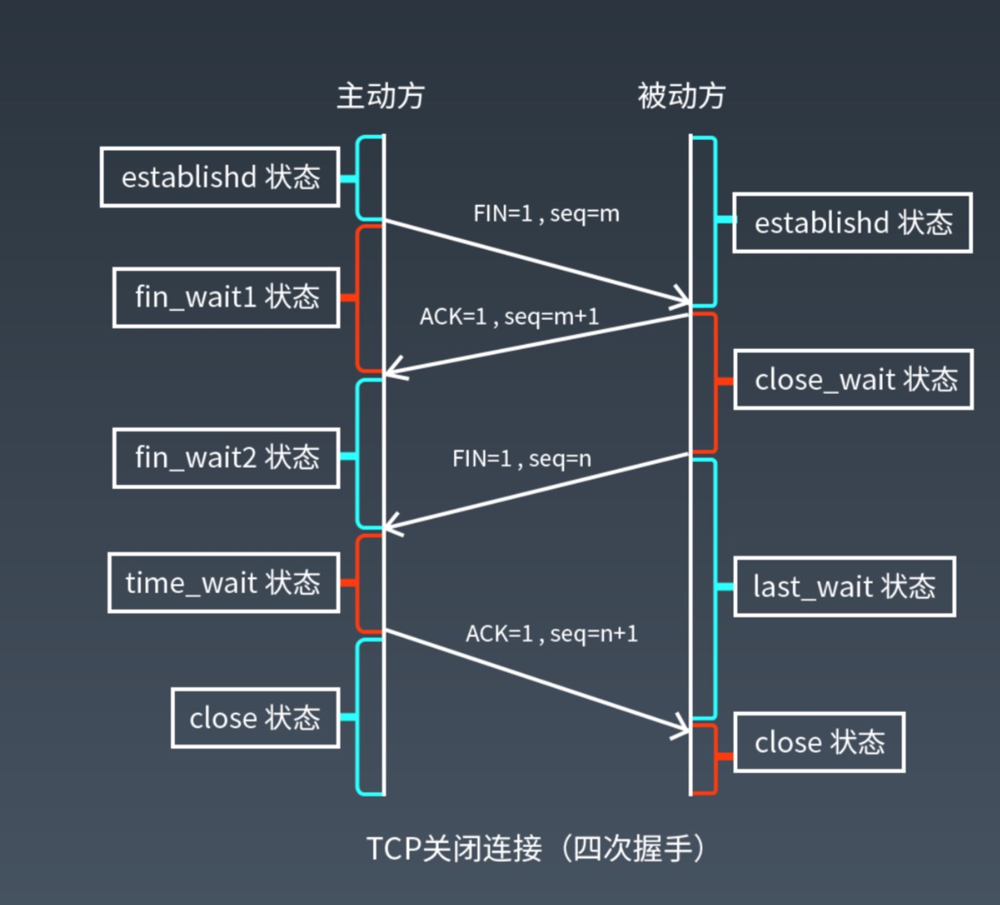
### 应用层 HTTP 协议
互联网应用需要在全球范围内为用户提供服务，将全球的应用和全球的用户联系在一起，需要一个统一
的应用层协议，这个协议就是 HTTP 协议
### HTTP 请求的7种方法
* GET：只读请求
* HEAD：和 GET 方法一样，但是只返回响应头
* POST：提交请求
* PUT：上传请求
* DELETE ： 删除 URL 标识的资源
* TRACE ： 回显服务器收到的请求，用以测试或者诊断
* OPTIONS：请求服务器返回支持的所有 HTTP 请求方法，测试服务器是否正常
### HTTP 响应的 5 种状态
* 1xx 消息 - 请求已被服务器接收，继续处理
* 2xx 成功 - 请求已成功被服务器接收、理解、并接受
* 3xx 重定向 - 需要后续操作才能完成这一请求
* 4xx 请求错误 - 请求含有词法错误或无法被执行
* 5xx 服务器错误 - 服务器在处理某个正确请求时发生错误
### HTTP 协议版本
* HTTP/1.0 客户端请求到资源后会关闭连接，并发量大的时候会导致频繁创建、关闭TCP连接，而
TCP 三次握手、四次挥手会消耗一定的时间
* HTTP/1.1 默认启动长连接模式，即客户端可以使用同一个 TCP 连接顺序发送多个请求，新版本
也引入了管道机制，客户端可以不用等上一个请求的响应结果就可以发送下一个请求，但是服务器端也
是按照客户端请求的顺序进行响应的，可以理解为半双工模式
* HTTP/2 引入了 HTTP "流" 的概念，允许将不同的 HTTP 并发复用到同一 TCP 连接上，使浏览器
更高效地复用 TCP 连接。HTTP/2 解决了单个 TCP 连接的使用效率低的问题，现在可以通过
同一连接同时传输多个请求/响应。但是，TCP 并不理解 HTTP 流，当多个 HTTP 请求复用一个
TCP 连接，如果前面的请求/响应没有处理完，后面的请求/响应也无法处理，也就是出现队头堵塞
现象。 
* HTTP/3 不是使用 TCP 作为会话传输层，而是使用 QUIC (一种新的互联网传输协议)。该协议
在传输层将流作为一等公民引入。多个 QUIC 流共享相同的 QUIC 连接，因此不需要额外的握手和
慢启动来创建新的 QUIC 流。但是 QUIC 流是独立的，因此在大多数情况下，只影响一个流的丢包
不会影响其他流，这是因为 QUIC 数据包封装在 UDP 数据包

## 非阻塞网络 I/O
### 计算机之间如何进行网络请求
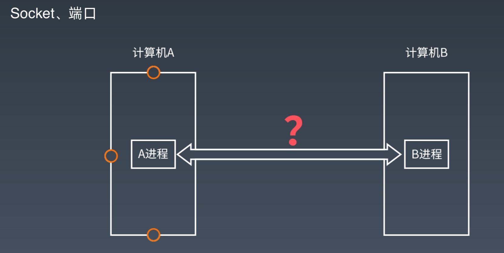
### 服务器-客户端
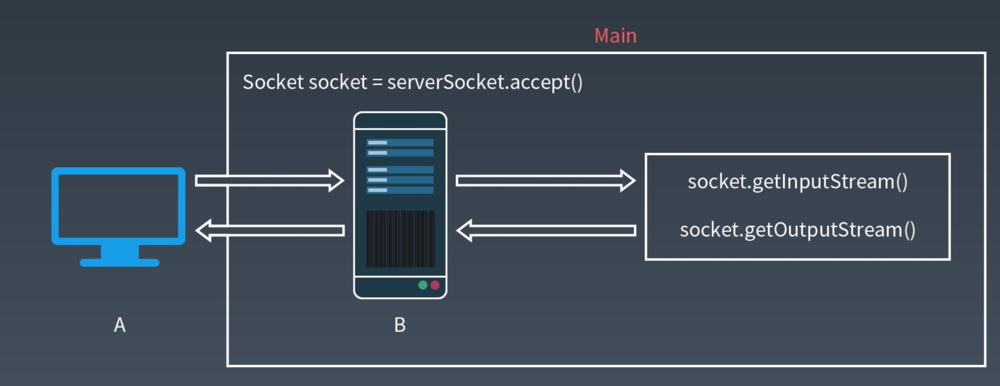
### 多线程服务器-客户端
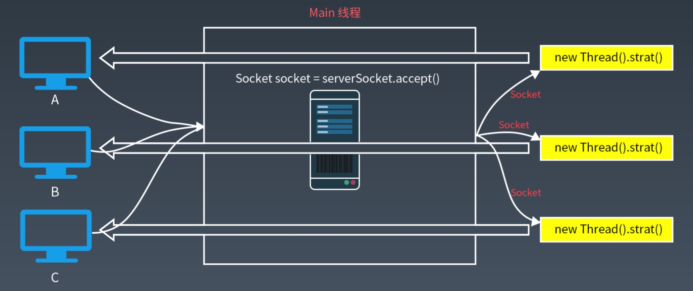
### 线程池服务器
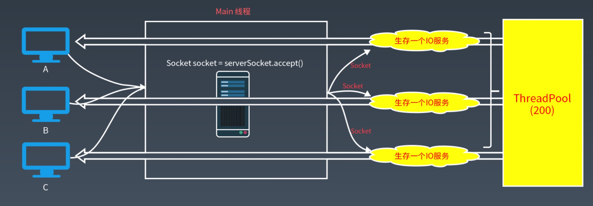
### BIO Blocking I/O 阻塞 I/O
阻塞 I/O : 进行 I/O 操作时，用户线程会一直阻塞，直到读操作或者写操作完成
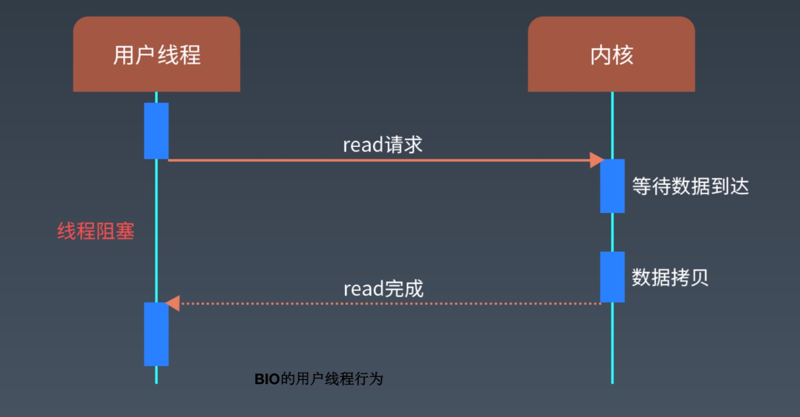
### Socket 接收数据，系统内核的处理过程
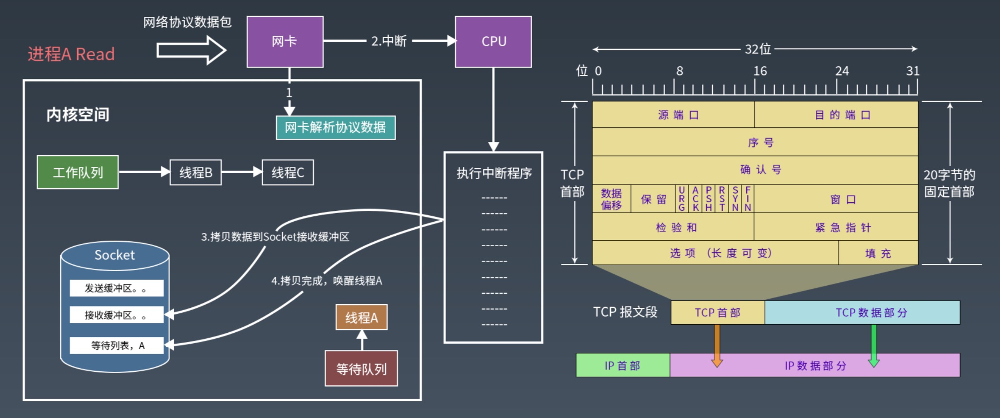
### 非阻塞 I/O ( Non-Blocking I/O )
非阻塞 I/O : I/O 操作立即返回，发起线程不会阻塞等待

非阻塞 read 操作:
* Socket 接收缓冲区有数据，读 n 个(不保证数据被读完整，因此有可能需要多次读）
* Socket 接收缓冲区没数据，则返回失败(不会等待)
非阻塞 write 操作：
* Socket 发送缓冲区满，返回失败(不会等待)
* Socket 发送缓冲区不满，写 n 个数据 (不保证一次性全部写入，因此可能需要多次写)

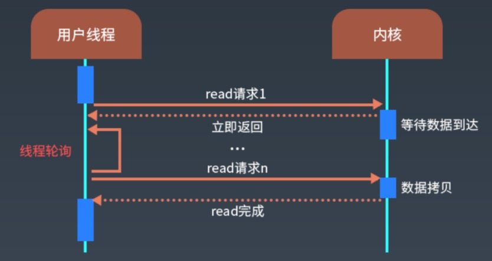

### Java NIO (New I/O)
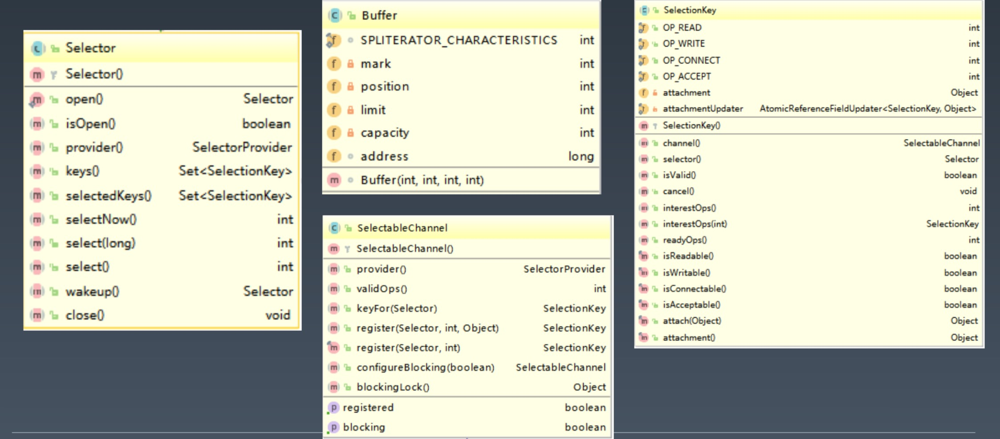

### Java IO vs NIO
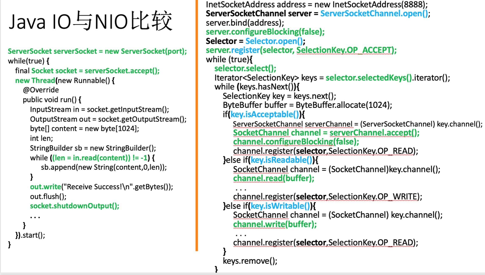

### 系统 I/O 复用方式：select, poll, epoll
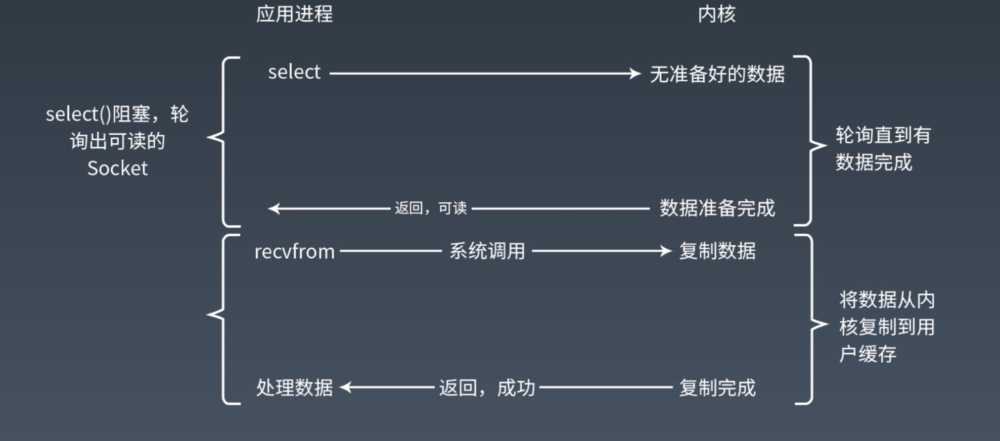

### Select (poll) 管理下的 read 过程
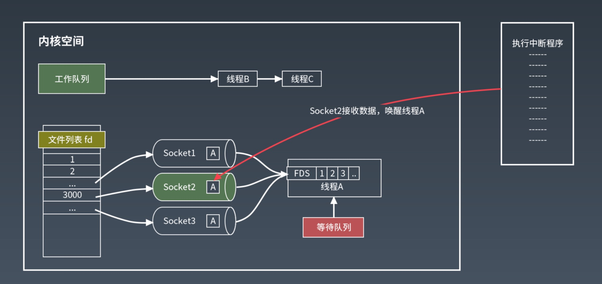
### epoll 管理下的 read 过程
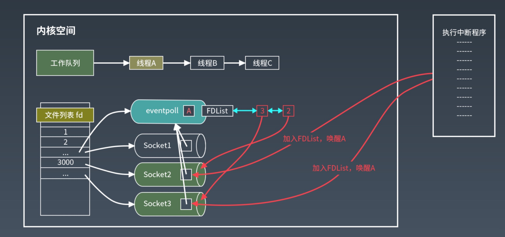
### 无活动连接时, Selector.select 方法被阻塞
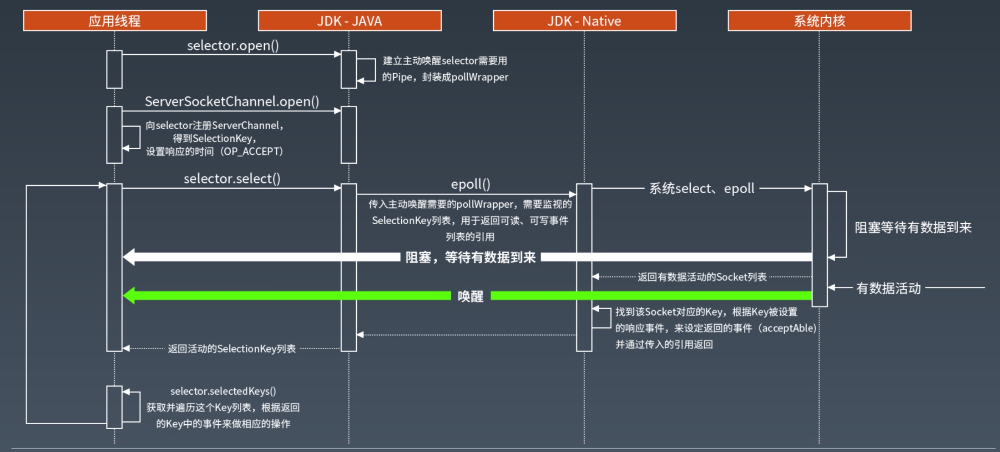

