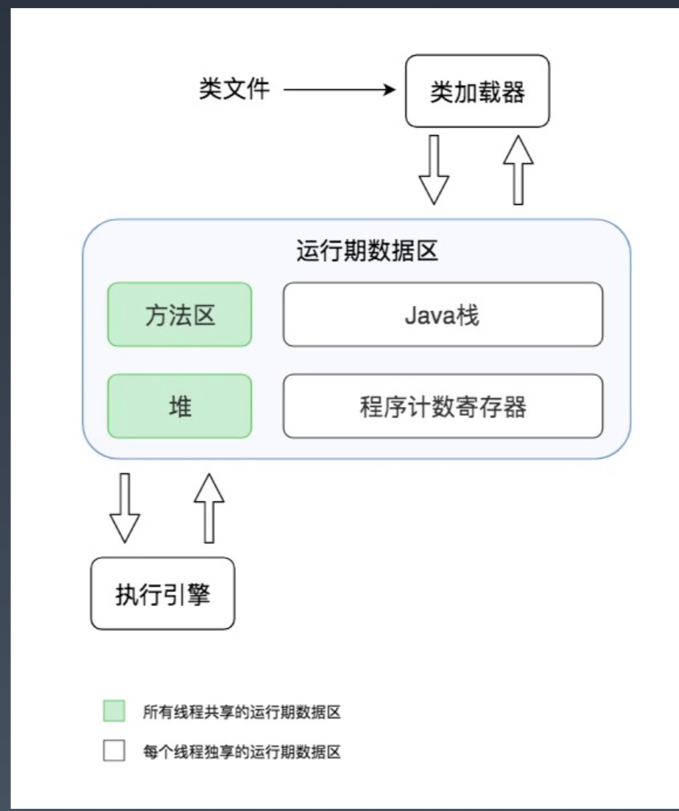
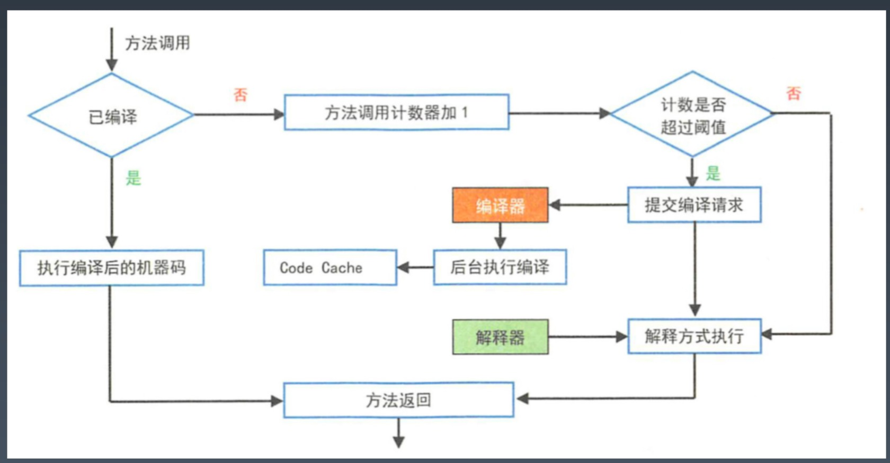
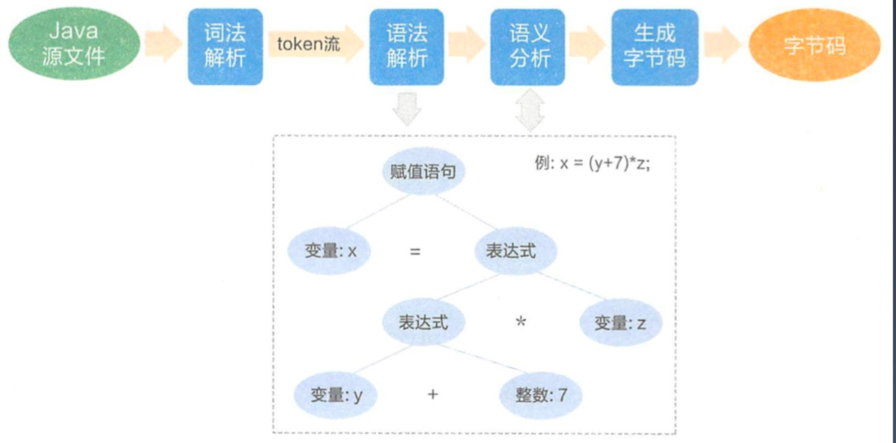
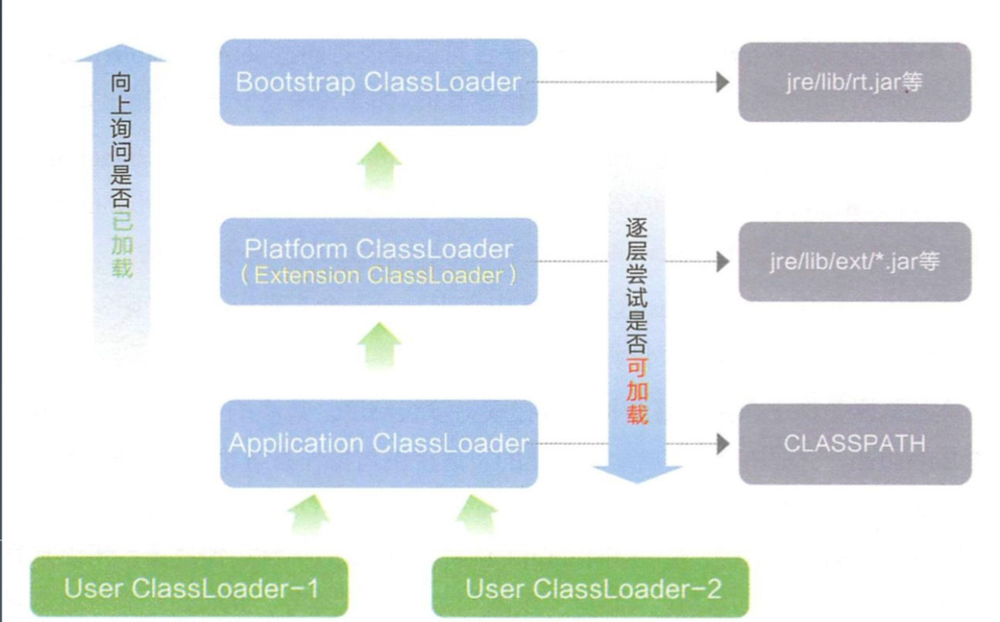
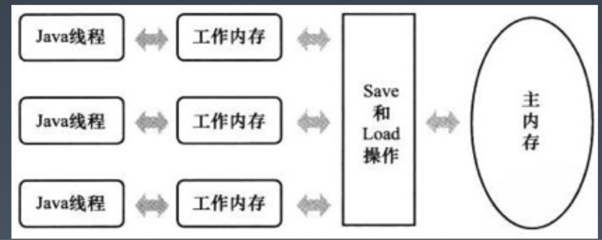
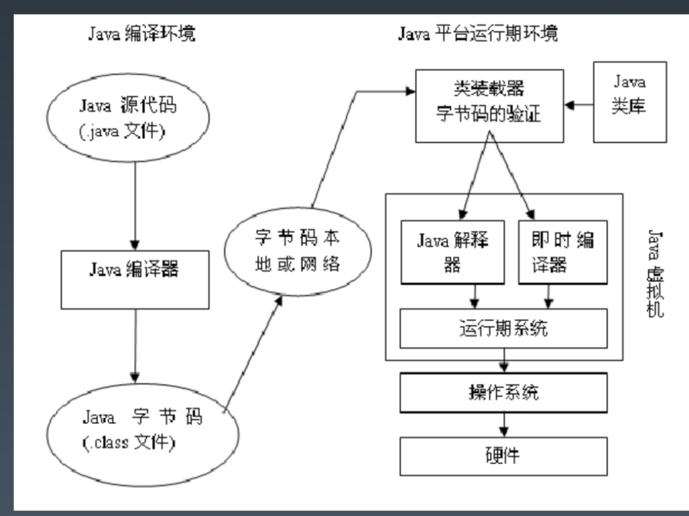

# Week9 总结
## JVM 虚拟机原理
### JVM 组成架构

### Java 字节码文件
计算机领域的任何问题都可以通过增加中间层（虚拟层）来解决
### 字节码执行流程

### Java 字节码文件编译过程

### 类加载器的双亲委派模型
低层次的当前类加载器，不能覆盖更高层次的类加载器已经加载的类。如果低层次的类加载器想加载
一个未知的类，需要上级类加载器确认，只有当上级类加载器没有加载过这个类，也允许加载的时候，
才让类加载器加载这个未知类。

### 自定义类加载器
* 隔离类加载器：同一个 JVM 中不同组件加载同一个类的不同版本
* 扩展加载源：从网络、数据库等处加载字节码
* 字节码加密：加载自定义的加密字节码，在 ClassLoader 中解密
### 堆 & 栈
* 堆：每个 JVM 实例唯一对应一个堆，应用程序在运行中所创建的所有类实例或数组都放在这个堆
中，并由应用所有的线程共享
* 堆栈：JVM 为每个新创建的线程都分配一个堆栈。也就是说，对于一个 Java 程序员来说，它的
运行就是通过对堆栈的操作来完成的
* Java 中所有对象的存储空间都是在堆中分配的，但是这个对象的引用却是在堆栈中分配的，也就是
说在建立一个对象时从两个地方都分配内存，在堆中分配的内存实际建立这个对象，而在栈中分配的
内存只是指向这个堆对象的引用而已
### 方法去 & 程序计数器
方法区主要存放从磁盘加载进来的类字节码，而在程序运行过程中创建的类实例则存放在堆里。程序
运行的时候，实际上是以线程为单位运行的，当 JVM 进入启动类的 main 方法时，就会为应用程序
创建一个主线程， main 方法里的代码就会被这个主线程执行，每个线程都有自己的 Java 栈，栈
里存放着方法运行期的局部变量。而当前线程执行到哪一行字节码指令，这个信息则被存放在程序计数
器中
### Java （线程）栈
所有的方法内定义的基本类型变量，都会被每个运行这个方法的线程放入自己的栈中，线程栈彼此隔离，
所以这些变量一定是线程安全的
### 线程工作内存 & volatile
Java 内存模型规定在多线程情况下，线程操作主内存变量，需要通过线程独有的工作内存拷贝主内存
变量副本来进行

一个共享变量（类的成员变量、类的静态成员变量）被 volatile 修饰后，保证了不同的线程对这个
变量进行操作时的可见性，即一个线程修改了某个变量的值，这新值对其他
线程来说是立即可见的

### Java 运行环境

### JVM 垃圾回收
