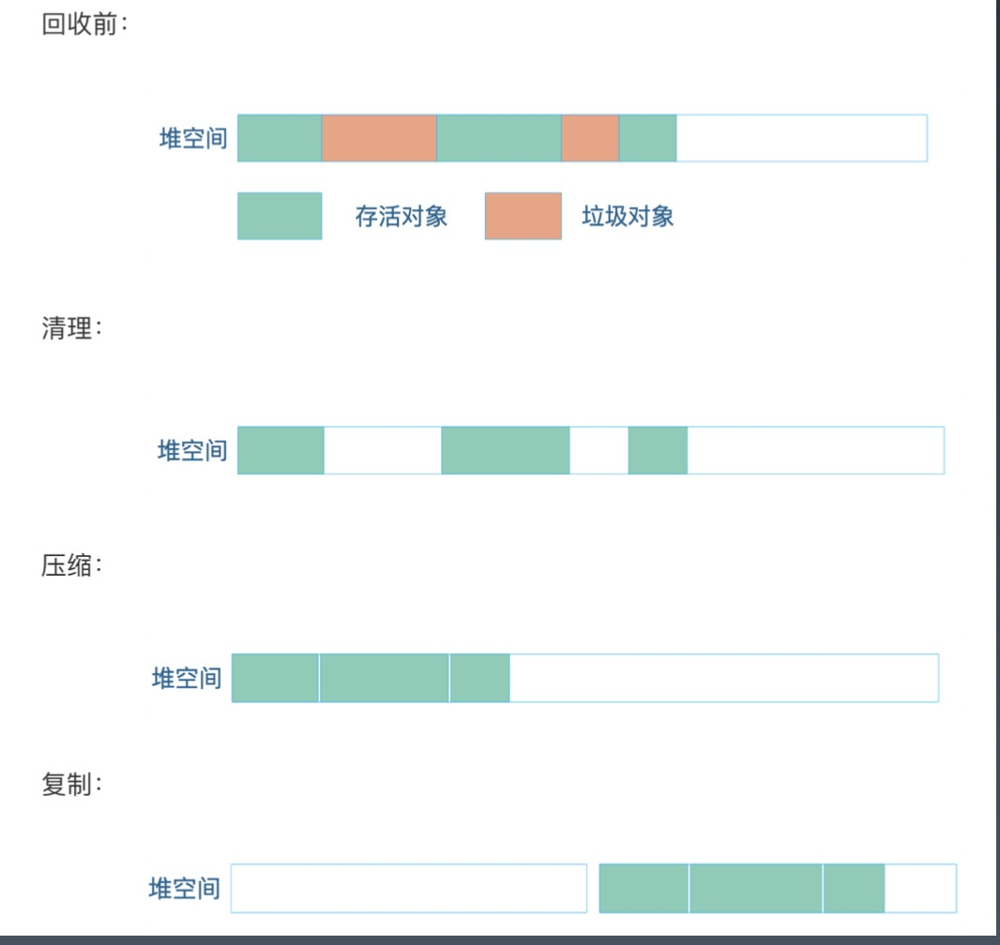
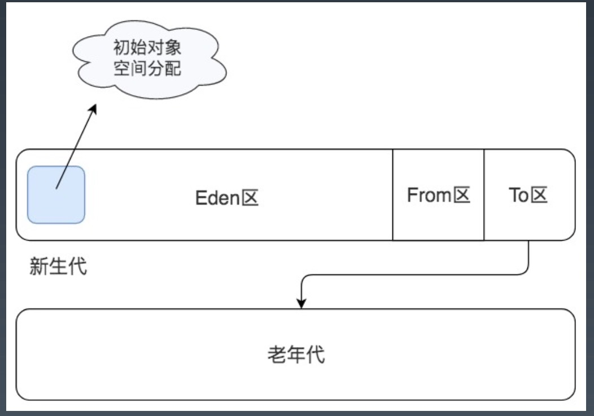

# Week9 总结
## JVM 虚拟机原理
### JVM 组成架构

### Java 字节码文件
计算机领域的任何问题都可以通过增加中间层（虚拟层）来解决
### 字节码执行流程

### Java 字节码文件编译过程

### 类加载器的双亲委派模型
低层次的当前类加载器，不能覆盖更高层次的类加载器已经加载的类。如果低层次的类加载器想加载
一个未知的类，需要上级类加载器确认，只有当上级类加载器没有加载过这个类，也允许加载的时候，
才让类加载器加载这个未知类。

### 自定义类加载器
* 隔离类加载器：同一个 JVM 中不同组件加载同一个类的不同版本
* 扩展加载源：从网络、数据库等处加载字节码
* 字节码加密：加载自定义的加密字节码，在 ClassLoader 中解密
### 堆 & 栈
* 堆：每个 JVM 实例唯一对应一个堆，应用程序在运行中所创建的所有类实例或数组都放在这个堆
中，并由应用所有的线程共享
* 堆栈：JVM 为每个新创建的线程都分配一个堆栈。也就是说，对于一个 Java 程序员来说，它的
运行就是通过对堆栈的操作来完成的
* Java 中所有对象的存储空间都是在堆中分配的，但是这个对象的引用却是在堆栈中分配的，也就是
说在建立一个对象时从两个地方都分配内存，在堆中分配的内存实际建立这个对象，而在栈中分配的
内存只是指向这个堆对象的引用而已
### 方法去 & 程序计数器
方法区主要存放从磁盘加载进来的类字节码，而在程序运行过程中创建的类实例则存放在堆里。程序
运行的时候，实际上是以线程为单位运行的，当 JVM 进入启动类的 main 方法时，就会为应用程序
创建一个主线程， main 方法里的代码就会被这个主线程执行，每个线程都有自己的 Java 栈，栈
里存放着方法运行期的局部变量。而当前线程执行到哪一行字节码指令，这个信息则被存放在程序计数
器中
### Java （线程）栈
所有的方法内定义的基本类型变量，都会被每个运行这个方法的线程放入自己的栈中，线程栈彼此隔离，
所以这些变量一定是线程安全的
### 线程工作内存 & volatile
Java 内存模型规定在多线程情况下，线程操作主内存变量，需要通过线程独有的工作内存拷贝主内存
变量副本来进行

一个共享变量（类的成员变量、类的静态成员变量）被 volatile 修饰后，保证了不同的线程对这个
变量进行操作时的可见性，即一个线程修改了某个变量的值，这新值对其他
线程来说是立即可见的

### Java 运行环境

### JVM 垃圾回收
JVM 垃圾回收就是将 JVM 堆中的已经不再被使用的对象清理掉，释放宝贵的内存资源。

JVM 通过一种可达性分析算法进行垃圾对象的识别，具体过程是：从线程栈帧中的局部变量，或者方法区的静态变量出发，将这些变量引用
的对象进行标记，然后看这些被标记对象是否引用了其他对象，继续进行标记，所有被标记过的对象都是被使用的对象，而那些没有被标记的
对象就是可回收的垃圾对象

进行标记完成以后，JVM 就会对垃圾对象占用的内存进行回收，回收主要有三种方法：
* 清理：将垃圾对象占据的内存清理掉，其实 JVM 并不会真正的将这些垃圾内存进行清理，而是将这些垃圾对象占用的内存空间标记为空闲，
记录在一个空闲列表里，当应用程序需要创建新的对象的时候，就从空闲列表中找到一段空闲内存分配给这个新对象。
* 压缩：从堆空间的头部开始，将存活的对象拷贝放在一段连续的内存空间中，那么其余的空间就是连续的空闲空间
* 复制：将堆空间分成两个部分，只在其中一部分创建对象，当这个部分空间用完的时候，将标记过的可用对象复制到另一个空间中

### JVM 分代垃圾回收

### JVM 垃圾回收器算法

### G1 垃圾回收内存管理机制

### Java 启动参数
标准参数，所有的 JVM 实现都必须实现这些参数的功能，而且向后兼容
* 运行模式 -server，-client
* 类加载路径 -cp, -classpath
* 运行调试 -verbose
* 系统变量 -D

非标准参数，默认 JVM 实现这些参数，但是不保证所有 JVM 实现都实现，且不保证向后兼容
* -Xms 初始堆大小
* -Xmx 最大堆大小
* -Xmn 新生代大小
* -Xss 线程堆栈大小

非 Stable 参数，此类参数各个 JVM 实现会有所不同，将来可能会随时取消
* -XX：-UseConcMarkSweepGC 启用 CMS 垃圾回收
### JVM 性能诊断工具
* 基本工具： jps， jstat，jmap，jstack
* 集成工具：JConsole，JVisualVM
#### JPS
JPS 用来查看 host 上运行的所有 java 进程的 pid(jvmid), 一般情况下使用这个工具的目的只是为了找出运行的 jvm 进程 id，
即 jvmid，然后可以进一步使用其他工具来监控和分析 jvm

常用的几个参数：
* -l 输出 java 应用程序的 main class 的完整包
* -q 仅显示 pid， 不显示其他任何相关信息
* -m 输出传递给 main 方法的参数
* -v 输出传递给 JVM 的参数，在诊断 JVM 相关问题的时候，这个参数可以查看 JVM 相关的参数设置
#### JSTAT
jstat("Java Virtual Machine statistics monitoring tool") 是 jdk 自带的一个轻量级小工具。主要对 Java 应用程序
的资源和性能进行实时的命令行监控，包括了对 Heap size 和垃圾回收状况的监控

语法结构：jstat [Options] vmid [interval] [count]
* Options -- 选项，我们一般使用 -gcutil 查看 gc 情况
* vmid -- VM 的进程号
* interval -- 间隔时间，单位毫秒
* count -- 打印次数，如果缺省则一直打印

* S0 - Heap 上的 Survivor space 0 区已使用的空间的百分比
* S1 - Heap 上的 Survivor space 1 区已使用的空间的百分比
* E - Heap 上的 Eden space 区已使用空间的百分比
* O - Heap 上的 Old space 区已使用空间百分比
* YGC - 从应用程序启动到采样时发生的 Young GC 的次数
* YGCT - 从应用程序启动到采样时 Young GC 所用的时间（单位秒）
* FGC - 从应用程序启动到采样时发生 Full GC 的次数
* FGCT - 从应用程序启动到采样时 Full GC 所用的时间（单位秒）
* GCT - 从应用程序启动到采样时用于垃圾回收的总时间（单位秒）
#### JMAP
jmap 是一个可以输出所有内存中对象的工具，甚至可以将 VM 中的 heap，以二进制输出成文本

使用方法：
* jmap -histo pid > a.log 可以将其保存到文本中，在一段时间后，使用文本对比工具可以对比出 GC 回收了哪些对象
* jmap -dump:format=b,file=f1 PID 可以将该 PID 进程的内存 heap 输出出来到 f1 文件里
#### JSTACK
jstack 可以查看 jvm 内的线程堆栈信息

#### JConsole

#### JVisualVM

## Java 代码优化
### 合理并谨慎使用多线程
使用场景（I/O 阻塞，多 CPU 并发）

资源争用于同步问题

java.util.concurrent

启动线程数 = [任务执行时间/(任务执行时间 - IO 等待时间)]*CPU 内核数
* 最佳启动线程数和 CPU 内核数量成正比，和 IO 阻塞时间成反比。如果任务都是 CPU 计算型任务，那么线程数最多不超过 CPU 内核数，
因为启动再多的线程，CPU 也来不及调度，相反如果是任务需要等待磁盘操作，网络响应，那么多启动线程有助于提供任务并发度，提高系统
吞吐能力，改善系统性能
### 竞态条件与临界区
在同一程序中运行多个线程本身不会导致问题，问题在于多个线程访问了相同的资源。

当两个线程竞争同一资源时，如果对资源的访问顺序敏感，就称存在竞态条件。导致竞态条件发生的代码区称作临界区。

在临界区中使用适当的同步就可以避免竞态条件

### Java 线程安全
允许被多个线程安全执行的代码称作线程安全的代码

方法局部变量:
* 局部变量存储在线程自己的栈中。也就是说，局部变量永远也不会被多个线程共享。所以，基础类型的局部变量是线程安全的

方法局部的对象引用:
* 如果在某个方法中创建的对象不会逃逸出该方法，那么它就是线程安全的

对象成员变量：
* 对象成员存储在堆上。如果两个线程同时更新同一个对象的同一个成员，那这个代码就不是线程安全的

Java Web 应用的多线程是有 Web 容器创建的。

Servlet 是线程安全的吗：
* 如果 Servlet 中无成员变量，或者没有多个线程同时更新同一个成员变量，那么它就是线程安全的
* 如果有多个线程会同时更新 Servlet 中的成员变量，那么它就不是安全的

### ThreaLocal

创建一个 ThreadLocal 变量（X类静态成员变量）：
* public static ThreadLocal myThreadLocal = new ThreadLocal();

存储此对象的值（A类a方法）：
* X.myThreadLocal.set("A thread local value");

读取一个 ThreadLocal 对象的值（B类b方法）：
* String threadLocalValue = (String)X.myThreadLocal.get();

### Java 内存泄露
Java 内存泄露是由于开发人员的错误引起的

如果程序保留对永远不再使用的对象的引用，这些对象将会占用并耗尽内存。
* 长生命周期的对象
* 静态容器
* 缓存

合理使用线程池和对象池
* 复用线程或对象资源，避免在程序的生命期中创建和删除大量对象
* 池管理算法（记录哪些对象是空闲的，哪些对象正在使用）
* 对象内容清除（ThreadLocal 的清空）

使用合适的 JDK 容器类（顺序表，链表，Hash）

缩短对象生命周期，加速垃圾回收
* 减少对象驻留内存的时间
* 在使用时创建对象，用完释放
* 创建对象的步骤（静态代码段-静态成员变量-父类构造函数-子类构造函数）

使用 I/O buffer 及 NIO
* 延迟写与提前读策略
* 异步无阻塞 IO 通信

优先使用组合代替继承
* 减少对象耦合
* 避免太深的继承层次带来的对象创建性能损失

合理使用单例模式
* 无状态对象
* 线程安全

计算机的任何问题都可以通过虚拟层（或者中间层）解决
* 面向接口编程
* 7层网络协议
* JVM
* 编程框架
* 一致性 Hash 算法的虚拟化实现

## 秒杀
### 秒杀系统设计原则
静态化：
* 采用 JS 自动更新技术将动态页面转化为静态页面

并发控制，防秒杀器：
* 设置阀门，只放最前面的一部分人进入秒杀系统

简化流程：
* 砍掉不重要的分支流程，如下单页面的所有数据库查询
* 以下单成功作为秒杀成功标志。支付流程只要在 1 天内完成即可

前端优化：
* 采用 YSLOW 原则提升页面响应速度
#### 静态化
秒杀商品 list 和 Detail 是静态 HTML 页面

秒杀商品列表/秒杀商品介绍页面，如何判断秒杀开始否？
* valid-offer.js : var valid_offerIds = 23624364,53778658,35885833

### 三道阀门设计
阀门：基于 TT 的计数器

### 秒杀器的预防
秒杀 Detail 页面：
* URL：随机
* 秒杀前 2 秒放出，脚本生成，秒杀前
* 1000 次访问上限控制【每件商品只能放入 1000 人浏览】

下单页面：
* 订单 ID，随机
* 不能直接跳过秒杀 Detail 页面进入
* 每个秒杀商品，带预先生成的随机 Token 作 URL 参数
* 如果秒杀过，直接跳到秒杀结果页面
* 100 次访问上限控制【每件商品只能放入 1000 人下单】

### Web Server 调优 - Apache 调优
* KeepAlive 相关参数调优
* 其他参数调优
    * HostnameLookups 设为 off, 对 allowfromdomain 等域名不进行正向和反向 dns 解析
* 关闭 cookies-log 日志
* 打开 Linux sendfile()
* 关闭无用的 module
    * mod_Gzip
    * 秒杀页面，非图片 HTML 文本所占流量比重可忽略不计，zip意义不大
    * mod_Beacon
    * mod_hummock(等反应过来，秒杀已经结束了)
 ### Web Server 调优 - JBoss 调优
 Mod-jk worker 调优
 
 JBoss AJP Connector
 
 Tomcat APR 设定
 
### 秒杀静态页面优化
 图片合并
 * 8 张图片合并成 1 张，CSS 偏移展示
 * 减少 HTTP 请求数，减少请求等待数
 * 减少发送 Cookies 的量
 
 HTML 内容压缩
 
 图片压缩：图片 Bytes < 长*宽/2250
 
 HTML Header Cache-Control 设置
 
 CSS，JS 精简
 * CSS，JS 精简到极致，部分直接写在页面中，减少 HTTP 请求次数
### 下单页面优化
数据库操作：全部砍掉
* 原下单页面要访问 8 次数据库，全部砍掉

秒杀流程精简：
* 砍掉填写或选择收货地址，放在秒杀成功后填写
* 砍掉调用是否开通支付接口，秒杀首页文案提示必须开通

采用内存缓存：
* 秒杀 Offer 数据，支付相关信息，缓存

### 交易系统性能优化
* 交易系统调优目标

| | 并发 | TRS |
|---|---|---|
|下单页面（优化前）|20|100|
|下单页面（优化后）|40|400|

* 关闭 KeepAlive（分析交易系统 accesslog，用户在短时间内连续点击概率很低）
* JVM 优化
* 优化 CMS 垃圾回收器的参数
* 消灭 Top10 Bottlenecks
    * Velocity 参数优化
    * 采用 DBCP 1.4 替换 C3P0
    * Offer 产品参数的 XML 解析
### 二跳页面优化
其他页面
* 前端优化：Yslow 规则调优
    * 减少 HTTP 请求，合并 JS，CSS，图片，充分利用浏览器缓存
* 图片压缩，公式
* 避免发送 Cookies

交易系统优化
* 普通订单管理列表和 XXX 秒批订单管理列表分离
* 禁止用模糊查询功能
### 应急预案
* 域名分离，独立域名，不影响原有业务
    * Style 集群：style.xxx.china.xxx.com
    * 图片服务器集群：img.xxx.china.xxx.com
    * 静态页面集群：page.xxx.china.xxx.com
    * 出问题直接把 xxx 相关域名卡掉，所有请求跳转到万能出错页面
* 机动服务器 10 台，备用
* 拆东墙补西墙战略
    * 5 天时间来不及采购服务器，因此 SA 待命，随时准备将非核心应用集群的冗余服务器下线，加入到秒杀集群
* 壁虎断尾策略
    * 所有办法均失效的情况下，例如流量耗尽
        * 非核心应用集群系统停止服务，如资讯，论坛，博客等社区系统
        * 保住首页，Offer Detail，旺铺页面等核心应用的可用性
    * 万能出错页面：秒杀活动已经结束
        * 任何出错都 302 跳转到此页面
        * 位于另外的集群
    * 万幸：最终所有预案都没有用上
### 改进一:采用更轻量/快速的服务器
采用 Lighttpd 代替 Apache 杀手锏 (AIO)
    
Lighttpd 1.5 VS Apache2.2.4
    
小页面性能（100K）
* http_load -verbose -timeout 40 -parallel 100 -fetches 500 http-load.10M.urls-100M

大页面性能（100M）     

性能关键：Web Server 的高性能 I/O

### 改进二：前端优化自动化
* xxx 服务器响应时间 <150ms ，但 Offer Detail 页面用户等待时间 5s，大部分时间耗在路上（资源请求和网络传输）
* 图片自动压缩（CMS 自动压缩）
* Cookies 服务化（控制 Cookies 的大小）
* xxx 前端延迟加载框架 SmartLoad（只加载首屏数据）
* Google mod_pagespeed module
    * 自动压缩图片，静态资源，智能浏览器缓存技术
* Google Diffable （增量下载静态资源技术）

### 改进三：架构镜像站组建山寨 CDN

### 改进四：采用反向代理 加速核心页面
在 Offer 集群前部署 Squid 反向代理集群

### 改进五：海量数据的透明垂直切分
